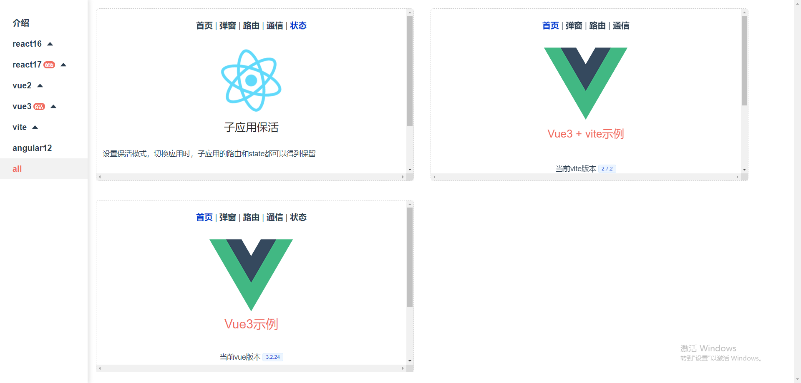

# 微前端

## 乾坤
链接：https://github.com/umijs/qiankun

并行在多个端口下运行多个应用，在main 应用中，通过子应用注册，子应用通过微前端框架加载。

加载方式是通过将对应区域挂载普通的DOM元素来实现的。

`上图区域渲染的是react15的子应用`

### 运行环境
建议node版本 v14。
### 项目启动
- 根目录执行yarn install;安装所有依赖
- 根目录执行 yarn examples:install;安装所有子应用的依赖
- 根目录执行 yarn examples:start;启动所有子应用

### 体验
运行乾坤微前端之后，在切换各个子应用的时候，出现的异常较多，暂时放弃乾坤方案。

## 无界
链接：https://github.com/Tencent/wujie

无界的界面加载方式是通过一个shadowDOM来实现的，这样就不会出现样式污染的问题。

### 运行环境
建议node版本 v16。
### 项目启动
- 根目录执行pnpm -i;安装所有依赖
- 进入examples/main-vue 目录；运行 yarn install ; yarn start
- 进入examples/react17 目录；运行 yarn start
- 进入examples/vite 目录；运行 yarn install ; yarn start
- 进入examples/vue3目录；运行yarn install；yarn start
### 体验
运行wujie微前端之后，切换子应用的时候，没有出现异常,但是打开弹框后却发生了滚动。
目前成功运行了vite，vue3和react17三个子应用，足够测试为前端的大部分功能了。

### 通信
1. props 注入机制
2. window.parent 通信机制（通过postMessage）
3. 去中心化的通信机制（EventBus）
#### 路由管理
1. 子应用之间的路由跳转。通过主应用传入的方法，来实现子应用之间的路由跳转。
2. 主应用跳转子应用。正常的使用Vue的路由组件实现路由切换,通过emit 事件来触发子应用路由模块的渲染。

子应用路由中的location 来自iframe.contentWindow

#### state管理
1. 通过 EventBus 进行状态管理和通信
## micro-app
链接：https://github.com/micro-zoe/micro-app
