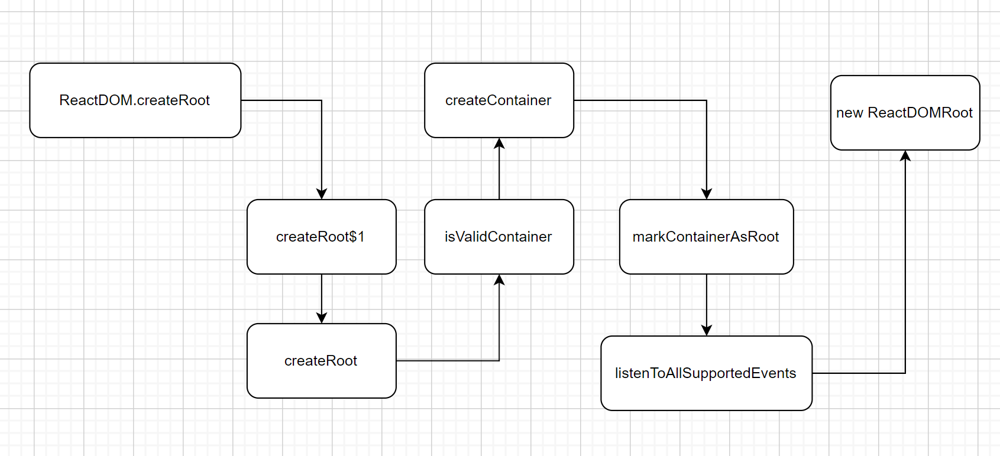
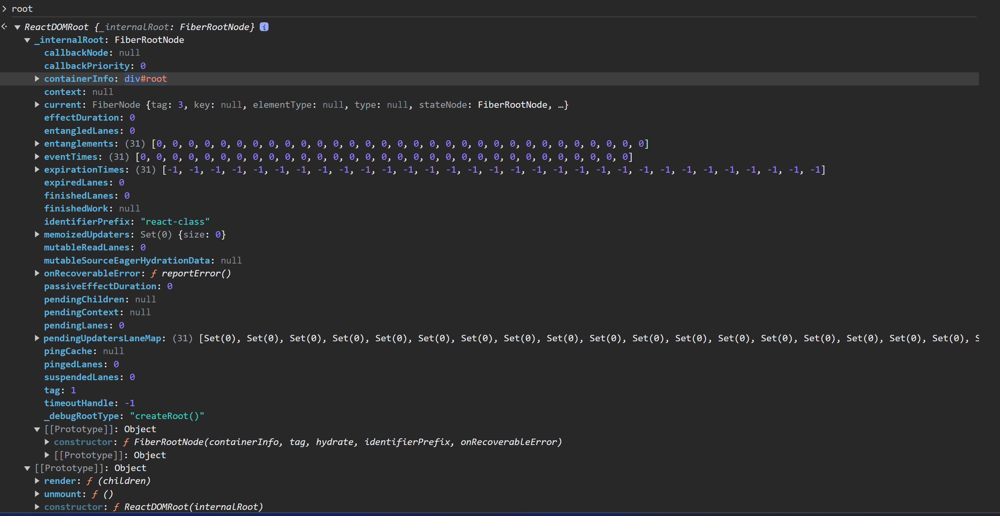
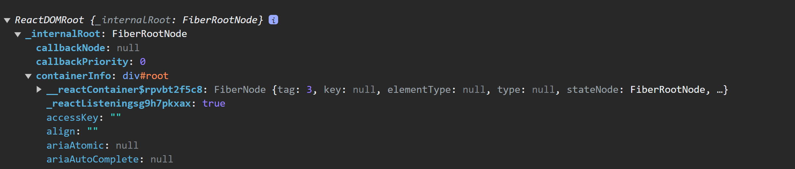
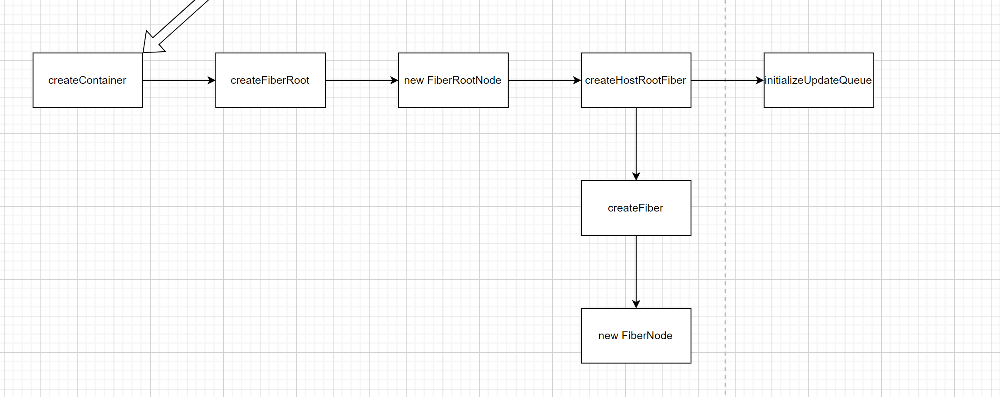
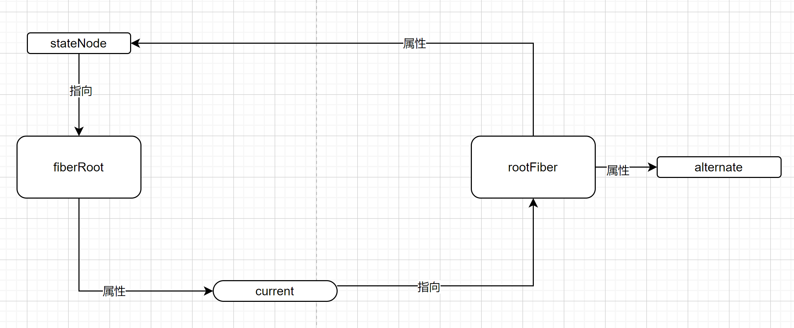
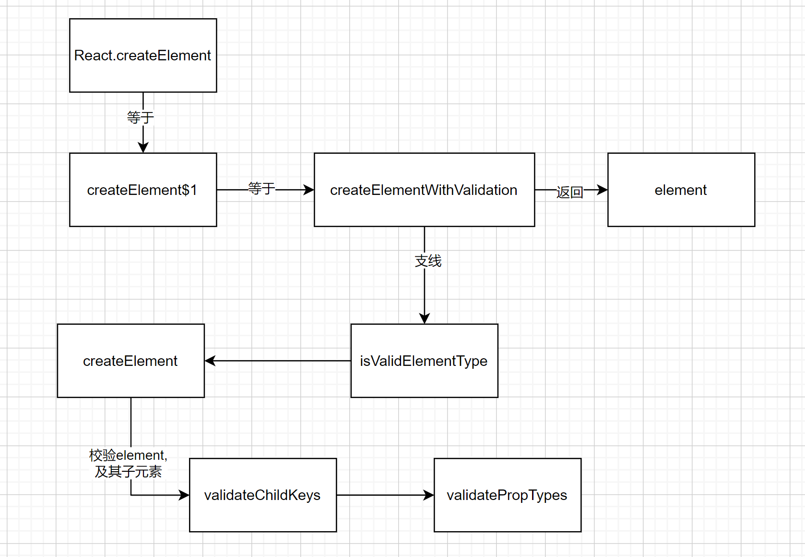
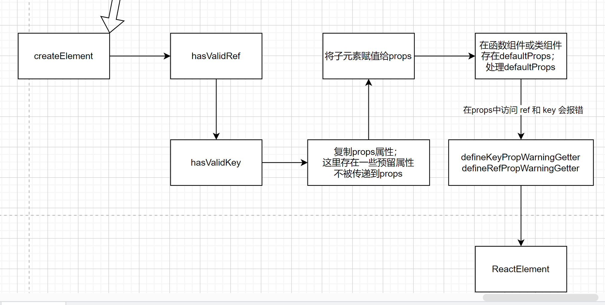

# react 的类组件渲染
## 类组件源代码
```javascript
 class App extends React.Component{
    constructor(props) {
        super()
        const {name} = props
        this.render = this.render.bind(this)
        this.change = this.change.bind(this)
        this.state = {
            name:name
        }
        console.log('MyComponent constructor')
    }
    componentDidMount(){
        console.log('MyComponent componentDidMount')
    }
    change(){
        this.setState({
            name:'my component new name'
        })
    }
    render(){
        console.log('MyComponent render')
        const {name} = this.state
        return (
            <div>
                <div>{name} 1</div>
                <div>{name} 2</div>
            </div>
        )
    }

}

const root = ReactDOM.createRoot(document.getElementById("root"),{
    identifierPrefix:'react-class'
})
// ReactDOMRoot的原型上具有render方法
root.render(<App name={'app-name'} />);
```

## 类组件编译后的代码
```javascript

class App extends React.Component {
    constructor(props) {
        super();
        const {
            name
        } = props;
        this.render = this.render.bind(this);
        this.change = this.change.bind(this);
        this.state = {
            name: name
        };
        console.log('MyComponent constructor');
    }

    componentDidMount() {
        console.log('MyComponent componentDidMount');
    }

    change() {
        this.setState({
            name: 'my component new name'
        });
    }

    render() {
        console.log('MyComponent render');
        const {
            name
        } = this.state;
        return React.createElement(
            "div",
            null,
            React.createElement("div", null, name, " 1"),
            React.createElement("div", null, name, " 2")
        );
    }

}

const root = ReactDOM.createRoot(document.getElementById("root"), {
    identifierPrefix: 'react-class'
}); // ReactDOMRoot的原型上具有render方法

root.render( React.createElement(App, {
    name: 'app-name'
}));
```


## 函数组件源码
```javascript
function App({name}){
       return (
           <div>
               <div>{name} 1</div>
               <div>{name} 2</div>
           </div>
       )
   }

    const root = ReactDOM.createRoot(document.getElementById("root"),{
        identifierPrefix:'react-class'
    })
    // ReactDOMRoot的原型上具有render方法
    root.render(<App name={'app-name'} />);
```
## 函数组件编译后
```javascript
function App({name}) {
        return React.createElement(
            "div",
            null,
            React.createElement("div", null, name, " 1"),
            React.createElement("div", null, name, " 2")
        );
    }

    const root = ReactDOM.createRoot(document.getElementById("root"), {
        identifierPrefix: 'react-class'
    }); // ReactDOMRoot的原型上具有render方法

    root.render( React.createElement(App, {
        name: 'app-name'
    }));
```
### 观察编译后的 类组件和函数组件
- 使用 ReactDOM.createRoot 创建了一个root对象
- 函数组件和类组件，都调用了`React.createElement`，然后调用了`root.render`进行渲染
### ReactDOM.createRoot

#### 两个参数
#### container
容器dom元素
#### options 可传参数
- hydrate 同于服务端渲染
- unstable_strictMode 是否开启严格模式，默认 false
- identifierPrefix,默认 空字符串
- onRecoverableError，默认console.error 函数
- transitionCallbacks，默认null

### 返回的root对象的属性和方法如下

#### root中的container
- __reactContainer$rpvbt2f5c8 是一个随机生成的属性，表示是被标记的root节点
 
### isValidContainer
```text
判断是否是合法的DOM容器节点
document.body span li div 的 nodeType 都是 1
document 的 nodeType 是 9
document.createDocumentFragment 创建的节点是 11
以上都是合法容器
```
### createContainer

```javascript
var root = createContainer(
      container,// 根节点
      ConcurrentRoot,// 两种应用启动模式： legacy 模式；Concurrent（默认1） 并发模式
      null,
      isStrictMode,// 是否开启严格模式 默认false
      concurrentUpdatesByDefaultOverride,//  通过默认覆盖并发更新 默认false
      identifierPrefix, //默认空字符串 ，React 为 React 生成的 id 使用的可选前缀。 useId . 当在同一页面使用多个根时，可用于避免冲突。必须与服务器上使用的前缀相同
      onRecoverableError// 默认console.error 函数
);
```
### createFiberRoot
相比 createContainer，多了两个参数 hydrate (false)、initialChildren (null);

```javascript
 createFiberRoot(
      containerInfo,
      tag,
      hydrate, // 默认 false
      initialChildren,// 默认null 
      hydrationCallbacks,
      isStrictMode,
      concurrentUpdatesByDefaultOverride,
      identifierPrefix,
      onRecoverableError,
        transitionCallbacks // 这个参数在react 18 版本中无用
    );
```

### new FiberRootNode
得到一个 fiberRoot 节点
```javascript

  function FiberRootNode(

      containerInfo,// 根节点
      tag,// 两种应用启动模式： legacy 模式；Concurrent 模式
      hydrate,// 是否是服务端渲染
      identifierPrefix,// 默认空字符串
      onRecoverableError // 默认console.error 函数
  ) {
    this.tag = tag; // 两种应用启动模式： legacy 模式；Concurrent 模式
    this.containerInfo = containerInfo; // 根容器节点元素
    this.pendingChildren = null;
    this.current = null;
    this.pingCache = null;
    this.finishedWork = null;
    this.timeoutHandle = noTimeout;// 默认-1
    this.context = null;
    this.pendingContext = null;
    this.callbackNode = null;
    this.callbackPriority = NoLane; // 默认0
    this.eventTimes = createLaneMap(NoLanes);// 创建一个数组
    this.expirationTimes = createLaneMap(NoTimestamp); // NoTimestamp 默认-1
    this.pendingLanes = NoLanes;// 进行中的车道
    this.suspendedLanes = NoLanes;// 暂停车道
    this.pingedLanes = NoLanes;// 被探测的车道
    this.expiredLanes = NoLanes;// 过期的车道
    this.mutableReadLanes = NoLanes;// 可变读取通道
    this.finishedLanes = NoLanes;
    this.entangledLanes = NoLanes;// 纠缠车道
    this.entanglements = createLaneMap(NoLanes); // 纠缠
    // React 为 React 生成的 id 使用的可选前缀。
    // useId . 当在同一页面使用多个根时，可用于避免冲突。必须与服务器上使用的前缀相同
    this.identifierPrefix = identifierPrefix;

    this.onRecoverableError = onRecoverableError;

    {
      this.mutableSourceEagerHydrationData = null;
    }

    {
      this.effectDuration = 0;
      this.passiveEffectDuration = 0;
    }

    {
      this.memoizedUpdaters = new Set(); // 记忆更新器
      // 设置 this.pendingUpdatersLaneMap 为一个数组
      // 获取该引用值
      var pendingUpdatersLaneMap = this.pendingUpdatersLaneMap = [];

      // TotalLanes 默认31
      for (var _i = 0; _i < TotalLanes; _i++) {
        // 初始化 pendingUpdatersLaneMap
        pendingUpdatersLaneMap.push(new Set());
      }
    }

    {
      //   这里的tag 默认是 ConcurrentRoot 模式
      switch (tag) {
        case ConcurrentRoot:
          //   hydrate 是false
          this._debugRootType = hydrate ? 'hydrateRoot()' : 'createRoot()';
          break;

        case LegacyRoot:
          this._debugRootType = hydrate ? 'hydrate()' : 'render()';
          break;
      }
    }
  }
```
### createHostRootFiber
#### createFiber
#### new FiberNode
```javascript

  function FiberNode(
      tag,// 3  宿主树的根。可以嵌套在另一个节点内
      pendingProps, // null
      key,// null
      mode // ConcurrentMode
  ) {
    // Instanc
      // 标记不同的组件类型
    this.tag = tag;
    //
    this.key = key;
    this.elementType = null;
    // 组件类型 div span 函数组件

    this.type = null;
    // 实例对象 如若组件的实例 原生DOM实例 function组件没有实例
    //   如果是类组件 stateNode就是类组件的实例对象
      // 如果是函数组件 就是null 函数组件没有实例
    this.stateNode = null; // Fiber


      /*构建fiber树相关*/

      // 指向自己的父级对象
    this.return = null;
    // 指向自己的第一个f子级fiber
    this.child = null;
    // 指向自己的下一个兄弟fiber对象
    this.sibling = null;

    this.index = 0;
    this.ref = null;
    // 即将跟新的props
    this.pendingProps = pendingProps;
    // 旧的props
    this.memoizedProps = null;

      // 旧的state
      this.memoizedState = null;


    // 该fiber对应的组件产生的状态更新会存放在这个队列中
      // 例如setState调用后，会将该组件放在更新队列中
    this.updateQueue = null;
    this.dependencies = null;
    // 记录当前组件及其子组件处于何种渲染模式
    this.mode = mode; // ConcurrentMode

    this.flags = NoFlags; // 0
    this.subtreeFlags = NoFlags;// 0
    this.deletions = null;
    this.lanes = NoLanes;// 0
    this.childLanes = NoLanes;// 0
    // 在fiber树更新的过程中 每个fiber都有一个跟其对应的fiber
      // 称为 current 《==》workinprogress
    //   在渲染完成之后他们会交换位置
    //   alternate指向 当前fiber在 workinprogress 树中的对应的fiber
    this.alternate = null;

    {
      // Note: The following is done to avoid a v8 performance cliff.
      //
      // Initializing the fields below to smis and later updating them with
      // double values will cause Fibers to end up having separate shapes.
      // This behavior/bug has something to do with Object.preventExtension().
      // Fortunately this only impacts DEV builds.
      // Unfortunately it makes React unusably slow for some applications.
      // To work around this, initialize the fields below with doubles.
      //
      // Learn more about this here:
      // https://github.com/facebook/react/issues/14365
      // https://bugs.chromium.org/p/v8/issues/detail?id=8538
      this.actualDuration = Number.NaN;
      this.actualStartTime = Number.NaN;
      this.selfBaseDuration = Number.NaN;
      this.treeBaseDuration = Number.NaN; // It's okay to replace the initial doubles with smis after initialization.
      // This won't trigger the performance cliff mentioned above,
      // and it simplifies other profiler code (including DevTools).

      this.actualDuration = 0;
      this.actualStartTime = -1;
      this.selfBaseDuration = 0;
      this.treeBaseDuration = 0;
    }

    {
      // This isn't directly used but is handy for debugging internals:
      this._debugSource = null;
      this._debugOwner = null;
      this._debugNeedsRemount = false;
      this._debugHookTypes = null;

      if (!hasBadMapPolyfill && typeof Object.preventExtensions === 'function') {
        Object.preventExtensions(this);
      }
    }
  }
```
#### fiberRoot 和 rootFiber
- 使用 new FiberRootNode 得到的是  fiberRoot (root)
- 使用 createHostRootFiber 得到的是 rootFiber (uninitializedFiber)
- root.current 指向 uninitializedFiber
- uninitializedFiber.stateNode 指向 root
#### 初始化 rootFiber (uninitializedFiber) 的 memoizedState 属性
```javascript
{
      var _initialState = {
        element: initialChildren,
        isDehydrated: hydrate,
        cache: null,
        // not enabled yet
        transitions: null,
        pendingSuspenseBoundaries: null
      };
      // 为rootFiber 添加一些初始属性
      uninitializedFiber.memoizedState = _initialState;
    }
```
### initializeUpdateQueue
初始化了 rootFiber (uninitializedFiber) 的 updateQueue 属性
```javascript
function initializeUpdateQueue(fiber) {
    var queue = {
      //   上以此更新之后的state,作为下一次更新的基础
      baseState: fiber.memoizedState,
      firstBaseUpdate: null,
      lastBaseUpdate: null,
      shared: {
        pending: null,
        interleaved: null,
        lanes: NoLanes // 0
      },
      effects: null
    };
    // 初始化 fiber 的 updateQueue
    fiber.updateQueue = queue;
  }
```
### markContainerAsRoot
- 传入两个参数 rootFiber 和 container 真实DOM节点
= 对该容器节点 作标记

```javascript
// internalContainerInstanceKey = '__reactContainer$' + randomKey;
function markContainerAsRoot(hostRoot, node) {
    node[internalContainerInstanceKey] = hostRoot;
  }
```

### listenToAllSupportedEvents
- 给 container 真实DOM节点 添加 属性 _reactListeningvj3cir8a39，值为true


### new ReactDOMRoot
- 返回一个对象，该对象的属性 _internalRoot 指向 fiberRoot

```javascript
function ReactDOMRoot(internalRoot) {

    this._internalRoot = internalRoot;
  }
```
### 描述  fiberRoot 和 rootFiber 部分属性的关系


## React.createElement

上图是 React.createElement 的执行过程。生成element的 关键方法是 createElement


### createElement
- this 指向 React；即实际是调用的 React.createElement。



```javascript

  function createElement(
      type, // 函数组件或类组件
      config, // 相当于传递的 props
      children // 子元素（可以包含多个）
  ) {
    var propName; // Reserved names are extracted

    var props = {};
    var key = null;
    var ref = null;
    var self = null;
    var source = null;

    if (config != null) {
      if (hasValidRef(config)) {
        ref = config.ref;

        {
          warnIfStringRefCannotBeAutoConverted(config);
        }
      }

      if (hasValidKey(config)) {
        {
          checkKeyStringCoercion(config.key);
        }

        key = '' + config.key;
      }

      self = config.__self === undefined ? null : config.__self;
      source = config.__source === undefined ? null : config.__source; // Remaining properties are added to a new props object

      for (propName in config) {

        if (hasOwnProperty.call(config, propName)
            && !RESERVED_PROPS.hasOwnProperty(propName)) {
          props[propName] = config[propName];
        }
      }
    } // Children can be more than one argument, and those are transferred onto
    // the newly allocated props object.


    var childrenLength = arguments.length - 2;

    if (childrenLength === 1) {
      props.children = children;
    } else if (childrenLength > 1) {
      var childArray = Array(childrenLength);

      for (var i = 0; i < childrenLength; i++) {
        childArray[i] = arguments[i + 2];
      }

      {
        if (Object.freeze) {
          Object.freeze(childArray);
        }
      }

      props.children = childArray;
    } // Resolve default props


    /**
     *如果当前处理的是组件
     * 看组件身上是否存在defaultProps
     * defaultProps存储的时props对象中属性的默认值
     * */
    if (type && type.defaultProps) {
      var defaultProps = type.defaultProps;
      // 遍历defaultProps，为props为undefined的设置默认值
      for (propName in defaultProps) {
        if (props[propName] === undefined) {
          props[propName] = defaultProps[propName];
        }
      }
    }

    {
      if (key || ref) {
        var displayName = typeof type === 'function' ?
            type.displayName || type.name || 'Unknown' : type;
        // displayName 就是当前组件的名称
        // 在props中访问key时添加报错函数
        if (key) {
          // 添加一个key的getter属性，从而监听key的访问
          defineKeyPropWarningGetter(props, displayName);
        }

        // 在props中访问ref时添加报错函数
        if (ref) {
          // 添加一个ref的getter属性，从而监听ref的访问
          defineRefPropWarningGetter(props, displayName);
        }
      }
    }
    // 返回一个ReactElement元素
    return ReactElement(type, key, ref, self, source, ReactCurrentOwner.current, props);
  }
```

### 对 props 的处理
以下四种属性是预留属性，不会赋值给 props
```javascript
var RESERVED_PROPS = {
    key: true,
    ref: true,
    __self: true,
    __source: true
  };
```
### ReactElement
```javascript
ReactElement = function (
      type, // 函数组件或类组件
      key,
      ref,
      self,// __self
      source,// __source
      owner,
      props // 生成的除了预留属性 新的props
  ) {
    var element = {
      // This tag allows us to uniquely identify this as a React Element
      // 组件的类型，十六进制数值或者Symbol值
      // React最终渲染DOM的时候，需要确保元素的类型时REACT_ELEMENT_TYPE
      // 以此作为判断依据
      $$typeof: REACT_ELEMENT_TYPE,
      // Built-in properties that belong on the element
      // 元素具体的类型值，、、
      // 如果元素节点 type属性中存储 的是普通元素就是div span等等
      // 如果元素是组件 type属性中存储的就是组件的构造函数
      type: type,
      // 元素的唯一标识
      // 用作内部vdom比对，提升DOM性能
      key: key,
      // 存储元素DOM对象或者组件实例对象
      ref: ref,
      // 存储向组件内传递的数据
      props: props,
      // Record the component responsible for creating this element.
      // 记录当前元素所属组件（记录当前元素是哪个组件创建的）
      _owner: owner
    };

    {
      // The validation flag is currently mutative. We put it on
      // an external backing store so that we can freeze the whole object.
      // This can be replaced with a WeakMap once they are implemented in
      // commonly used development environments.
      element._store = {}; // To make comparing ReactElements easier for testing purposes, we make
      // the validation flag non-enumerable (where possible, which should
      // include every environment we run tests in), so the test framework
      // ignores it.

      Object.defineProperty(element._store, 'validated', {
        configurable: false,
        enumerable: false,
        writable: true,
        value: false
      }); // self and source are DEV only properties.

      Object.defineProperty(element, '_self', {
        configurable: false,
        enumerable: false,
        writable: false,
        value: self
      }); // Two elements created in two different places should be considered
      // equal for testing purposes and therefore we hide it from enumeration.

      Object.defineProperty(element, '_source', {
        configurable: false,
        enumerable: false,
        writable: false,
        value: source
      });

      if (Object.freeze) {
        Object.freeze(element.props);
        Object.freeze(element);
      }
    }

    return element;
  };
```
createElement 就是创建了一个个 ReactElement(包括组件和普通元素节点)

-[x] [render 的过程](./render.md)
-[ ] context 的处理
-[ ] React.createClass
-[ ] 类组件 componentWillReceiveProps
-[ ] 类组件 componentWillMount 