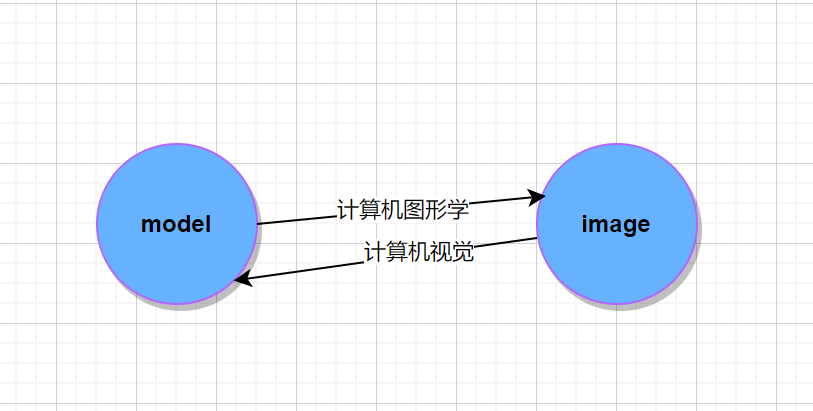

# 计算机图形学第一课
## 图形学基础
- 与现实世界的接口
- 理解物理世界的概念
- 新的计算方法，展示和技术
- 涉及`矩阵、光学、形体、动画、仿真`
## 相关主题
- 光栅化
- 曲线和曲面
- 光线追踪
- 动画和模拟
#### 什么是可视化？
把一些在三维空间中测量的信息，将其转换为视觉信息的过程；
1. 虚拟现实技术
2. 现实增强技术

#### 为什么学习计算机图形学？
涉及到工作中的opengl和shader;

### 光栅化
将维空间的几何形体显示在屏幕上；
### 计算机视觉 
（涉及理解，猜测，意义）

## 总结
+ 从model到图像的渲染过程是计算机图像学的主要内容
+ 从图像到model的过程是计算机视觉学习的主要内容

