# 阿里云中子域名配置
- 登录阿里云
- 搜索域名解析
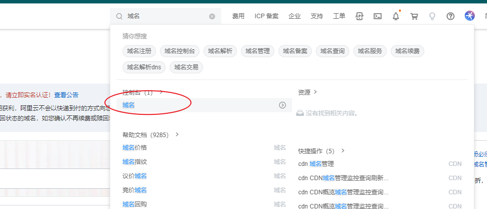
- 进入域名控制台
- 进入域名列表
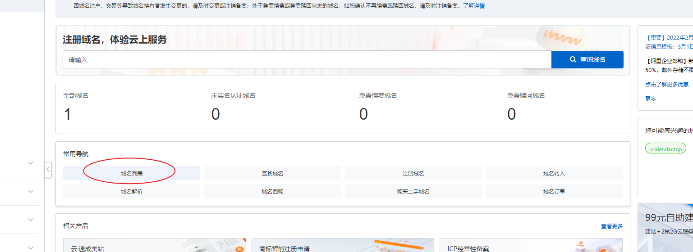
- 点击解析
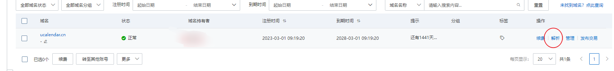
- 开始添加记录
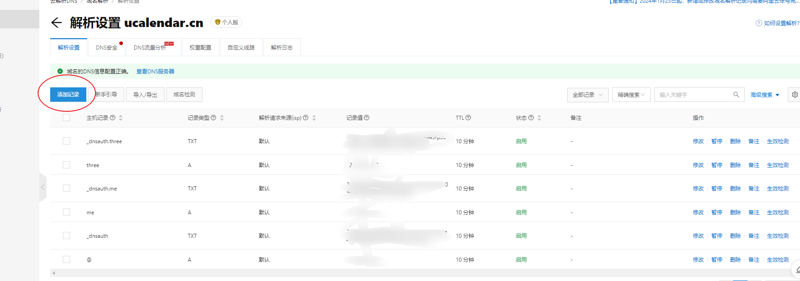
- 填写子域名信息
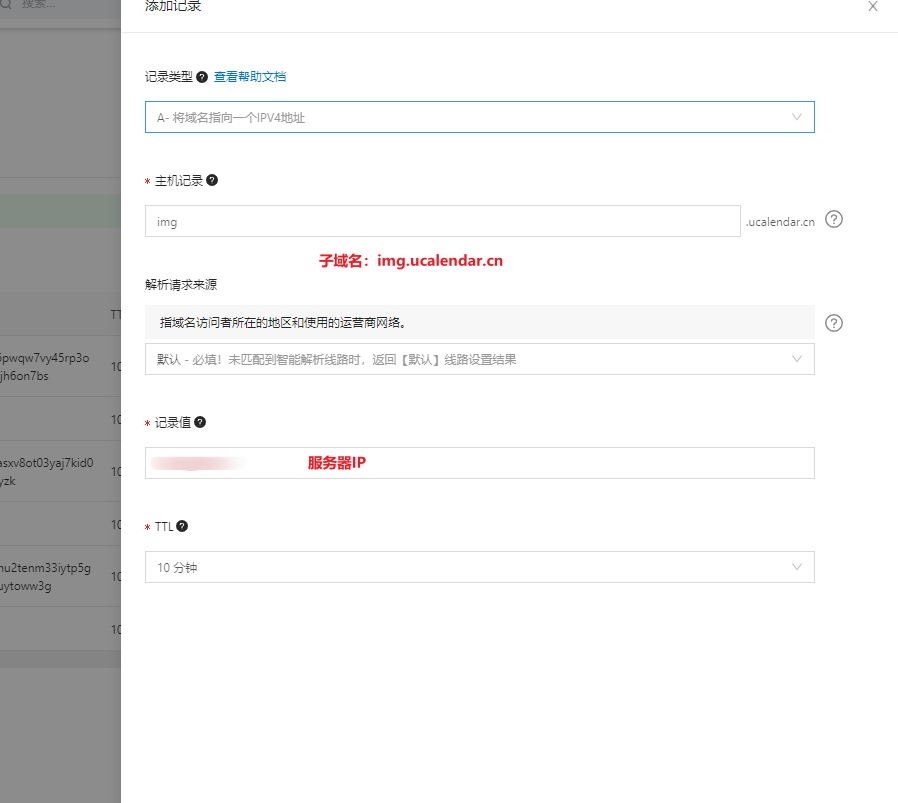

## 网站的部署
- https 证书的申请
- 搜索ssl，进入数字证书管理服务
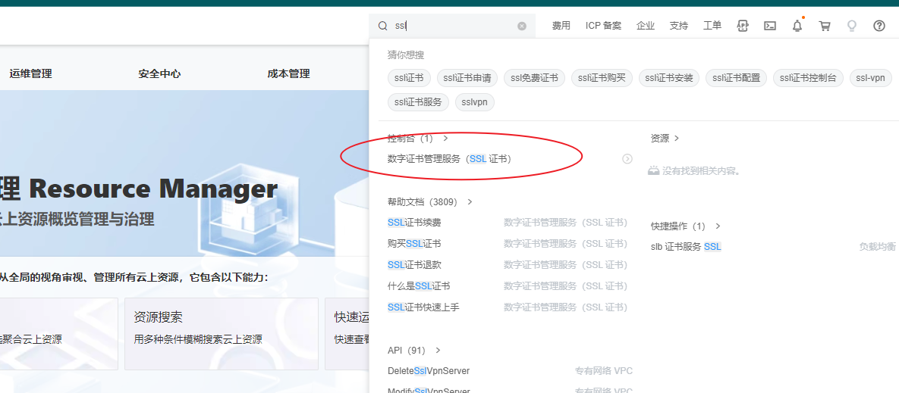
- 申请证书,依次点击1，2，3。（有些情况下需要购买免费证书）
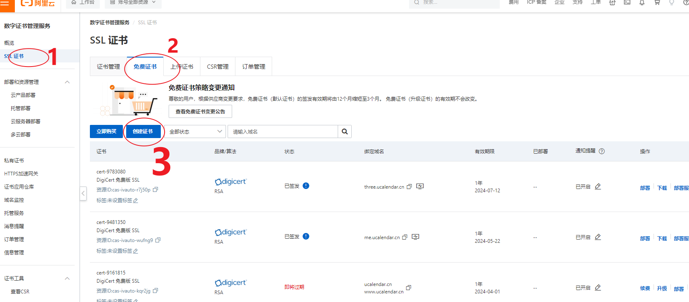
- 进入申请等待状态
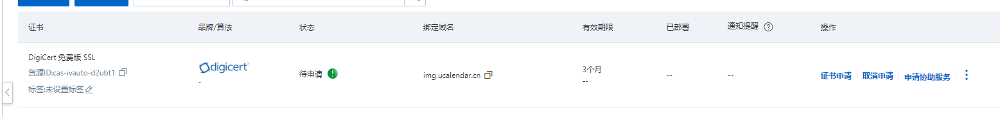
- 下载证书
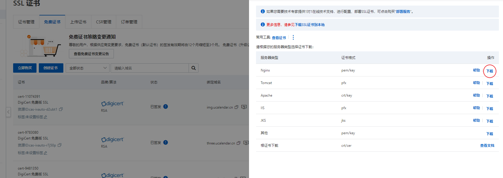
- 将证书放入文件夹
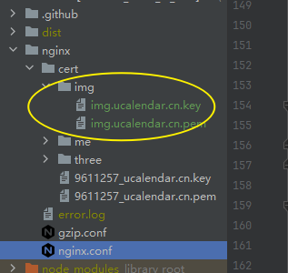
- 配置nginx

```text
 server {
               listen       443 ssl http2;
               server_name  img.ucalendar.cn;

               ssl_certificate      cert/img/img.ucalendar.cn.pem;
               ssl_certificate_key  cert/img/img.ucalendar.cn.key;

               ssl_session_cache    shared:SSL:1m;
               ssl_session_timeout  5m;

               ssl_ciphers  HIGH:!aNULL:!MD5;
               #表示使用的TLS协议的类型，您需要自行评估是否配置TLSv1.1协议。
               ssl_protocols TLSv1.1 TLSv1.2 TLSv1.3;
               ssl_prefer_server_ciphers  on;

               location / {
                   root   img;
                   index  index.html index.htm;
                   try_files $uri $uri/ /index.html;
               }
    }
```
- 替换nginx配置文件
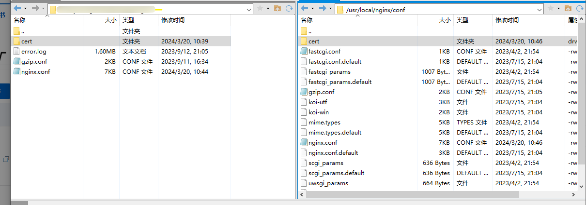
- 重启nginx，并访问网站
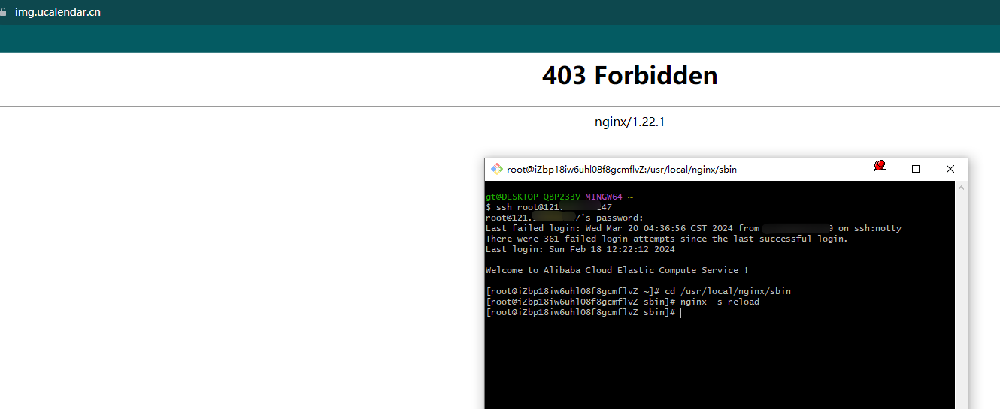
- 传入前端代码资源，再次访问
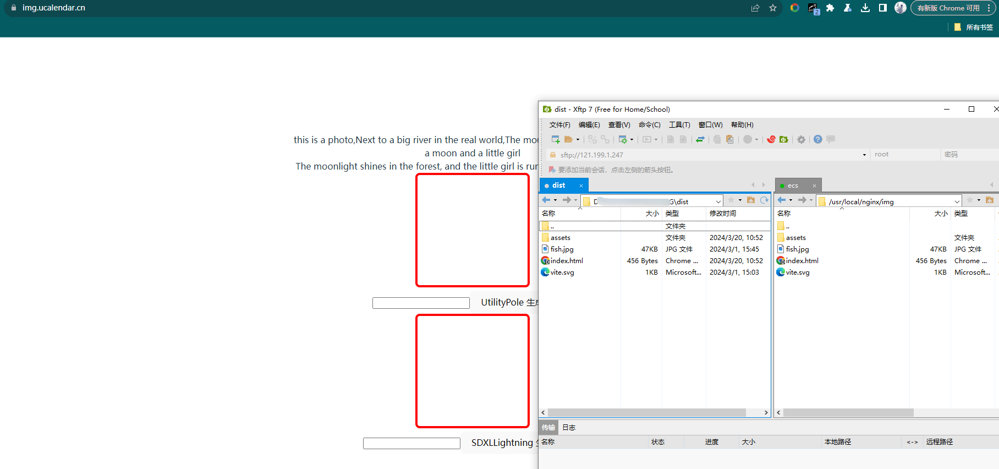

## 配置自动化部署流程
- 创建workflow
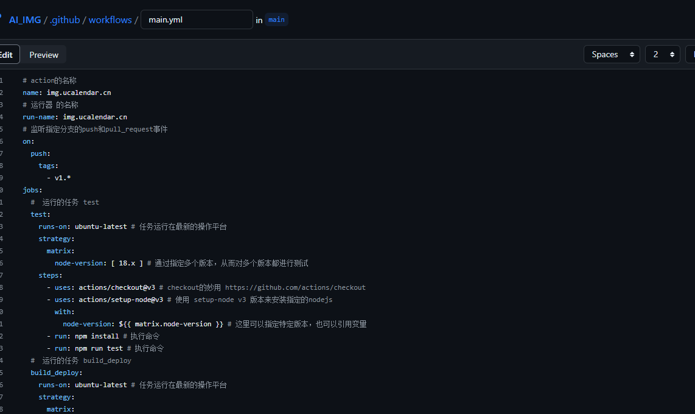
- 配置仓库的密钥（因为在workflow中，打包完成后需要上传文件到服务器主机上。所以需要配置用户名、主机IP、主机密码）
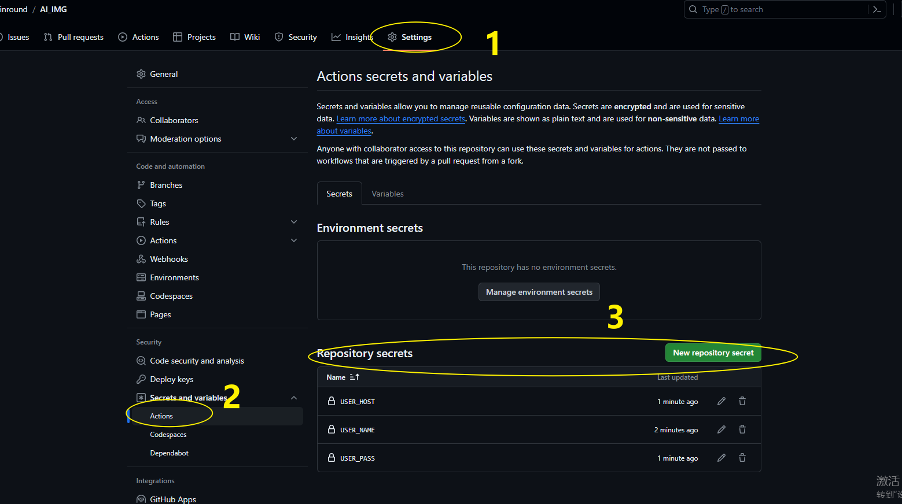
- 最终推送代码到仓库，触发workflow
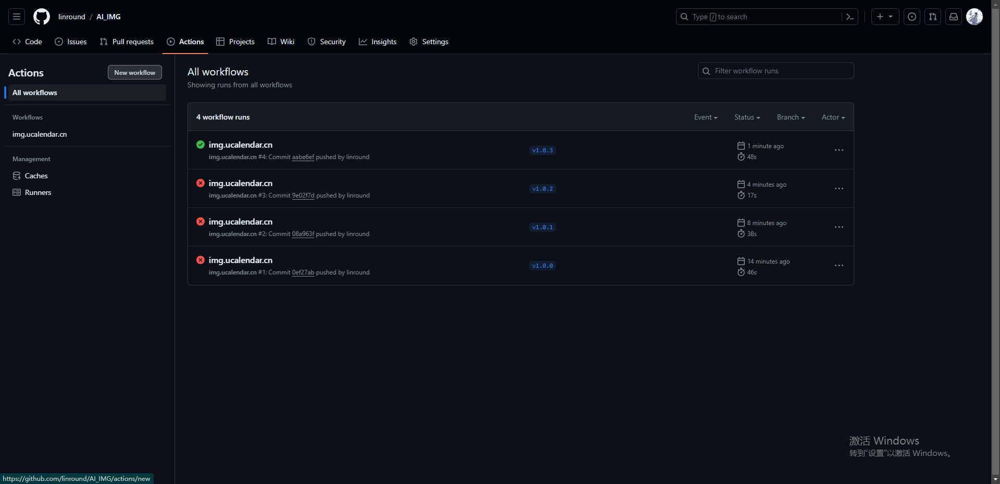

## 总结
- 在触发workflow中，会执行各种npm命令。在初始阶段在本地多测试几遍，来查看是否能够正常运行。从而避免在workflow中出现问题。
- 本次教程总共耗时2小时。
