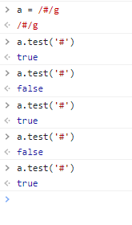
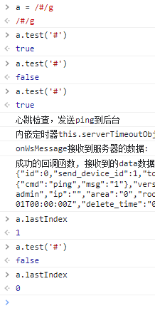

# 关于工作中的一些问题记录

## git 操作中的一些问题
- 关于在`webstorm`中`.gitignore`文件配置`失效`的问题   
[问题描述]()：本地在webstorm的.gitignore文件中配置dist文件夹不提交，但是每次commit的记录中却还是包含dist文件夹；   
[原因]()： .gitignore只能忽略未被track的文件，而git本地缓存。如果某些文件已经被纳入了版本管理中，则修改.gitignore是无效的。   
[解决方案]()：删除该文件夹

## 关于正则表达式的问题
[问题描述]()：
正则表达式执行结果一会儿为`false`、一会儿`true`
- 

[原因]()： [test()的执行改变了正则表达式lastIndex属性](https://blog.csdn.net/weixin_45337170/article/details/116599089)。连续的执行test方法，后续的执行将会从lastIndex处开始匹配字符串（exec()同样改变正则本身的lastIndex属性值）。

[解决方案]()：  
每次执行完成后清空`lastIndex`即可   



# 蔡勒公式求周几
```javascript
export function getWeekday (timestamp: CalendarTimestamp): number {
  // 蔡勒公式求具体一天的周几


  if (timestamp.hasDay) {
    const _ = Math.floor
    // 当天的日
    const k = timestamp.day
    // 月（m大于等于3，小于等于14，即在蔡勒公式中，
    // 某年的1、2月要看作上一年的13、14月来计算，比如2003年1月1日要看作2002年的13月1日来计算）
    const m = ((timestamp.month + 9) % MONTH_MAX) + 1
    // 世纪减1（年份前两位数）
    const C = _(timestamp.year / 100)
    // 年（后两位数）
    const Y = (timestamp.year % 100) - (timestamp.month <= 2 ? 1 : 0)
    return ((k + _(2.6 * m - 0.2) - 2 * C + Y + _(Y / 4) + _(C / 4)) % 7)
  }

  return timestamp.weekday
}
```
