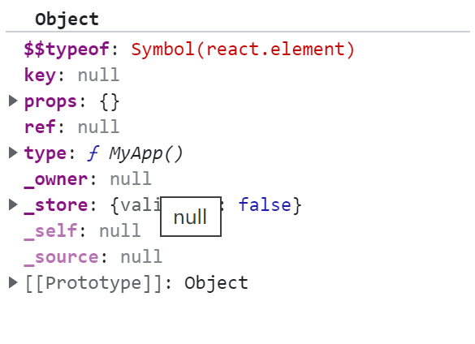

# createElementWithValidation


- 源码如下
```javascript
function createElementWithValidation(type, props, children) {
        
        var validType = isValidElementType(type); // We warn in this case but don't throw. We expect the element creation to
        // succeed and there will likely be errors in render.

        if (!validType) {
            var info = '';

            if (type === undefined || typeof type === 'object' && type !== null && Object.keys(type).length === 0) {
                info += ' You likely forgot to export your component from the file ' + "it's defined in, or you might have mixed up default and named imports.";
            }

            var sourceInfo = getSourceInfoErrorAddendumForProps(props);

            if (sourceInfo) {
                info += sourceInfo;
            } else {
                info += getDeclarationErrorAddendum();
            }

            var typeString;

            if (type === null) {
                typeString = 'null';
            } else if (isArray(type)) {
                typeString = 'array';
            } else if (type !== undefined && type.$$typeof === REACT_ELEMENT_TYPE) {
                typeString = "<" + (getComponentNameFromType(type.type) || 'Unknown') + " />";
                info = ' Did you accidentally export a JSX literal instead of a component?';
            } else {
                typeString = typeof type;
            }

            {
                error('React.createElement: type is invalid -- expected a string (for ' + 'built-in components) or a class/function (for composite ' + 'components) but got: %s.%s', typeString, info);
            }
        }
        var element = createElement.apply(this, arguments); // The result can be nullish if a mock or a custom function is used.
        // TODO: Drop this when these are no longer allowed as the type argument.

        if (element == null) {
            return element;
        } // Skip key warning if the type isn't valid since our key validation logic
        // doesn't expect a non-string/function type and can throw confusing errors.
        // We don't want exception behavior to differ between dev and prod.
        // (Rendering will throw with a helpful message and as soon as the type is
        // fixed, the key warnings will appear.)


        if (validType) {
            for (var i = 2; i < arguments.length; i++) {
                validateChildKeys(arguments[i], type);
            }
        }

        if (type === REACT_FRAGMENT_TYPE) {
            validateFragmentProps(element);
        } else {
            validatePropTypes(element);
        }

        return element;
    }
```

## createElementWithValidation 执行过程如下
- 检查元素是否合法（元素只能是标签或者函数类组件）
- 调用 createElement（this绑定的是React这个类）

## createElement
- ReactElement(type, key, ref, self, source, ReactCurrentOwner.current, props);
> type是函数组件；key、ref、self、source默认是空
## ReactElement



上图是React返回的基础的React元素；元素创建完成后，将元素传给render函数;执行[root.render](c.md)