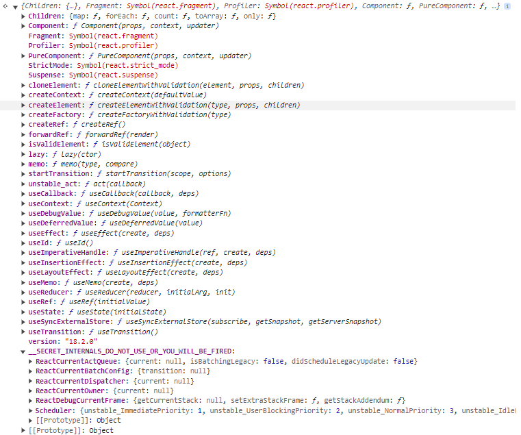
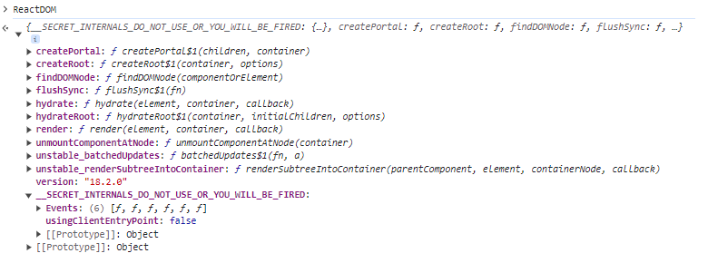
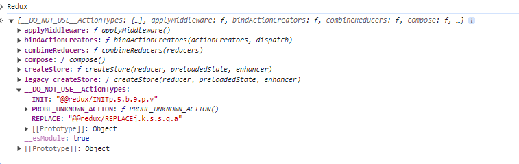

# react,reactDOM之间是什么样的关系？
- 引入 [react.development.js](./react.development.js)，react的相关属性如下：

- 引入[react-dom.development.js](./react-dom.development.js),reactDOM的属性如下：

- 引入 [redux.js](./redux.js),Redux的属性如下：

## React.createRoot  
构建 fiberRoot和rootFiber
fiberRoot的current 指向 rootFiber
 rootFiber的stateNode指向fiberRoot
fiberRoot中包含了 updateQueue 属性
updateQueue 包含了一些更新状态相关的值


-[x] container,挂载到页面的容器元素 
-[ ] options
  -[ ] unstable_strictMode
  -[ ] identifierPrefix
  -[ ] onRecoverableError
  -[ ] transitionCallbacks
```javascript
function createRoot$1(container, options) {
    {
      if (!Internals.usingClientEntryPoint && !true) {
        error('You are importing createRoot from "react-dom" which is not supported. ' + 'You should instead import it from "react-dom/client".');
      }
    }

    return createRoot(container, options);
  }
```
## 关于FiberRootNode方法
```javascript
function FiberRootNode(containerInfo, tag, hydrate, identifierPrefix, onRecoverableError) {
    // 两种应用启动模式： legacy 模式；Concurrent 模式  
    this.tag = tag; 
    this.containerInfo = containerInfo; // 根容器节点元素
    this.pendingChildren = null;
    this.current = null;
    this.pingCache = null;
    this.finishedWork = null;
    this.timeoutHandle = noTimeout;// 默认-1
    this.context = null;
    this.pendingContext = null;
    this.callbackNode = null;
    this.callbackPriority = NoLane; // 默认0
    this.eventTimes = createLaneMap(NoLanes);// 创建一个数组
    this.expirationTimes = createLaneMap(NoTimestamp); // NoTimestamp 默认-1
    this.pendingLanes = NoLanes;// 进行中的车道
    this.suspendedLanes = NoLanes;// 暂停车道
    this.pingedLanes = NoLanes;// 被探测的车道
    this.expiredLanes = NoLanes;// 过期的车道
    this.mutableReadLanes = NoLanes;// 可变读取通道
    this.finishedLanes = NoLanes;
    this.entangledLanes = NoLanes;// 纠缠车道
    this.entanglements = createLaneMap(NoLanes);
    // React 为 React 生成的 id 使用的可选前缀。
    // useId . 当在同一页面使用多个根时，可用于避免冲突。必须与服务器上使用的前缀相同
    this.identifierPrefix = identifierPrefix;

    this.onRecoverableError = onRecoverableError;

    {
      this.mutableSourceEagerHydrationData = null;
    }

    {
      this.effectDuration = 0;
      this.passiveEffectDuration = 0;
    }

    {
      this.memoizedUpdaters = new Set(); // 记忆更新器
      var pendingUpdatersLaneMap = this.pendingUpdatersLaneMap = [];

      // TotalLanes 默认31
      for (var _i = 0; _i < TotalLanes; _i++) {
        pendingUpdatersLaneMap.push(new Set());
      }
    }

    {
      switch (tag) {
        case ConcurrentRoot:
          this._debugRootType = hydrate ? 'hydrateRoot()' : 'createRoot()';
          break;

        case LegacyRoot:
          this._debugRootType = hydrate ? 'hydrate()' : 'render()';
          break;
      }
    }
  }
```
- this.tag; 两种应用启动模式： legacy 模式；Concurrent 模式 

## ReactDOMRoot
ReactDOMRoot的原型链上具有render和unmount方法，这里调用的就是该render方法
```javascript
 const root = ReactDOM.createRoot(document.getElementById("root"),{
    identifierPrefix:'my_code_test'
  })
  // ReactDOMRoot的原型上具有render方法
  root.render(<Example />);
```
