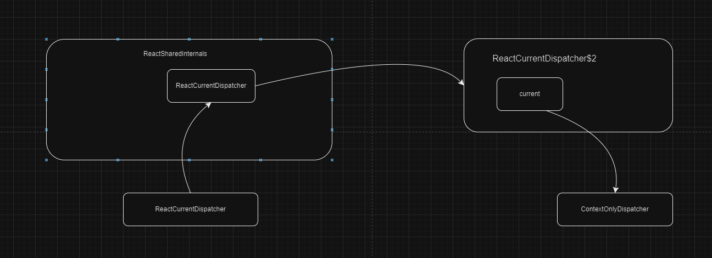

# useState
示例代码： [链接](./index.html)

`useState` 是一个react 钩子，用于在函数组件中添加状态。

```javascript
const [state, setState] = useState(initialState)
```
- 使用
  - 添加状态
  - 基于前一个状态的更新
  - 更新数组或对象时，需要手动合并更新
  - 避免初始状态的重建
  - 使用 key 值来设置状态
  - 存储之前的渲染信息

## 源码解读
- setState 是异步的。
- setState 可以接收一个函数，这个函数的参数时prevState,返回值是新的state。
## dispatcher 的指向关系

### useState 的实现是什么呢？
- scheduleUpdateOnFiber ，进入更新
- 创建 更新任务，放入taskQueue 中。
- renderRootSync。进行同步渲染。
- pushDispatcher,(只会在开始的时候放置一次，以便后续的 子组件可以访问)。 首先 放置 ContextOnlyDispatcher，在一个全局对象 ReactCurrentDispatcher$2(实际就是 ReactCurrentDispatcher)上
- 创建根 fiber ,并设置为 workInProgress。
- 进入 workLoop,beginWork
- 进入函数组件，此时即可从 ReactCurrentDispatcher获取  ContextOnlyDispatcher
- 使用useState 钩子，在 mountState 函数中，获取当前的 fiberNode ,并创建 包含fiber 的 disPatchState 函数，然后返回状态和 disPatchState 函数。
- disPatchState 函数 由于获取了fiberNode和 lastRenderedState 等属性,所以可以精准的更新 组件。
- lastRenderedState 会在每次更新时，保存上一次的状态。
### 当多个useState 调用时，执行情况是怎样的呢？
- currentlyRenderingFiber$1.memoizedState 会创建一个hookState链表
### 当多个setState调用时，执行情况是怎样的呢？
- 调用第一个 setState时，可以获取到 当前fiberNode 和 lastRenderedState
- queue 被放在 concurrentQueue 中。
- 将新的 update 放在 queue.interleaved,多个setState会放在 concurrentQueues 中
- 会创建一个微任务执行更新，但是继续同步的执行另外的setState。所以因为setState 在处理值的时候是同步的，但是更新 函数组件时 是异步的。所以
  如果一个setState 执行更新多次，该setState函数始终是上一次创建的，所以访问的状态也始终是上一次的。 
- disPatcher 的起点是 fiberRootNode,在向下更新时，会判断子fiber 是否需要更新（`attemptEarlyBailoutIfNoScheduledUpdate 函数`），如果不需要更新就不会重新执行函数组件，而直接进入下一个孙fiber.
- disPatcher 传入的fiber的作用就是能够获取之前的状态数据，形成state 链表,并且精准标记 该fiber 需要更新
### 是如何 使用setState 标记 fiber 可更新的呢？
- 因为触发了事件，那么就会存在一个 任务。有可能是更新、动画等。那么就可以标记了
- 状态值改变，进入 enqueueConcurrentHookUpdate ，对fiber 进行标记。
## updateState 的过程
### 两个新的state链表是如何进行更新的呢？
- concurrentQueues 中 interleaved属性值转移至 pending
### currentHook 在 mountState 和 updateState 中的作用是什么呢？


## 总结
### 创建时
- 将fiber 放在全局，创建绑定该fiber 的 disPatcher 方法

### 更新时
- 调用之前创建的 disPatcher 方法，此时获取状态信息。状态变化，对fiber 进行更新的标记，并进入从root fiber 开始的更新过程，在更新过程中会跳过没有被标记的组件。
- 如果 disPatcher 方法 没有改变，那么就不会对fiber 进行更新标记，更不会进入更新过程。
- disPatcher 方法调用,会在对应的fiber queue上创建对应的 pending 值，然后在组件渲染渲染的获取该 pending 值即可
- 多个disPatcher 同时调用
  - dispatchSetState，enqueueConcurrentHookUpdate，scheduleUpdateOnFiber，ensureRootIsScheduled，scheduleSyncCallback
  - scheduleSyncCallback，传递一个 performSyncWorkOnRoot 函数，参数是root。该函数放入了 syncQueue。
  - state 的pending 
### state 的形成和渲染调用的 联系
- 渲染被放在了微任务中，disPatcher 方法是同步的，多个disPatcher 方法调用，而渲染时，会根据state链表，进行更新。
disPatcher 方法调用完成后就会进入渲染函数的调用。
- 实际就是 state的pending状态是同步设置的，通过一个微任务触发 从根fiber的一个更新，
  在更新过程中，会获取到 state的pending 状态的值。最终进行渲染
