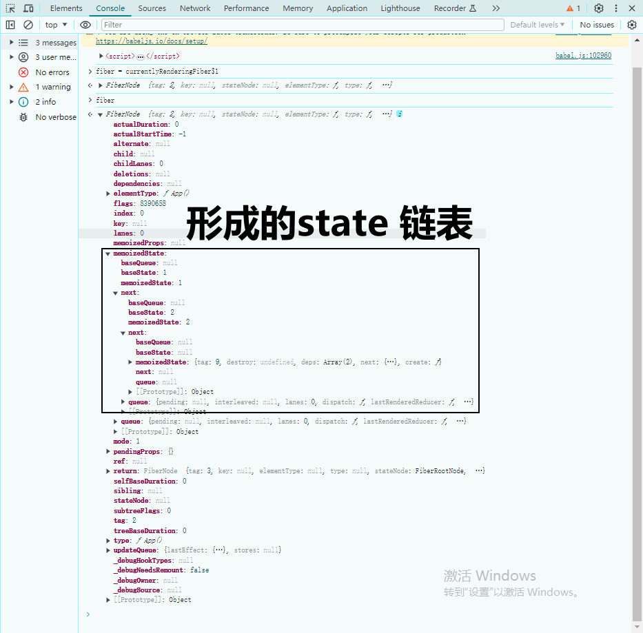
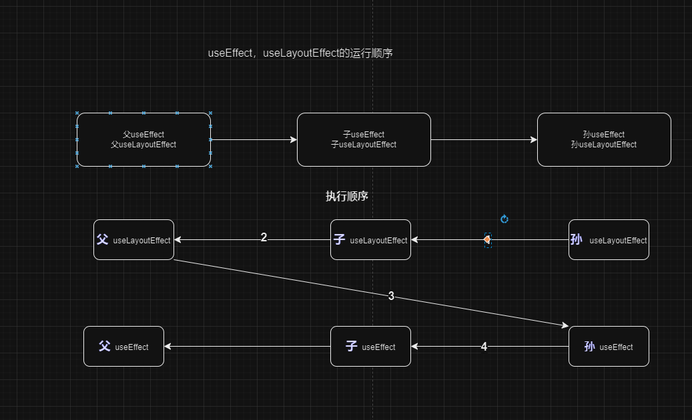

# useEffect

useEffect 相当于 vue 中的 watch。

```javascript
useEffect(setup, dependencies?)
```


## 使用

- useEffect 可以用来与外部系统建立相应的连接。[也就是能够很好的进行解耦](https://react.dev/reference/react/useEffect#examples-connecting)
- 在使用useEffect 的时候，注意消除请求的条件竞争。参考[这里](https://react.dev/reference/react/useEffect#fetching-data-with-effects)
- 基于前一个状态进行更新。传递一个更新函数，从而减少依赖得传递。参考[这里](https://react.dev/reference/react/useEffect#updating-state-based-on-previous-state-from-an-effect)
## 可能出现的问题
- 在严格模式下，useEffect 会执行两次
- useEffect 无限循环执行的问题
  - 在useEffect 中，更新了某个依赖
  - 状态导致了重复渲染，渲染时导致了 useEffect 依赖的改变

## 关于自定义钩子的示例

## 源码分析
### useEffect 函数是怎样的呢？


在函数组件App 调用的时候。如果存在钩子调用 首先会 对 workInProgressHook进行赋值。
对于多个钩子，会形成 workInProgressHook 链表。在当前这个 hook.memoizedState 中存储当前 effect，
effect包括了deps,create,和 destroy(初始是 undefined)。继续在 当前 fiber 的updateQueue中创建 effect 链表。

整个过程就是 workLoop会 不断地从 taskQueue 中取出任务，然后执行任务。然而在渲染过程中 遇到useEffect 会创建一个新任务，放在taskQueue中。


以上是`两个 useState `和`一个 useEffect` 形成的 memoizedState 链表。


- 执行 mountEffect.
- 传入的参数 callback 会被放在 taskQueue 中
- 调用函数
  - commitRoot
  - commitRootImpl
    - 在任务队列中添加一个 调用flushPassiveEffects 的 函数
  - flushPassiveEffects (被放在了任务队列中)
  - flushPassiveEffectsImpl 
  - commitPassiveMountEffects 
  - commitPassiveMountEffects_begin
    - 找到被标记的 fiber
  - commitPassiveMountEffects_complete
  - commitPassiveMountOnFiber
  - commitHookEffectListMount
    - 获取 effect 的 create函数。
    - 执行 create 函数,并获取返回值。返回值作为 destroy 函数，这个时候destroy 函数相当于闭包，此时可以缓存了上一次的相关数据。
    - 这里的 effect 是从 fiber.updateQueue 中获取的。


### 条件竞争的形成和解决方法是什么？
源码示例参考[这里](./raceConditions.html)
### useEffect 执行时机是什么时候，为什么 通过useEffect 可以访问真实DOM？
useEffect 中的函数实在DOM挂载到页面上之后才执行的

### 基于 useEffect 的自定义钩子，此时的fiber 来源是什么？

代码参考：[链接](./customHook.html)  

此时 fiber 的来源是通过访问一个全局的 currentlyRenderingFiber$1 来获取的。

### useEffect 和 useLayoutEffect 的区别是什么？
- useEffect、useLayoutEffect 中都可以访问真实的DOM。
- useLayoutEffect 会比 useEffect 先执行。

### useEffect 相对于 渲染是异步的；useLayoutEffect 是同步的。所以 useEffect 有可能造成页面显示闪烁的问题？为什么 useLayoutEffect 会阻塞渲染，而useEffect 没有阻塞渲染呢？

- 首先是执行 commitLayoutEffects，在此会执行useLayoutEffect的相关回调；然后 useEffect 由于是被放在任务队列中，所以才会在之后执行。
- 两者都会 在 commitHookEffectListMount 中调用 回调。
### useEffect 未传递参数时，会执行多次吗？

- 当未传递参数时，useEffect 在组件的每次渲染都会执行。这和 useCallback 是一样的。
- 当传递空数组的时候，useEffect 指挥执行初始的这一次。

### setState 执行时，useEffect 执行时机是什么时候呢？

setState 执行后，state 的pending状态就绪后。然后执行从rootFiber 执行渲染,这个时候 useEffect
的依赖就会重新获取，如果依赖发生了变化，那么就会重新执行useEffect。

### 子级 useEffect,父级useEffect，子级useLayoutEffect,父级useLayoutEffect 的执行顺序是怎样的呢？


## 总结
useEffect 会放在 updateQueue 中（多个形成链表）；useState会放在memoizedState中（多个形成链表）。

hook 对象会创建自己的memoizedState，然后在fiber.updateQueue中创建effect链表。

fiber 也有自己的 memoizedState，用来存储当前的 useState 链表、


useEffect 的调用是通过 workLoop 在调度 任务 来执行的。useLayoutEffect,则和任务队列无关。

因为在渲染执行过程中  useEffect 是放在了任务队列中（排渲染函数后），而 useLayoutEffect,是在当前渲染函数执行时，首先在fiber.updateQueue 中创建了 effect,
然后等DOM挂载完了直接执行。


### workLoop 的作用
- 可以接收一开始 fiberRoot，从而进入渲染流程 
- 可以接收 useEffect 的回调

