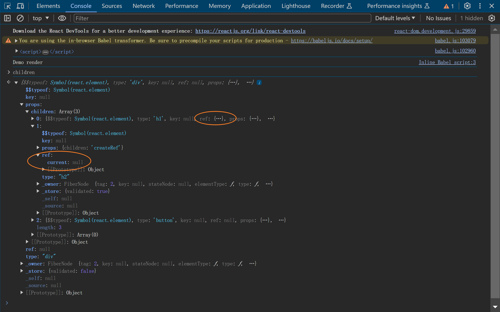

# useRef

- useRef 存储得大都是与界面渲染无关的信息
## 说明
- 可以改变 `ref.current` 属性。
- 当改变` ref.current`属性的值时，react 不会重新渲染该组件，因为 ref 是一个复杂的对象。
- 不要在初始渲染时读写 `ref.current`。这样会造成组件不可预测的行为。

## 关于hooks链表
 在初始阶段，只要调用了 mountWorkInProgressHook 就会形成链表。

调用 mountWorkInProgressHook 的钩子函数包括 mountMemo、mountCallback、
mountRef、mountState、useEffect、useLayoutEffect。因此以上的函数都会形成在一个链表上。
该链表保存在 memoizedState 属性上。

然而 createRef 的值，是不存在该链表上的。

### createRef 与 useRef 的区别
- 现象
  - useEffect 的依赖是 useRef 创建的 ref 对象，当组件更新时，useEffect 不会重新执行。
  - useEffect 的依赖是 createRef 创建的 ref 对象，当组件更新时，useEffect 会重新执行。
  - 初始的时候 createRef 不需要传入初值。因为传入的初值是不会用到的
- 原因
  - 在更新的时候，useRef 是从 链表上获取的旧的ref对象；而 createRef 每次都会重新执行创建一个新的 ref 对象。
  - 在 React 框架中 useRef 在初始化时调用的 mountRef 函数，在更新时调用的是 updateRef；
  - 在 React 框架中 createRef 在初始化和更新时都调用的同一个 createRef。因此不区分初始和更新的情况。
- 与 useEffect 和 useLayoutEffect 结合使用
  - 因为 useEffect 和 useLayoutEffect 都是在dom 形成之后执行的，所以在两者传入的回调中都可以访问 真实DOM
### forwardRef 的作用是什么？
forwardRef 是一个高阶函数，用于将 ref 属性转发给子组件。

- 父组件创建了一个 ref,并将其传递给子组件。
- 子组件是由 forwardRef 创建的一个函数组件。
- forwardRef 会将 ref 属性转发给子组件。
  - 通过测试，普通组件中的ref 是一个对象.但是不会被赋值
  - forwardRef 创建的函数组件，render 函数的第二个参数 ref 会被赋值 真实DOM
  - 问题来了，父组件 使用props 传递的 ref,是如何转发给 函数组件的第二个函数，赋值后却没有影响到 组件props的 ref 呢？
  - 组件本省具有正常的props ref 属性。 但是在forward 创建的函数组件中，是如何进行转发的呢？
### ref.current 赋值的时机是什么
- 创建 forwardRef 创建的函数组件的 fiberNode 时，element 的 ref 赋值给 fiberNode的 ref 属性
- 普通的函数组件 的 ReactElement 的 ref 属性时null。 
- 若给组件传递了 ref,搞ref 属性在 reconcileSingleElement 函数中，都会赋值给 fiberNode 的 ref属性。
- forwardRef 创建的 fiberNode 保存了这个 ref 属性 
- 进入 forwardRef 创建的 fiberNode(作为workInProgress) 的beginWork 函数中
- beginWork 函数 返回的 workInProgress 的child.
- 这个时候就会执行 之前传递给 forwardRef 的函数的函数组件。
- 执行 updateForwardRef，取得 workInProgress 的 render 函数 最为组件进行执行，创建子fiberNode
- 此时进入 renderWithHooks,只不过 使用 render 函数作为了 Component 。
- 将ref的引用传递给了 子ReactElement 的 ref 属性。

- 总结
  - forwardRef 创建了一个特殊的组件，该组件存在一个render 函数，这个render 函数
  接收的第二个参数是父级传递下来的ref 对象的引用。 此时在子组件中直接使用 该引用对象。
  通过对该引用对象的赋值，就可以将真实的子组件的DOM传递给 父组件了。

- commitAttachRef
  
  在 commitAttachRef 中会根据情况对 ref.current 进行赋值
- commitLayoutEffectOnFiber

- ref 在 ReactNode 中是一个属性，而不是props子属性 。ref 与 props 同级；

- useEffect 是在形成 effect 链表。dom 挂载后就会调用 effect 链表中的回调函数

那么 ref.current 调用情况如下：（从内到外的顺序）

- commitAttachRef
- commitLayoutEffectOnFiber
- commitLayoutMountEffects_begin
  - 对于普通DOM 形成的 fiberNode 会根据情况对 ref.current进行赋值。
  - 对于 函数组件形成的 fiberNode 会触发 useLayoutEffect 链表的回调函数。
- commitLayoutMountEffects_complete(从内部FiberNode往外为 ref.current进行赋值)
- commitLayoutEffects_begin.(进入到最内部的那个FiberNode)
- commitLayoutEffects （此处执行完成了 layoutEffect 回调函数）

- commitRootImpl
- commitRoot

## 总结
- useRef 属于 hooks 的一种。其创建的对象会被链接到effect 链表中。所以在更新的时候是从链表中获取，从而保持了对象不变
- createRef 在初次和更新的时候都会创建一个新的对象。
- 两者创建的对象都会被放在 ref 属性中，ref.current 会在 整个dom 挂载到页面后，调用 commitLayoutEffects 的时候为 ref.current 赋值。
- forwardRef 是一个高阶函数，用于将 ref 属性转发给子组件。
