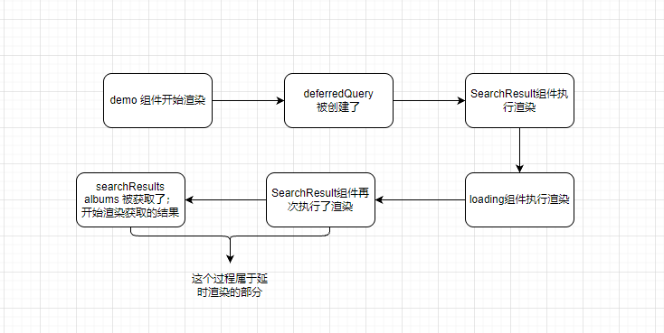

# useDeferredValue 

useDeferredValue 允许延迟更新一部分UI。

## 作用
- 在加载状态中显示旧的内容。
- 表明内容已经过时。
- 延迟部分 UI 的重新渲染。

## 注意点
- 在一个过渡的更新中，useDeferredValue 总是会返回一个新的值；不会产生延迟渲染，因为更新已经被延迟了。
- 传递给 useDeferredValue的值应该是原始的数据类型(string 或 number),也可以是渲染函数外部的对象。如果在渲染时创建一个对象，并且立刻传递给 useDeferredValue，这个对象在每次渲染时都是不同的值，导致不必要的重复渲染。
- 如果用户输入速度快于接收其延迟值的重新渲染的速度，只会在用户停止输入后重新渲染。
- useDeferredValue 与Suspense集成，如果新值的后台更新暂停了用户界面，用户将看不到回退值。用户会看到 fallback 的值，直到数据加载完毕。
- useDeferredValue 自身不会阻止额外的网络请求。
- useDeferredValue 本身不会造成固定的延迟。只要React 完成原始的重新渲染，React就会立即开始使用新的延迟值进行后台重新渲染。

## 场景描述
在用户输入的场景下
- 首次渲染时，显示 fallback 的 loading 组件。
- 用户第一次输入，延迟了一段时间后`（延迟期间显示的初始的内容）`，显示新的内容`（初始的内容+第一次输入的值）`。
- 用户第二次输入，延迟了一段时间后`（延迟期间显示的初始的内容+第一次输入的内容）`，显示新的内容`（初始的内容+第一次输入的内容+第二次输入的值）`。

### 提出问题
- 这期间的延迟时长是怎么确定的呢？

## useDeferredValue 的使用

使用useState 创建数据A，对数据A 使用 useDeferredValue 进行延迟更新。 
然后将数据A传递给 SearchResults 组件，此时由于 数据A 的更新是延迟的，所以 SearResults 组件的更新渲染也是延迟的。

在示例中，input 组件中query 值是立即发生了更新；SearchResults组件传入了 deferredQuery;
此时 SearchResults 组件的更新渲染是延迟的。

###  分析

useDeferredValue 不会立即返回新的值，会等到上次返回的新结果处理完才会继续返回。在useDeferredValue的返回新结果之间，并不会影响父组件的渲染，也就避免了父组件中部分的卡顿问题。

## 在初始渲染阶段 useDeferredValue 的使用
创建了一个hook，该 hook.memoizedState 就是传递给 useDeferredValue 的值。

