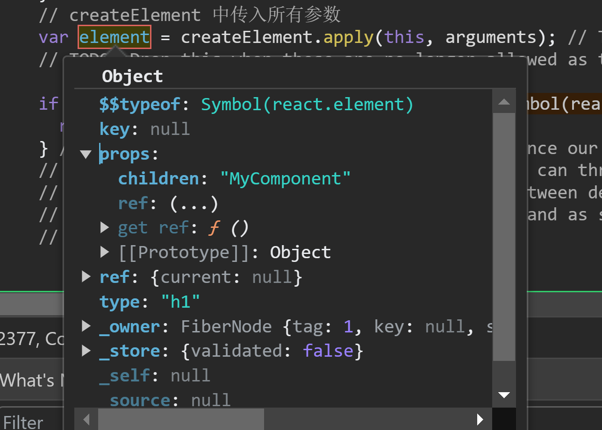

# React.createElement函数的作用
## 源码部分
```javascript
exports.createElement = createElement$1;
var createElement$1 =  createElementWithValidation 
```
在这里传入参数
- type 
- props
- children
以上虽然只有三个参数，但实际可传入三个以上的参数

```javascript
function createElementWithValidation(type, props, children) {
    var validType = isValidElementType(type); // We warn in this case but don't throw. We expect the element creation to
    // succeed and there will likely be errors in render.

    if (!validType) {
        var info = '';

        if (type === undefined || typeof type === 'object' && type !== null && Object.keys(type).length === 0) {
            info += ' You likely forgot to export your component from the file ' + "it's defined in, or you might have mixed up default and named imports.";
        }

        var sourceInfo = getSourceInfoErrorAddendumForProps(props);

        if (sourceInfo) {
            info += sourceInfo;
        } else {
            info += getDeclarationErrorAddendum();
        }

        var typeString;

        if (type === null) {
            typeString = 'null';
        } else if (isArray(type)) {
            typeString = 'array';
        } else if (type !== undefined && type.$$typeof === REACT_ELEMENT_TYPE) {
            typeString = "<" + (getComponentNameFromType(type.type) || 'Unknown') + " />";
            info = ' Did you accidentally export a JSX literal instead of a component?';
        } else {
            typeString = typeof type;
        }

        {
            error('React.createElement: type is invalid -- expected a string (for ' + 'built-in components) or a class/function (for composite ' + 'components) but got: %s.%s', typeString, info);
        }
    }

    var element = createElement.apply(this, arguments); // The result can be nullish if a mock or a custom function is used.
    // TODO: Drop this when these are no longer allowed as the type argument.

    if (element == null) {
        return element;
    } // Skip key warning if the type isn't valid since our key validation logic
    // doesn't expect a non-string/function type and can throw confusing errors.
    // We don't want exception behavior to differ between dev and prod.
    // (Rendering will throw with a helpful message and as soon as the type is
    // fixed, the key warnings will appear.)


    if (validType) {
        for (var i = 2; i < arguments.length; i++) {
            validateChildKeys(arguments[i], type);
        }
    }

    if (type === REACT_FRAGMENT_TYPE) {
        validateFragmentProps(element);
    } else {
        validatePropTypes(element);
    }

    return element;
}
```
将传入的所有参数传入createElement函数
```javascript
var element = createElement.apply(this, arguments);
```

```javascript

function createElement(type, config, children) {
    var propName; // Reserved names are extracted

    var props = {};
    var key = null;
    var ref = null;
    var self = null;
    var source = null;

    if (config != null) {
        if (hasValidRef(config)) {
            ref = config.ref;

            {
                warnIfStringRefCannotBeAutoConverted(config);
            }
        }

        if (hasValidKey(config)) {
            {
                checkKeyStringCoercion(config.key);
            }

            key = '' + config.key;
        }

        self = config.__self === undefined ? null : config.__self;
        source = config.__source === undefined ? null : config.__source; // Remaining properties are added to a new props object

        for (propName in config) {
            if (hasOwnProperty.call(config, propName) && !RESERVED_PROPS.hasOwnProperty(propName)) {
                props[propName] = config[propName];
            }
        }
    } // Children can be more than one argument, and those are transferred onto
    // the newly allocated props object.


    var childrenLength = arguments.length - 2;

    if (childrenLength === 1) {
        props.children = children;
    } else if (childrenLength > 1) {
        var childArray = Array(childrenLength);

        for (var i = 0; i < childrenLength; i++) {
            childArray[i] = arguments[i + 2];
        }

        {
            if (Object.freeze) {
                Object.freeze(childArray);
            }
        }

        props.children = childArray;
    } // Resolve default props


    if (type && type.defaultProps) {
        var defaultProps = type.defaultProps;

        for (propName in defaultProps) {
            if (props[propName] === undefined) {
                props[propName] = defaultProps[propName];
            }
        }
    }

    {
        if (key || ref) {
            var displayName = typeof type === 'function' ? type.displayName || type.name || 'Unknown' : type;

            if (key) {
                defineKeyPropWarningGetter(props, displayName);
            }

            if (ref) {
                defineRefPropWarningGetter(props, displayName);
            }
        }
    }

    return ReactElement(type, key, ref, self, source, ReactCurrentOwner.current, props);
}
```
以上四个部分适合调用createElement部分相关的代码，createElement最终返回的时一个ReactElement
- 在createElement函数中使用得到了所有的子元素;下面这段代码来源于createElement函数
- 可以看到当只有一个子元素时props.children是一个对象，多个子元素时props.children是一个数组
```javascript

    var childrenLength = arguments.length - 2;

    if (childrenLength === 1) {
        props.children = children;
    } else if (childrenLength > 1) {
        var childArray = Array(childrenLength);

        for (var i = 0; i < childrenLength; i++) {
            childArray[i] = arguments[i + 2];
        }

        {
            if (Object.freeze) {
                Object.freeze(childArray);
            }
        }

        props.children = childArray;
    }
```
- 关于
```javascript
  var key = null;
  var ref = null;
```
ref,key即作为ReactElement的一级属性，也作为其一级属性props的属性
在createElement器件访问ref会直接报错，ref是一个get属性;所以对于ref的访问需要在一个适当的时机去访问
- 在componentDidMount生命周期中访问ref
- 使用useEffect 来监听ref的变化

