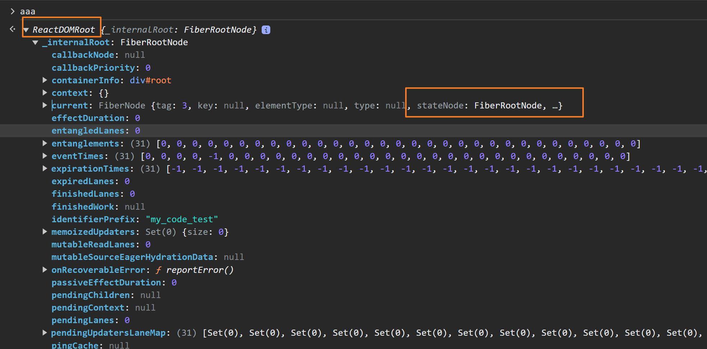
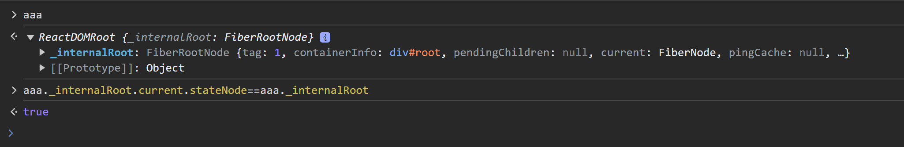

# 双缓存技术
在React中，DOM的更新采用了双缓存技术，双缓存技术致力于更加快速的DOM更新。

- 什么是双缓存？  
例如：使用canvas绘制动画，在绘制每一帧之前都需要清除上一帧的画面，清楚上一帧就会花费时间。
如果当前帧画面计算量较大，那么就会造成又花费更多的时间；这就导致上一帧的清除到下一帧显示中间会有较长的间隙，就会出现白屏；
- 如何解决白屏？  
为了解决这个问题，可以在内存中绘制当前帧，绘制完成后直接用当前帧替换上一帧的画面，这样在整画面替换过程中就会节约很多时间；
从而避免白屏的出现。这种在内存中构建并替换的技术叫做双缓存。
- React使用双缓存技术
React使用双缓存技术完成Fiber树的构建和替换，实现DOM的快速更新   
在React中最多会同时存在两个Fiber树，当前在屏幕中现实的内容对应的Fiber树叫做CurrentFiber,当发生更新时，React
会在内存中重新构建一颗新的Fiber树，这颗正在构建的Fiber树叫做 workInProgress Fiber树。在双缓存技术中，workInProgress Fiber树
就是即将要显示在页面中的Fiber树，当着可Fiber树构建完成后，React会使用它直接替换 Current Fiber树达到快速更新DOM的目的。一旦 workInProgress Fiber树
在屏幕中呈现，他就会变成CurrentFiber树    
 在current Fiber节点有一个alternate 属性指向对应的 workInProgress Fiber节点，在 workInProgress Fiber节点中有一个alternate属性指向 对应的
current Fiber 节点对象；

## 区分 fiberRoot与rootFiber

- fiberRoot表示 Fiber数据结构对象，是Fiber数据结构中的最外层的对象
- rootFiber 表示组件挂载点对应的Fiber对象,比如React应用中默认的组件挂载点就是id为root的div
- fiberRoot包含rootFiber,在fiberRoot对象中有一个current属性，存储rootFiber
- rootFiber 指向 fiberRoot,在rootFiber中有一个stateNode属性，指向fiberRoot
在react中FiberRoot只有一个，而rootFiber可以有多个，因为render方法可以调用多次，fiberRoot会记录应用的更新信息，比如协调器
在完成工作后，会将工作结果存储在fiberRoot中

##  ReactDOM.createRoot
这里创建的是一个fiberRoot节点

