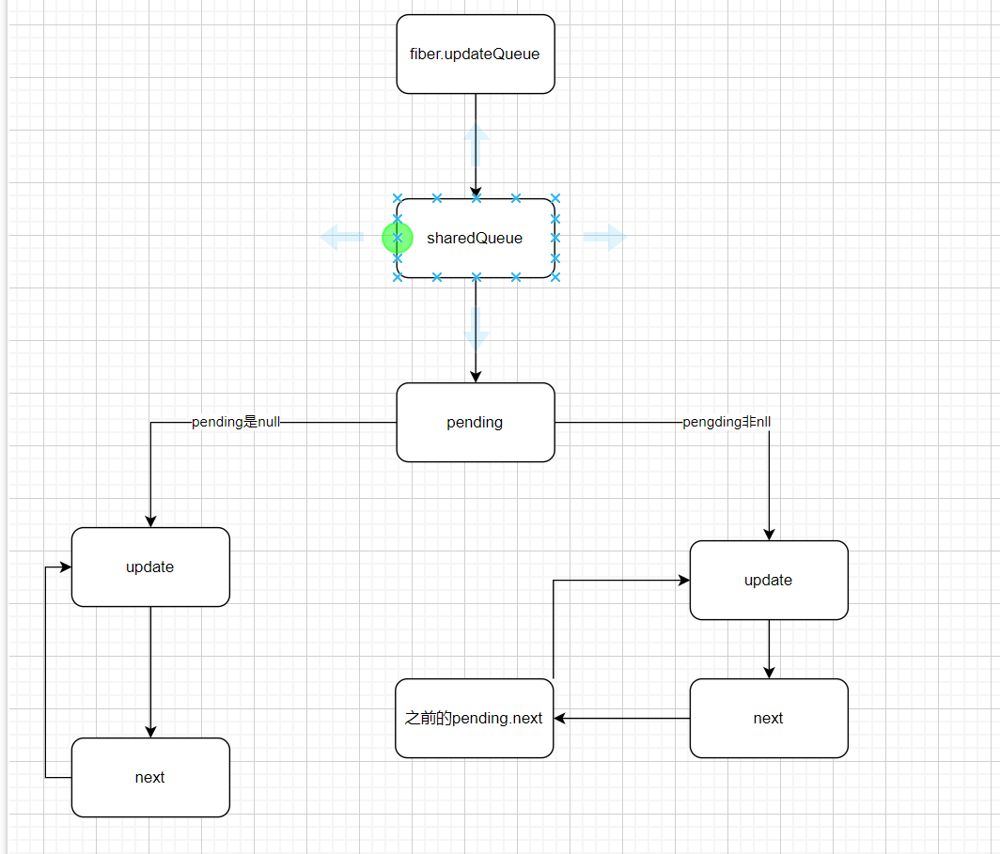

# enqueueUpdate 的解读
将任务update 存放于 任务队列(updateQueue)中 ，创建单项链表解构存放update， next用来串联update

## 源码
```javascript
function enqueueUpdate(
      fiber, 
      update,
      lane
  ) {
    //   获取 当前fiber的更新队列
      // 初始时fiber就是 rootFiber
    var updateQueue = fiber.updateQueue;

    // 如果更新队列不存在 就返回Null
    if (updateQueue === null) {
      // Only occurs if the fiber has been unmounted.
        // 仅仅发生在fiber已经被卸载
      return null;
    }
    //
      // This is an unsafe render phase update. Add directly to the update
      // queue so we can process it immediately during the current render.
      // 获取待执行的update任务
      // 初始渲染时没有待执行的任务

    //   这里的渲染更新触发，是由setState触发的
    var sharedQueue = updateQueue.shared;
      var pending = sharedQueue.pending;

    {
      if (currentlyProcessingQueue === sharedQueue && !didWarnUpdateInsideUpdate) {
        error('An update (setState, replaceState, or forceUpdate) was scheduled ' + 'from inside an update function. Update functions should be pure, ' + 'with zero side-effects. Consider using componentDidUpdate or a ' + 'callback.');

        didWarnUpdateInsideUpdate = true;
      }
    }

    if (isUnsafeClassRenderPhaseUpdate()) {
      // 如果没有待执行的update任务
      if (pending === null) {
        // This is the first update. Create a circular list.
          // 这是第一次更新，创建一个循环列表
        update.next = update;
      } else {
        //   如果已经存在，那就将这个更新任务 添加到这个单向链表中
        update.next = pending.next;
        pending.next = update;
      }

      // 将任务存储在pending属性中
      sharedQueue.pending = update; // Update the childLanes even though we're most likely already rendering
      // this fiber. This is for backwards compatibility in the case where you
      // update a different component during render phase than the one that is
      // currently renderings (a pattern that is accompanied by a warning).

      return unsafe_markUpdateLaneFromFiberToRoot(fiber, lane);
    } else {
      return enqueueConcurrentClassUpdate(fiber, sharedQueue, update, lane);
    }
  }
```