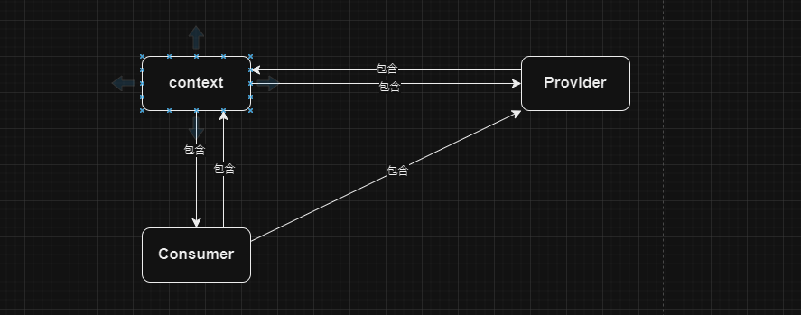
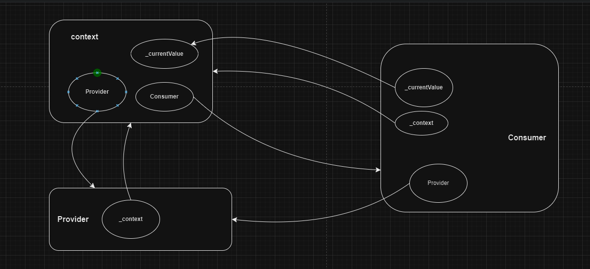
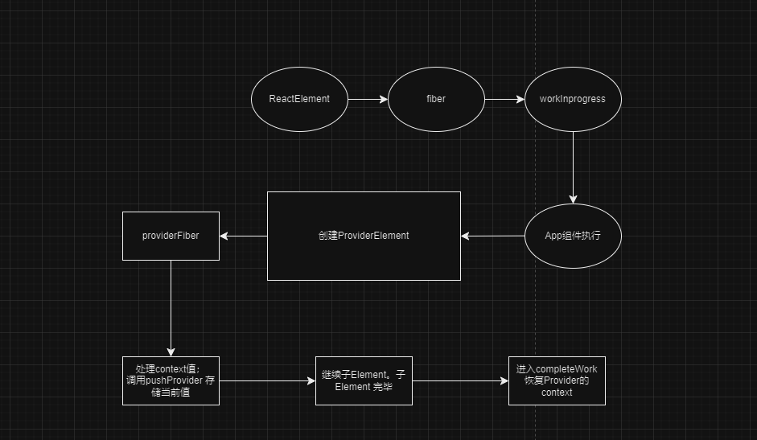

# createContext
示例代码：[链接](./index.html)

createContext 返回一个 context 对象。
- 组件可以通过 useContext 来订阅 context 的变化。
- 组件可以通过 Consumer 来订阅 context 的变化。
```javascript
const MyContext = React.createContext({
    value:'myContext'
  });
```

可以直接使用 `useContext` 获取 `MyContext` 的值；结合 `MyContext.Provider`，可以实现对 `MyContext` 值的更改。

## 使用方法
对于context 的使用方式有下面两者方式可以进行使用。
### useContext
使用钩子来使用 `MyContext` 的值
```javascript
 function Demo() {
  const {value} = React.useContext(MyContext);
  return React.createElement("div", null, "context:", value);
}
```
### Context.Consumer
使用 `Context.Consumer` 来使用 `MyContext` 的值；目前推荐使用useContext。
```javascript
function ConsumerDemo() {
  return (
    <MyContext.Consumer>
      {({value}) => <div>ConsumerDemo:{value}</div>}
    </MyContext.Consumer>
  )
}
```

## 相关疑问
### 为什么 推荐使用useContext呢？相比Consumer有什么优势？
### Provider的作用是什么？对于子元素 是如何处理的呢？
```javascript

  function App() {
    const [value,setValue] = React.useState(1);
    return (
      <div>
        <MyContext.Provider value={{value}}>
          <Demo />
          <ConsumerDemo/>
        </MyContext.Provider>
        <button onClick={() => setValue(value+1)}>change</button>
      </div>
    )
  }
```

## 源码分析
### createContext 做了什么？
```javascript
const MyContext = React.createContext({
    value: 'myContext'
  });
```
创建了一个context 对象。该context 对象包含了一个Provider和Consumer;


- Provider

  $$typeof 是 REACT_PROVIDER_TYPE；

- Consumer

  - $$typeof 是 REACT_CONTEXT_TYPE;
  - Consumer又定义了Provider 属性，返回 context.Provider 的值;
### 组件是如何获取 context 传入的数据？
#### useContext
```javascript
function Demo() {
    const {value} = React.useContext(MyContext);
    return React.createElement("div", null, "context:", value);
  }
```
useContext 的本质就是通过 readContext(context) 来获取 `传入的context` 的值。
说明 传入通过 Provider 传入的值，修改的是context 的引用值。

### 是如何修改 的Provider的值？Provider 的值与 context 值，引用关系是如何的？


从上图的引用关系来看，_currentValue 最终的来源都是 context。

对于 Provider fiber,调用 updateContextProvider。修改Provider 的引用值 _currentValue。
_currentValue 就是传入的 值。 此时 父级的 context的 _currentValue 就被修改了。但是 _currentValue2的之并没有被修改。 
此时子函数组件调用，再使用useContext 获取的值 _currentValue，就是修改后的值。


### Consumer 是如何获取 context 传入的数据？
对于Component fiber,调用 updateContextConsumer。获取context的值，然后调用 对应的函数，传入获取的值。最终返回child.

### 使用 setState的时候的fiber和当前所在的函数组件之间的关系是什么？
因为在调用 setState 的时候，会传入fiber。

例如：[代码文件](./index.html)

在 appElement 渲染时。使用appElement 创建完成fiber 之后，该fiber 变成 workInProgress。
然后渲染该 workInProgress，并调用函数组件。所以在函数组件中使用的 hook ,绑定的组件fiber就是当前该函数组件，因此可以精准的进行状态更新和
重新渲染。

### 

## 总结
createContext 就是创建了一个context对象。
该对象包含了Provider和Consumer。

- 在Provider中，调用 updateContextProvider的过程就是修改Provider 的引用值 _currentValue。然后在子级中使用useContext来获取 已经修改的值。
- 在Consumer中，调用 updateContextConsumer的过程就是获取context的值，然后调用对应的函数，传入获取的值。最终返回child。


- context 的值的变化规律。参考源码：[链接](./index2.html).
  在fiber树形成过程中都是不断地在改变同一个引用之，并将前一个值存在栈中，然后在DOM构建时又恢复对应的Context值。所以虽然是同一个引用值，但是却实现
  了在兄弟级Provider,父子级Provider 之间的值的正确的传递。
