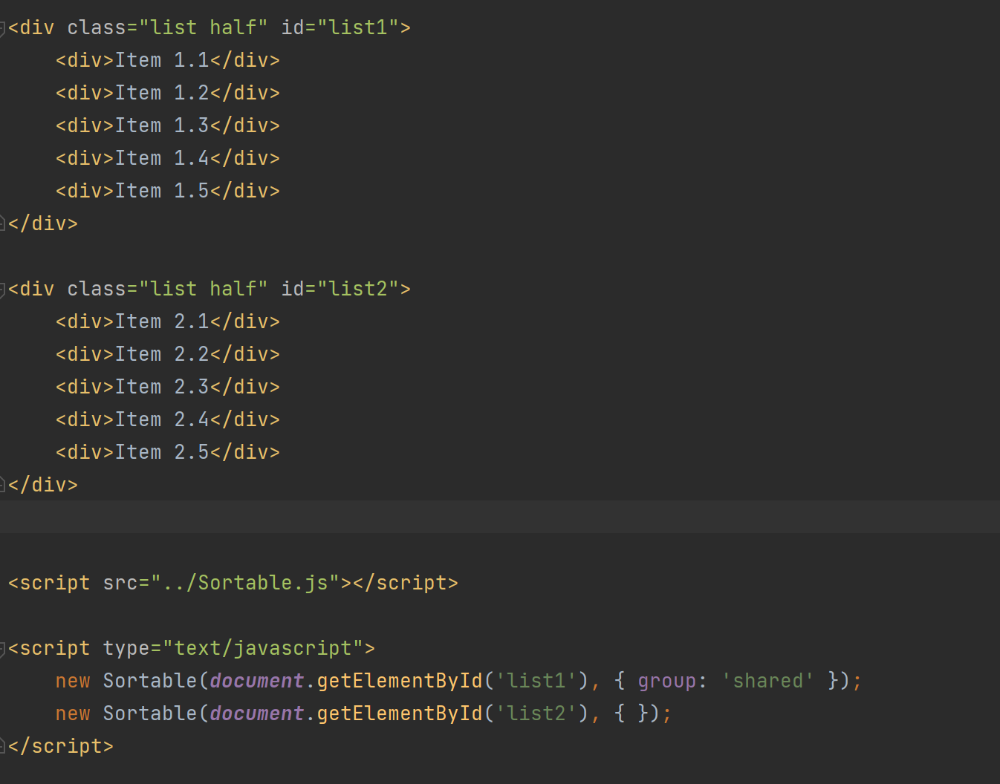

# Sortable 源码分析
## 使用


## Sortable类
```javascript
function Sortable(el, options) {

		
    if (!(el && el.nodeType && el.nodeType === 1)) {
      throw "Sortable: `el` must be an HTMLElement, not ".concat({}.toString.call(el));
    }

    this.el = el; // root element

    this.options = options = _extends({}, options); // Export instance

    el[expando] = this;
    var defaults = {
      group: null,
      sort: true,
      disabled: false,
      store: null,
      handle: null,
      draggable: /^[uo]l$/i.test(el.nodeName) ? '>li' : '>*',
      swapThreshold: 1,
      // percentage; 0 <= x <= 1
      invertSwap: false,
      // invert always
      invertedSwapThreshold: null,
      // will be set to same as swapThreshold if default
      removeCloneOnHide: true,
      direction: function direction() {
        return _detectDirection(el, this.options);
      },
      ghostClass: 'sortable-ghost',
      chosenClass: 'sortable-chosen',
      dragClass: 'sortable-drag',
      ignore: 'a, img',
      filter: null,
      preventOnFilter: true,
      animation: 0,
      easing: null,
      setData: function setData(dataTransfer, dragEl) {
        dataTransfer.setData('Text', dragEl.textContent);
      },
      dropBubble: false,
      dragoverBubble: false,
      dataIdAttr: 'data-id',
      delay: 0,
      delayOnTouchOnly: false,
      touchStartThreshold: (Number.parseInt ? Number : window).parseInt(window.devicePixelRatio, 10) || 1,
      forceFallback: false,
      fallbackClass: 'sortable-fallback',
      fallbackOnBody: false,
      fallbackTolerance: 0,
      fallbackOffset: {
        x: 0,
        y: 0
      },
      supportPointer: Sortable.supportPointer !== false && 'PointerEvent' in window && !Safari,
      emptyInsertThreshold: 5
    };
    PluginManager.initializePlugins(this, el, defaults); // Set default options

    for (var name in defaults) {
      !(name in options) && (options[name] = defaults[name]);
    }

    _prepareGroup(options); // Bind all private methods


    for (var fn in this) {
      if (fn.charAt(0) === '_' && typeof this[fn] === 'function') {
        this[fn] = this[fn].bind(this);
      }
    } // Setup drag mode


    this.nativeDraggable = options.forceFallback ? false : supportDraggable;

    if (this.nativeDraggable) {
      // Touch start threshold cannot be greater than the native dragstart threshold
      this.options.touchStartThreshold = 1;
    } // Bind events


    if (options.supportPointer) {
      on(el, 'pointerdown', this._onTapStart);
    } else {
      on(el, 'mousedown', this._onTapStart);
      on(el, 'touchstart', this._onTapStart);
    }

    if (this.nativeDraggable) {
      on(el, 'dragover', this);
      on(el, 'dragenter', this);
    }

    sortables.push(this.el); // Restore sorting

    options.store && options.store.get && this.sort(options.store.get(this) || []); // Add animation state manager

    _extends(this, AnimationStateManager());
  }
```