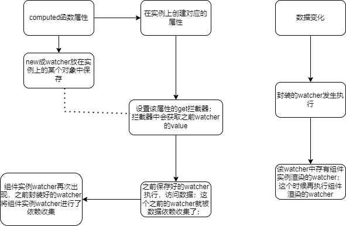

# 针对computedGetter中的这套依赖收集机制和触发更新机制
**前提：**  
+ 之前computed属性转化成了实例上的属性，但是该属性的get方法是重写成了computedGetter；这个时候访问该实例上的该属性，实际就是触发computedGetter，  

**computedGetter做了什么？**  

  
首先会找到之前该方法的watcher，然后会调用watcher的get方法去获取值，这个时候之前的函数watcher就会访问数据，该函数watcher就被放入了数据的依赖中；
同样该watcher也收集外部访问它的实例；
```javascript
return function computedGetter() {
        debugger
          var watcher = this._computedWatchers && this._computedWatchers[key];
          if (watcher) {
              if (watcher.dirty) {
                  watcher.evaluate();
              }
              if (Dep.target) {
                  if (Dep.target.onTrack) {
                      Dep.target.onTrack({
                          effect: Dep.target,
                          target: this,
                          type: "get" /* TrackOpTypes.GET */,
                          key: key
                      });
                  }
                  watcher.depend();
              }
              return watcher.value;
          }
      };
```