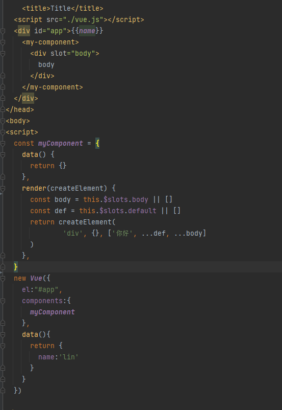
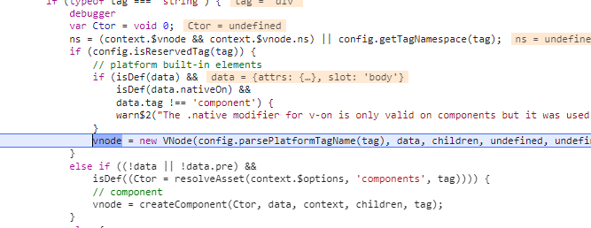

# 使用render函数中的插槽

## 比较难以理解的地方在于，为什么render函数中可以直接获取到插槽？ 
```javascript
const myComponent = {
    data() {
      return {}
    },
    render(createElement) {
      const body = this.$slots.body || []
      const def = this.$slots.default || []
      return createElement(
              'div', {}, ['你好', ...def, ...body]
      )
    },
  }
```

- 开始对父组件进行模板编译
- 父组件的模板含有子组件标签，一开始也被当作做了普通元素
- 父组件的render函数形成开始执行，开始生产vNode，这个时候还不知道该子标签是组件；
- VNode开始生产真实node,当遇到改便签的init钩子时，会为该标签创建一个组件options
- 在执行该组件的initRender时，会为该组件生成对应的插槽内容，以便后续最终的render执行；

## 问题2 为什么普通标签没有Init钩子
非保护标签都会被当作组件标签，添加组件钩子


