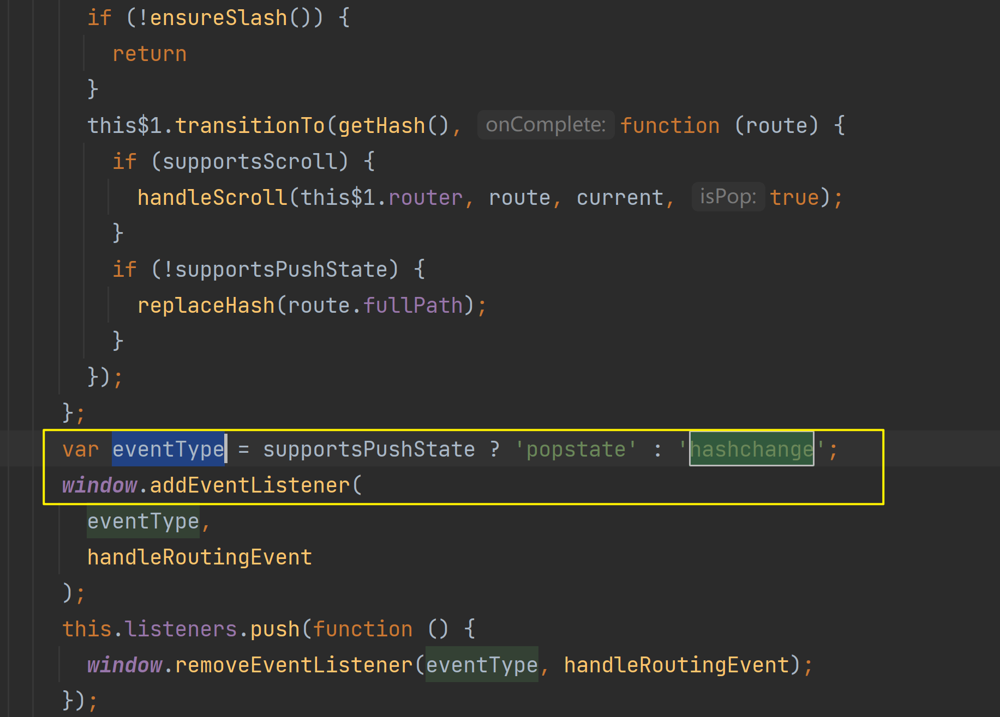
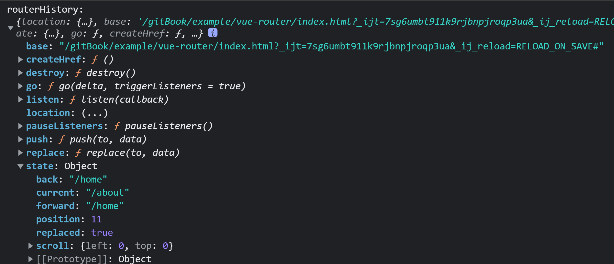

# vue 路由
为了实现单页面模式的渲染，首先需要定义单页面模块与路由的关系；当路由发生变化时，在单页面中去渲染对应的路由模块；
因此需要解决两个问题：
1. 路由与需要渲染模块的映射关系
2. 需要监听到页面路由发生的变化

## 如何让监听路由模块发生的变化？主要是监听历史记录的前进后退操作；
主要是为了监听浏览器左上角按钮来操作历史记录，这个时候在页面中只有通过监听popStata事件来处理路由变化；常规的路由交互，可以通过相关API来改变历史记录，但是这个改变不触发popStata事件；
+ 方式一：
当前新版本路中均是监听的[popState事件](../Browser/popStataAndHashChange.md)；  
旧版本使用的是监听[hashChange事件](../Browser/popStataAndHashChange.md):

+ 方式二：监听popstate事件  
**具体实现方案如下:**  
通过监听事件，确定页面路径的变化，从而找到对应需要渲染的路由模块；
+ `createWebHashHistory`创建路由返回一个history对象

+ `createRouter`创建一个路由(封装好操作路由的方法)
+ 提供`RouterLink`组件  
封装了一个a标签，重写点击事件进行路由跳转；
+ 提供`RouterView`组件
提供一个渲染页面的组件；当routerView切换时，通过路由嵌套的深度去匹配该路由；
渲染匹配上的该组件；

总结：  
vueRouter通过创建routerApi，封装了操作路由的方法。监听popState，然后调用封装的方法；
用户交互，调用封装的操作路由的方法；实现操作路由的Api的复用性；  
RouterLink 封装了一个a标签，重写了里面的事件，调用注入的路由中封装的api方法；利用pushState
更改历史，利用自身封装的方法改变页面路由状态进行渲染；   
RouterView 负责路由发生变化后，匹配对应的路由配置，渲染配置中的组件；

