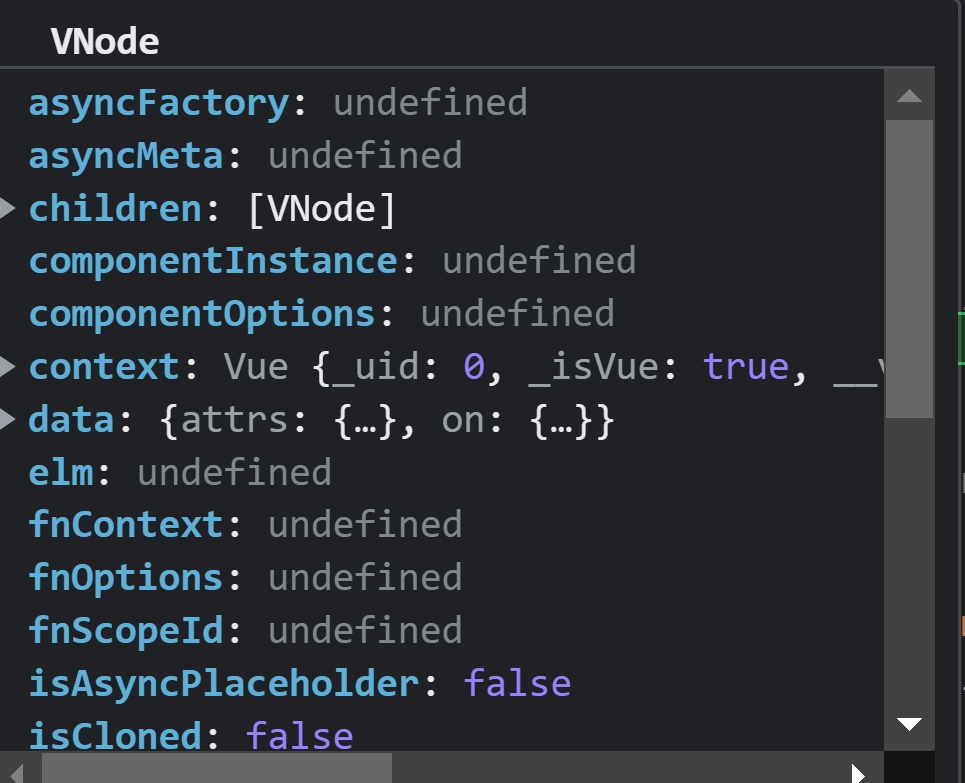

# 《精解》vue2

## new Vue
创建一个Vue实例
```javascript
function Vue(options) {
      if (!(this instanceof Vue)) {
          warn$2('Vue is a constructor and should be called with the `new` keyword');
      }
      this._init(options);
  }
```
## init 方法调用  
为当前组件添加一个uid；标记为Vue组件（isVue）;__v_skip(避免实例被观察)；合并为组件实例添加基本的options（组件、指令）；将传入的options与本身Vue具有的options进行
归一化处理（components、props、inject、Directives）；
```javascript
Vue.prototype._init = function (options) {
          var vm = this;
          // a uid
          vm._uid = uid++;
          var startTag, endTag;
          /* istanbul ignore if */
          if (config.performance && mark) {
              startTag = "vue-perf-start:".concat(vm._uid);
              endTag = "vue-perf-end:".concat(vm._uid);
              mark(startTag);
          }
          // a flag to mark this as a Vue instance without having to do instanceof
          // check
          vm._isVue = true;
          // avoid instances from being observed
          vm.__v_skip = true;
          // effect scope
          vm._scope = new EffectScope(true /* detached */);
          // merge options
          if (options && options._isComponent) {
              // optimize internal component instantiation
              // since dynamic options merging is pretty slow, and none of the
              // internal component options needs special treatment.
              initInternalComponent(vm, options);
          }
          else {
              vm.$options = mergeOptions(resolveConstructorOptions(vm.constructor), options || {}, vm);
          }
          /* istanbul ignore else */
          {
              initProxy(vm);
          }
          // expose real self
          vm._self = vm;
          initLifecycle(vm);
          initEvents(vm);
          initRender(vm);
          callHook$1(vm, 'beforeCreate', undefined, false /* setContext */);
          initInjections(vm); // resolve injections before data/props
          initState(vm);
          initProvide(vm); // resolve provide after data/props
          callHook$1(vm, 'created');
          /* istanbul ignore if */
          if (config.performance && mark) {
              vm._name = formatComponentName(vm, false);
              mark(endTag);
              measure("vue ".concat(vm._name, " init"), startTag, endTag);
          }
          if (vm.$options.el) {
              vm.$mount(vm.$options.el);
          }
      };
```
1. [x] 初始化生命周期    
定义了实例上的标志位：`根组件、父组件、provide；`  
初始化了：`子组件，refs、watcher、_inactive、_directInactive、_isMounted、_isDestroyed、_isBeingDestroyed`
```javascript
 function initLifecycle(vm) {
      var options = vm.$options;
      // locate first non-abstract parent
      var parent = options.parent;
      if (parent && !options.abstract) {
          while (parent.$options.abstract && parent.$parent) {
              parent = parent.$parent;
          }
          parent.$children.push(vm);
      }
      vm.$parent = parent;
      vm.$root = parent ? parent.$root : vm;
      vm.$children = [];
      vm.$refs = {};
      vm._provided = parent ? parent._provided : Object.create(null);
      vm._watcher = null;
      vm._inactive = null;
      vm._directInactive = false;
      vm._isMounted = false;
      vm._isDestroyed = false;
      vm._isBeingDestroyed = false;
  }
```
2. [x] 初始化事件对象  
这里主要处理 _parentListeners；
```javascript
function initEvents(vm) {
  vm._events = Object.create(null);
  vm._hasHookEvent = false;
  // init parent attached events
  var listeners = vm.$options._parentListeners;
  if (listeners) {
    updateComponentListeners(vm, listeners);
  }
}
```
3. [x] 初始化`render`函数  
初始化vnode、_staticTrees（与v-once指令有关）；处理插槽内容；定义响应式的$attrs和$listeners；

```javascript
function initRender(vm) {
      vm._vnode = null; // the root of the child tree
      vm._staticTrees = null; // v-once cached trees
      var options = vm.$options;
      var parentVnode = (vm.$vnode = options._parentVnode); // the placeholder node in parent tree
      var renderContext = parentVnode && parentVnode.context;
      vm.$slots = resolveSlots(options._renderChildren, renderContext);
      vm.$scopedSlots = parentVnode
          ? normalizeScopedSlots(vm.$parent, parentVnode.data.scopedSlots, vm.$slots)
          : emptyObject;
      // bind the createElement fn to this instance
      // so that we get proper render context inside it.
      // args order: tag, data, children, normalizationType, alwaysNormalize
      // internal version is used by render functions compiled from templates
      // @ts-expect-error
      vm._c = function (a, b, c, d) { return createElement$1(vm, a, b, c, d, false); };
      // normalization is always applied for the public version, used in
      // user-written render functions.
      // @ts-expect-error
      vm.$createElement = function (a, b, c, d) { return createElement$1(vm, a, b, c, d, true); };
      // $attrs & $listeners are exposed for easier HOC creation.
      // they need to be reactive so that HOCs using them are always updated
      var parentData = parentVnode && parentVnode.data;
      /* istanbul ignore else */
      {
          defineReactive(vm, '$attrs', (parentData && parentData.attrs) || emptyObject, function () {
              !isUpdatingChildComponent && warn$2("$attrs is readonly.", vm);
          }, true);
          defineReactive(vm, '$listeners', options._parentListeners || emptyObject, function () {
              !isUpdatingChildComponent && warn$2("$listeners is readonly.", vm);
          }, true);
      }
  }
```
4. [x] 调用`beforeCreate` 生命钩子  
调用该组件传入的`beforeCreate`钩子函数；
5. [x] 初始化注入  
在data和props之前，从当前组件的_provided属性上获取到inject中的键值；获取完成后，在当前实例上添加注入的属性，并进行响应式化；
```javascript
function initInjections(vm) {
      var result = resolveInject(vm.$options.inject, vm);
      if (result) {
          toggleObserving(false);
          Object.keys(result).forEach(function (key) {
              /* istanbul ignore else */
              {
                  defineReactive(vm, key, result[key], function () {
                      warn$2("Avoid mutating an injected value directly since the changes will be " +
                          "overwritten whenever the provided component re-renders. " +
                          "injection being mutated: \"".concat(key, "\""), vm);
                  });
              }
          });
          toggleObserving(true);
      }
  }
```
6. [x] 初始化`state`  
```javascript
function initState(vm) {
      var opts = vm.$options;
      if (opts.props)
          initProps$1(vm, opts.props);
      // Composition API
      initSetup(vm);
      if (opts.methods)
          initMethods(vm, opts.methods);
      if (opts.data) {
          initData(vm);
      }
      else {
          var ob = observe((vm._data = {}));
          ob && ob.vmCount++;
      }
      if (opts.computed)
          initComputed$1(vm, opts.computed);
      if (opts.watch && opts.watch !== nativeWatch) {
          initWatch(vm, opts.watch);
      }
  }
```
- initProps$1  
检查props是否合法：根据props来初始实例的_props和实例上的键值（实例上的键值实际上是通过代理的方式
，在vm实例上定义一个键，然后代理到_props上对应的值）；  
- initMethods  
检测实例中的props对象会不会与methods存在冲突；将methods中的方法直接赋值到vm实例上；

- initData  
检测传入的data是否会和methods、props发生冲突；根据data来初始化实力的_data，
在vm上定义一个键，然后代理到_data上对应的键；然后对_data上的数据进行响应式化；
- initComputed$1  

对于computed中的属性，如果是对象，会获取其get;如果是函数，那么就是这个函数本身；
如果是对象，也可以定义该属性的set函数；最终在vm实例上定义一个键值，其get函数和set函数就是之前处理好的函数（本身，获取自定义的set和get）
；这里的get实际被做成了一个computedGetter，这个computedGetter最终返回的是这个watcher的value（这个value是之前被计算缓存好的值）
- initWatch  
根据key值去创建一个watcher,options中有个特殊属性user为true;这个时候他会主动去调用这个watcher的getter函数，这个时候watcher就会被对应的属性依赖收集器收集；  


**总结：**
 ` watch和computed之间的区别在于：vm实例上会有一个_computedWatchers，这个对象保存我们定义的computed函数形成的watcher，这个时候，该watcher没有调用，所以值也没有；接下来在实例上
定义我们的computed键，定义这个键的get和set函数，其中get函数就是computedGetter(这个getter就是返回之前watcher的value);所以后续有值该值被访问时，会触发之前缓存的watcher进行执行，这个时候缓存的watcher会被数据依赖收集，并且会生成该watcher的value;所以页面对该属性的访问最终会得到watcher所缓存的value；
当数据发生变化时，之前缓存的watcher由于被收集到，所以会重新执行；`  
`watch不一样其会直接将函数定义为watcher，并且立即去执行该函数，在执行过程中立刻被依赖收集了，所以后续值发生变化，该wacther就会执行,也就会触发函数执行`，   
所以computer是访问watcher计算得到的值，而watcher是直接执行一个函数；

9. [x] 初始化`Provide`  
在实例的_provided上添加属性；
10. [x] 调用`created`生命钩子  
调用我们传入的created钩子函数
11. [x] 开始挂载
- 找到需要挂载的元素
- 获取模板
- 编译模板得到render函数 （这里将编译后的render函数进行了缓存）  
`baseCompile`:  
1.转换html模板到ast树,ast树描述了当前模板的属性、事件、标签名、子节点、父节点等等；
  
2.对ast树进行优化，(标记静态节点)  
3.利用ast生成渲染节点需要的代码,通过new Function的方式得到render函数；
  
4.最终对本次的模板编译进行模板和编译结果的map缓存；  
5.调用mount函数进行挂载  

1. [x] 调用`beforeMount`生命钩子  
调用传入的beforeMount钩子函数；  
- 调用updateComponent函数进行组件渲染  
- 调用render函数形成VNode


- 调用patch方法进行VNode转化(如果之前有VNode，会在这个阶段传入并进行对比)  
- 最终形象真实的node
- 真实node形成完成后，挂载到旧的node节点的父节点上
- 移除oldVNode上的真实节点
- 挂载完成,调用mounted钩子


