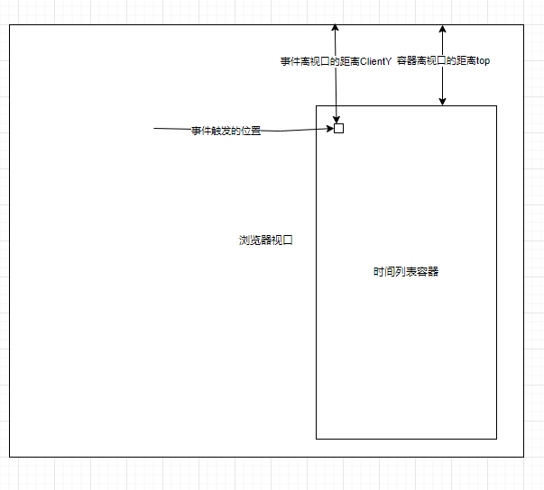

# 日历组件

## 日视图组件
+ 如何在点击页面时取得该点坐标的时间值?
> 1. 添加鼠标的点击事件
> 2. 获取鼠标的clientY值（即相对于浏览器除了tabs栏的视口的未知）
> 3. 获取时间列表容器相对于视口的`top`位置，使用元素的 [getBoundingClientRect](https://developer.mozilla.org/zh-CN/docs/Web/API/Element/getBoundingClientRect) API即可获取元素相对于视口的未知
> 4. 利用`clientY 减 top`即可获得



+ 手动添加事件时，如何将距离值转换为时间？时间值的边界问题如何处理的？
> 1. 手动添加事件，这个时候获取的是坐标值
> 2. 将坐标值处理为时间，（精确度为分钟）
> 3. 手动添加时间时，需要将边界处理为15分钟的时间格子边界
> 4. 对于开始时间，将余数减掉即可得到上边界
> 5. 对于结束时间，计算与时间格子的差值，再用原有时间加上格子差值；即可得到时间的上边界值；
```javascript

roundTime (time, down = true) {
  const roundTo = 15
  // 以15分钟为单元格子
  const roundDownTime = roundTo * 60 * 1000
  // 对于开始时间取得上边界的方式就是减去余数
  // 对于取下边界 加上一个格子相差的即可
  return down
    ? time - time % roundDownTime
    : time + (roundDownTime - (time % roundDownTime))
}


mouseMove (tms) {
  // 将日期转换为时间戳，精确到分钟
  const mouse = this.toTime(tms)
  console.log('mouseMove')
  if (this.dragEvent && this.dragTime !== null) {
    const start = this.dragEvent.start
    const end = this.dragEvent.end
    const duration = end - start
    const newStartTime = mouse - this.dragTime
    const newStart = this.roundTime(newStartTime)
    const newEnd = newStart + duration

    this.dragEvent.start = newStart
    this.dragEvent.end = newEnd
  } else if (this.createEvent && this.createStart !== null) {
    // 得到结束时的边界时间
    const mouseRounded = this.roundTime(mouse, false)
    // 比较结束时的边界时间和开始时的时间大小
    const min = Math.min(mouseRounded, this.createStart)
    const max = Math.max(mouseRounded, this.createStart)
    // 重新设置新的时间范围
    this.createEvent.start = min
    this.createEvent.end = max
  }
}


startTime (tms) {
  // 将日期转换为时间戳，精确到分钟
  const mouse = this.toTime(tms)
  if (this.dragEvent && this.dragTime === null) {
    const start = this.dragEvent.start
    this.dragTime = mouse - start
  } else {
    // 获取开始的边界时间
    this.createStart = this.roundTime(mouse)
    this.createEvent = {
      name: `Event #${this.events.length}`,
      color: 'black',
      start: this.createStart,
      end: this.createStart,
      timed: true,
    }
    this.events.push(this.createEvent)
  }
}
```


+ 如何将已有事件转换为坐标？ 如何处理已有事件的坐标边界问题？
