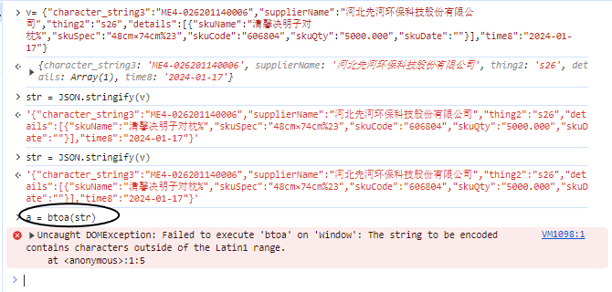

# 场景描述
后端通过 url 传参一般如何处理？浏览器遇见%会直接报错。


---------------------------------------
在必须使用 base64 作为参数的情况时：

## 做法一
- 参数转str
- str 转成 base64
- base64 拼接到 url上
- 前端从 url 获取 base64，然后进行 atob 解码
- 最终获得解码的参数

下面是出现异常的数据
```javascript
{
  "character_string3":"ME4-026201140006",
    "supplierName":"xxxxx股份有限公司",
    "thing2":"s26",
    "details":[
      {"skuName":"清馨决明子对枕%",
      "skuSpec":"48cm×74cm%23",
        "skuCode":"606804",
        "skuQty":"5000.000",
        "skuDate":""
      }],
    "time8":"2024-01-17"
}
```
在做法一中，上述数据在步骤2，出现了异常报错。针对某些特殊的数据，在转 base64 时需要特殊处理。


## 做法一的改进


---------------------------------------------
打勾的是与做法一中一致的，未打勾的是改进的步骤。

---------------------------------------------

- [x] 参数转str 
- [ ] 将 str 进行 encodeURI 编码
- [ ] 编码后的 转成 base64
- [x] base64 拼接到 url上
- [x] 前端从 url 获取 base64，然后进行 atob 解码
- [ ] 进行decodeURI 解码
- [x] 最终获得解码的参数


## links

------------------------------------------------
需要注意一下： encodeURI 自身无法产生能适用于 HTTP GET 或 POST 请求的 URI

------------------------------------------------

- [encodeURI](https://developer.mozilla.org/zh-CN/docs/Web/JavaScript/Reference/Global_Objects/encodeURI)
- [encodeURIComponent](https://developer.mozilla.org/zh-CN/docs/Web/JavaScript/Reference/Global_Objects/encodeURIComponent)
