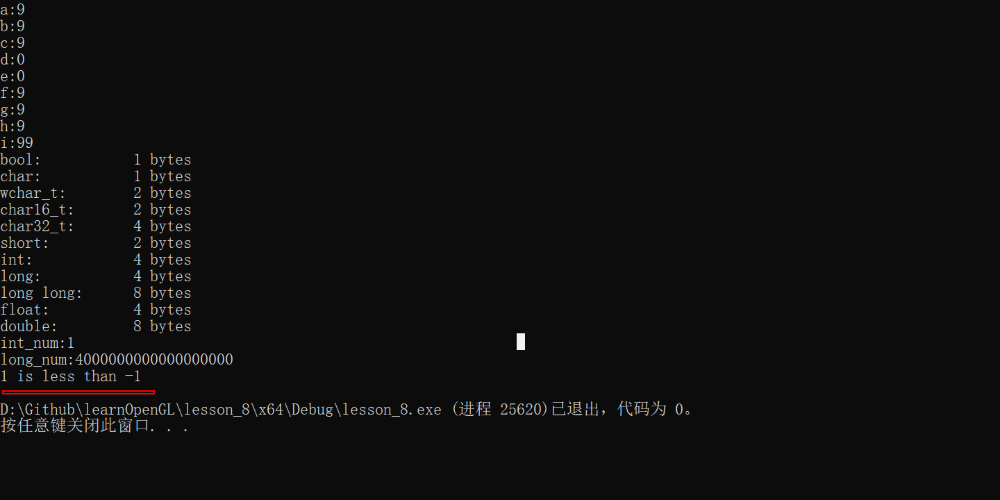

# 知识点1
#### 什么是声明？
语句是计算机程序中的一条指令，他告诉计算机执行一个动作；
#### 什么是函数？
函数是按顺序执行的语句的集合；
#### 友好的注释特点
- 让用户了解代码将如何实现其目标；
- 在语句级别，应该注释来描述代码为什么做某件事情。
- 注释应该以对不知道代码做什么的人有意义的方式编写；
#### 对象和变量
- 所有计算机都有内存，称为RAM（随机存储内存的缩写）；可以将RAM看成一系列地址；
每个地址可以在程序运行时保存一段数据。
- 对象可以命名或未命名（匿名）；命名对象称为变量，对象名称称为标识符；
```javascript
/**
 * var 是声明
 * a 是变量
 * 
 */
var a = 1

```
- 变量实例化；为了创建变量，使用一种特殊的声明语句，称为定义（`声明和定义之间有什么区别？`）；
下面是定义一个名为x的变量：
```
int x
```
编译这条语句时，它会提示自己，我们正在定义一个变量，给它命名为x，并且他是int类型；
- `实例化`是一个花哨的词，意思是对象将被创建并分配一个内存地址。变量必须先实例化，然后才能用于存储值。例如：假设x在内存位置140位置，每当程序使用变量x时，他将访问内存位置140中的值。`实例化的对象有事也称为实例`;
- `数据类型`，告诉编译器变量将存储什么类型的值（例如数字，字母，文本）；
- 在c++中，必须在编译是知道变量的类型，并且在不重新编译程序的情况下不能更改该类型。意味着整数类型变量只能保存整数值；


#### 数据初始化
四种初始化：
```text
int a; // 未初始化
int b = 5; // 等号初始化
int c( 6 ); // 直接初始化
int d { 7 }; // 大括号初始化
```
- 等号初始化也叫复制初始化
- 括号内初始化也叫直接初始化，这里主要是为了更有效的初始化复杂对象；
- 大括号初始化，比较常用；也称为统一初始化或者列表初始化；
```text
int c 未初始化的值在运行是会报错；

int c(29.9) 会转化为29；
int c() 空值会报错；

int c{29.9} 这里会报错,当结合cin使用时，如果输入29.9，最终会得到29；
int c{} 空值会转化为0
```

### 关于未定义的变量
- 使用未初始化的变量是较为常犯的错误，也会非常难调试；（因为如果未初始化的变量碰巧被分配到某个内存点，程序可能荏苒可以运行一个合理的值）；
### 未定义的行为
可能出现的症状：
- 程序每次运行结果不同
- 程序始终产生相同的错误结果
- 程序可以正常工作，但是会产生不正确的结果；
- 程序适用某些编译器，但不适用其他编译器；
### 运算符
- 一元运算符：作用于一个数；
- 二元运算符：作用于两个数；
- 三元运算符：作用于三个数；
- 空运算符：作用于零操作数；

### 表达式和语句
- `表达式` 是计算单个值的文字，变量，运算符和函数调用的组合。

### 函数
- 在c++中，函数不能定义在其它函数中。
- void 函数不需要return;
- 为什么使用函数？
> 将复杂程序简化为更小、更易管理的块，从而降低整体的复杂性；
> 可重用性、测试、可扩展、抽象。
- 在c++中，可以使用前向声明来告诉编译器标识符的存在。
- 在一个项目中，多个模块文件中只能有一个main函数；
### 参数
参数是在进行函数调用时从调用者传递给函数的值；
- 当一个函数被调用时，函数的所有参数都被创建为变量，并且每个参数的值都被赋值到匹配的参数中。这个过程称为按值传递；
### 局部变量
函数参数以及函数体内定义的变量称为局部变量，
- 作用域是一个编译时的属性，
- 用于在函数体中声明的参数或者变量的名称仅在声明他们的函数中可见；这意味着可以命名函数中的局部变量，无需考虑其他函数中变量的名称。这有助于保持功能独立；


### 宏
定义如何将输入文本转换为替换输出文本的规则；
- #define 指令
- 宏定义的左值是不可修改的
### 条件编译
- #ifdef 指令
### 头文件
随着程序变得越来越大，使用统一的头文件进行声明转发。
- 源文件应该包含其配对的头文件
- 不要在头文件中定义变量或函数
- 使用标头保护，防止重复引入

### 关于符号位的一些问题
- 在c++中，如果一个有符号位-1，和一个无符号位1作比较；可能会出现1小于-1的结果；

`````text
#include <iostream>

int main()
{
    signed int s { -1 };
    unsigned int u { 1 };

    if (s < u) // -1 is implicitly converted to 4294967295, and 4294967295 < 1 is false
        std::cout << "-1 is less than 1\n";
    else
        std::cout << "1 is less than -1\n"; // this statement executes

    return 0;
}
`````

- 在处理位操作时首选无符号数；与数组索引有关的情况。
### 浮点数
`float为4个字节` `double为8个字节` `long double可以为8、12、16子节点，通常填充为12个字节；`
- 有限使用double float ,因为浮点数缺乏精度通常导致不准确；
- 