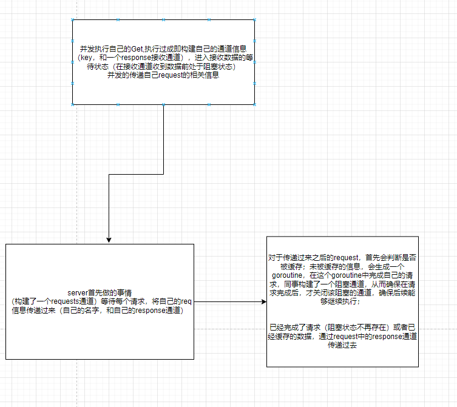

# 关于go语言的细节
- 在每一个函数之前写一个说明函数行为的注释也是一个好习惯。这些惯例很重要，因为这些内容会被像godoc这样的工具检测到，并且在执行命令时显示这些注释
- 关于go语言是如何知道一个变量是何时可以被回收的呢？
> 基本的实现思路是，从每个包级的变量和每个当前运行函数的每一个局部变量开始，通过指针或引用的访问路径遍历，是否可以找到该变量。如果不存在这样的访问路径，那么说明该变量是不可达的。也就是说
> 它是否存在并不会影响程序后续的计算结果；
- 将短生命周期对象的指针保存到具有长生命周期的对象中，特别是保存到全局变量时，会阻止对短生命周期对象的垃圾回收（从而影响程序的性能）；
- nil 可以赋值给任何指针或引用类型的变量。常量有更灵活的赋值规则，因为这样可以避免不必要的显示类型转换；
- 库或模块的目的都是为了支持模块化、封装、单独编译、代码重用；
- 声明语句的作用域是指源代码中可以有效使用这个名字的范围。
- 关于声明语句和生命周期；声明语句的作用域对应的是一个源代码的文本区域；他是一个编译时的属性。
- 一个变量的生命周期指的是程序运行时变量存在的有效时间段，在这个时间段内可以被程序的其他部分引用；是一个运行时的概念；


- go语言的数据类型分类：基础类型、复合类型、引用类型、接口类型
  - 基础类型：数字，字符串、布尔型
  - 复合类型：数组和结构体
  - 引用类型： 指针、切片、字典、函数、通道（意味着对任一引用类型数据修改都会影响所有该引用的拷贝）


- %取模运算符的符号和被取模数的符号总是一致的，因此-5%3和-5%-3结果都是-2
- 除法运算符/的行为则依赖于操作数是否全为整数，比如5.0/4.0的结果是1.25，但是5/4的结果是1
- 数据类型强制转换时，注意类型的的可转换范围，uint8最大为255,转换较大值会导致精度丢失
- float32的有效bit位只有23个，其它的bit位用于指数和符号
  - > var f float32 = 16777216 // 1 << 24  
    >  // f+1 是个很特殊的数   
    > fmt.Println(f == f+1)    // "true"!
- %q 打印带单引号的字符
- %c 打印字符
- %g 打印浮点数
- %f 打印浮点数
- %e 打印浮点数（带指数）


- 数组时国定长度序列
- 切片是可变长序列
  - 切片操作超出cap 的上线会导致panic异常；但是超出len(s)意味着扩展了slice;

- 禁止对map元素取址的原因是map可能随着元素数量的增长而重新分配更大的内存空间，从而可能导致之前的地址无效

- 同一结构体实例，可以使用 `==` 直接进行比较
  - 结构体中 得益于匿名嵌入的特性，我们可以直接访问叶子属性而不需要给出完整的路径
    - ```gotemplate
      type point struct {
        X, Y int
      }

      type circle struct {
        // 直接写了类型，而不指定名字
        point
        // Center point
        Radius int
      }

      type wheel struct {
        Circle circle
        Spokes int
      } 


- 结构体成员Tag,默认使用Go语言结构体的成员名字作为JSON的对象（通过reflect反射技术)
```gotemplate
type Movie struct {
	Title  string // 后面这部分统称为结构体成员Tag
	Year   int    `json:"released"`
	Color  bool   `json:"color,omitempty"`
	Actors []string
}
```


- text/template 和 html/template
  - html/template 会对特殊字符进行转义，从而能够正常显示特殊字符
  - text/template 不会对特殊字符转移，导致在显示过程中出现安全问题
  - 关于html 的可信任属性的使用


- 两个函数形式参数列表和返回值列表中的变量类型一一对应，那么这两个函数被认为有相同的类型或签名

- defer语句；在调用普通函数或方法前加上关键字defer，就完成了defer所需要的语法；
- 知道包含改defer语句的函数执行完毕时，defer后面的函数才会被执行
- 即使存在panic，最终也会调用对应的defer语句
- defer语句中的函数会在return语句更新返回值变量后再执行，又因为在函数中定义的匿名函数可以访问该函数包括返回值变量在内的所有变量，所以，对匿名函数采用defer机制，可以使其观察函数的返回值。
- 延迟执行的匿名函数甚至可以修改函数返回给调用者的返回值


## 记录函数的进入和退出的时间点

```gotemplate

package main

import (
	"log"
	"time"
)

func main() {
	bigSlowOperation()
}
func bigSlowOperation() {
	// 记录函数的进入和退出实际
	// 记录进入 trace即bigSlowOperation的时间
	// 使用defer记录退出bigSlowOperation的时间
	defer trace("bigSlowOperation")()
	time.Sleep(10 * time.Second)
}
func trace(msg string) func() {
	start := time.Now()
	log.Printf("enter %s", msg)
	return func() {
		log.Printf("exit %s (%s)", msg, time.Since(start))
	}
}

```

## panic、recover
- 使用recover 可以接收panic发送的错误相关信息
- 区分的恢复所有的panic异常，不是可取的做法；因为在panic之后，无法保证包级变量的状态仍然和我们预期一致。比如，对数据结构的一次重要更新没有被完整完成、文件或者网络连接没有被关闭、获得的锁没有被释放。此外，如果写日志时产生的panic被不加区分的恢复，可能会导致漏洞被忽略。


```gotemplate
package main

import "fmt"

func main() {
	defer func() {
		p := recover()
		if p != nil {
			fmt.Println("接收到的错误信息：", p)
		}
	}()
	fmt.Println("main正常执行：，main")
	panic("mainPanic")
}

```
- ，如果一个类型名本身是一个指针的话，是不允许其出现在接收器中的

- 一个对象的变量或者方法如果对调用方是不可见的话，一般就被定义为“封装”。封装有时候也被叫做信息隐藏，同时也是面向对象编程最关键的一个方面


## 关于make 的相关操作
```gotemplate

package main

import "fmt"

type Buffer struct {
	buf     []byte
	initial [64]byte
}

func (b *Buffer) Grow(n int) {
	if b.buf == nil {
		// 这里发生了内存（cap）分配,
		// 这里初始化了一个长度为0的数组
		b.buf = b.initial[:0]

	}
	//
	if len(b.buf)+n < cap(b.buf) {
		// make
		// 参数1是类型
		// 参数2是长度
		// 参数三是预留内存空间
		buf := make([]byte, len(b.buf)+n, 2*cap(b.buf)+n)
		fmt.Println(len(buf))
		fmt.Println(cap(buf))
		b.buf = buf
	}
	b.buf[5] = 5
    // 使用append 时会发生内存分配的行为，通过预设内存，从而减少内存的分配行为
    b.buf = append(b.buf, 5)
	fmt.Println(n)
}

func main() {
	var b Buffer
	b.Grow(20)

}

```


## 接口类型 和普通结构类型之间的关联
```gotemplate
package main

import "fmt"

func main() {
res := fmt.Errorf("%s \n %s", "dddddddddddddddddd", "cccccccccccc")
fmt.Println(res)
// Errno(2) 把2进行类型转换，转换为Errno类型
// Errno 实现了对应的Error 方法

// error 是一个 接口类型 ,这个接口类型具有Error 方法
// 所以可以将一个已经实现了Error 方法的类型Errno(2) 赋值给一个接口类型 err
var err error = Errno{"a": "aaaaaaa", "b": "bbbbb", "c": "cccccccccc"}
fmt.Println(err.Error())
}

type Errno map[string]string

func (e Errno) Error() string {
return "myError"
}

```


## goroutine
- 暂停goroutine的方式
  - 通过goroutine之间的通信来让一个goroutine请求其它的goroutine，并让被请求的goroutine自行结束执行
  - 主函数返回时，所有的goroutine都会被直接打断，程序退出

  
### 并发（多个客户端连接一个服务端）
- 服务端
```gotemplate
package main

import (
	"io"
	"net"
	"time"
)

// 每隔一秒 将当前时间写到客户端

func main() {
	// 创建一个lis对象
	// 这个对象会监听一个网络端口上的到来的链接
	listener, err := net.Listen("tcp", "localhost:8000")
	if err != nil {
		return
	}
	for true {

		// listener.Accept对象会直接阻塞，直到一个新的连接被创建

		conn, err := listener.Accept()
		if err != nil {
			continue
		}
		// 处理一个完整的客户端连接
		// 增加go关键字 每一次连接都会进入一个独立的goroutine
		go handleConn(conn)
	}
}
func handleConn(c net.Conn) {
	defer c.Close()
	for {
		// 获取到当前时刻，然后写入到客户端
		_, err := io.WriteString(c, time.Now().Format("15:04:05:00  linyuan \n"))
		if err != nil {
			return
		}
		// 每隔疫苗及就执行写入
		time.Sleep(1 * time.Second)
	}
}

```

- 客户端
```gotemplate
package main

import (
	"io"
	"log"
	"net"
	"os"
)

func main() {
	conn, err := net.Dial("tcp", "localhost:8000")
	if err != nil {
		log.Fatal(err)
	}
	defer conn.Close()
	mustCopy(os.Stdout, conn)
}

func mustCopy(dst io.Writer, src io.Reader) {
	// 将写入的流读取到标准输出控制台上
	if _, err := io.Copy(dst, src); err != nil {
		log.Fatal(err)
	}
}

```


### 并发的ECHO服务
- 服务端
```gotemplate
package main

import (
	"bufio"
	"fmt"
	"net"
	"strings"
	"time"
)

// 每隔一秒 将当前时间写到客户端

func main() {
	// 创建一个lis对象
	// 这个对象会监听一个网络端口上的到来的链接
	listener, err := net.Listen("tcp", "localhost:8000")
	if err != nil {
		return
	}
	for true {

		// listener.Accept对象会直接阻塞，直到一个新的连接被创建

		conn, err := listener.Accept()
		if err != nil {
			continue
		}
		// 处理一个完整的客户端连接
		// 增加go关键字 每一次连接都会进入一个独立的goroutine
		go handleConn(conn)
	}
}

func echo(c net.Conn, shout string, delay time.Duration) {
	// 为这个连接写入 对应的大写字符（发送大写数据）
	fmt.Fprintln(c, "\t", strings.ToUpper(shout))
	time.Sleep(delay)
	// 为这个连接写入 对应的字符（发送正常数据）
	fmt.Fprintln(c, "\t", shout)
	time.Sleep(delay)
	// 为这个连接写入 小写的字符（发送小写数据）
	fmt.Fprintln(c, "\t", strings.ToLower(shout))
}
func handleConn(c net.Conn) {
	input := bufio.NewScanner(c)
	for input.Scan() {
		// 为了防止客户端的第三次shout在前一个shout处理完成之前一直没有被处理
		// 使用go关键字开启协程
		// 
		go echo(c, input.Text(), 1*time.Second)
	}
	// NOTE: ignoring potential errors from input.Err()
	c.Close()
}

```
- 客户端
```gotemplate
package main

import (
	"io"
	"log"
	"net"
	"os"
)

func main() {
	conn, err := net.Dial("tcp", "localhost:8000")
	if err != nil {
		log.Fatal(err)
	}
	defer conn.Close()
	// 从连接上读取数据，并写入到控制台 (获取服务器数据)
	go mustCopy(os.Stdout, conn)
	// 从控制台读取数据，并写入连接 (发送给服务器)
	mustCopy(conn, os.Stdin)
}

func mustCopy(dst io.Writer, src io.Reader) {
	// 将写入的流读取到标准输出控制台上
	if _, err := io.Copy(dst, src); err != nil {
		log.Fatal(err)
	}
}
package main

import (
"io"
"log"
"net"
"os"
)

func main() {
conn, err := net.Dial("tcp", "localhost:8000")
if err != nil {
log.Fatal(err)
}
defer conn.Close()
// 从连接上读取数据，并写入到控制台 (获取服务器数据)
go mustCopy(os.Stdout, conn)
// 从控制台读取数据，并写入连接 (发送给服务器)
mustCopy(conn, os.Stdin)
}

func mustCopy(dst io.Writer, src io.Reader) {
// 将写入的流读取到标准输出控制台上
if _, err := io.Copy(dst, src); err != nil {
log.Fatal(err)
}
}

```


### 定义多个channel 获取指定数
- 以关闭中间通道实现
- 当channel作为函数的参数时，他一般总是专门用于只发送或者只接收；
- 关闭操作只用于断言不再向channel发送新的数据，所以只有在`发送者`所在的goroutine
才会调用close函数；
- 直接向无缓存的channel中传递数据会导致死锁；通常无缓存的channel需要与goroutine一直使用；
- 泄漏的goroutines并不会被自动回收，因此确保每个不再需要的goroutine能正常退出是重要的


```gotemplate
package main

import "fmt"

// 以下程序取得10以下数字的平方
func main() {
	naturals := make(chan int)
	squares := make(chan int)

	// Counter
	go func() {
		for x := 0; x < 10; x++ {
			naturals <- x
		}
		// 只需要告诉接收者goroutine,所有数据已发送完毕
		// 无论一个channel是否被关闭
		// 当他没有被引用时将会被回收
		close(naturals)
	}()

	// Squarer
	go func() {
		for x := range naturals {
			squares <- x * x
		}
		close(squares)
	}()

	// Printer (in main goroutine)
	for x := range squares {
		fmt.Println(x)
	}
}

```


- 方式二
```gotemplate
package main

import "fmt"

// 以下程序取得10以下数字的平方
func main() {
	naturals := make(chan int)
	squares := make(chan int)

	// Counter
	go func() {
		for x := 0; x < 10; x++ {
			naturals <- x
		}
		// 只需要告诉接收者goroutine,所有数据已发送完毕
		// 无论一个channel是否被关闭
		// 当他没有被引用时将会被回收
		close(naturals)
	}()

	// Squarer
	go func() {
		for x := range naturals {
			squares <- x * x
		}
		close(squares)
	}()

	// Printer (in main goroutine)
	for x := range squares {
		fmt.Println(x)
	}
}

```

- 一个函数在线性程序中可以正确的工作。如果在并发的情况下，这个函数依然可以正确的工作，那么就说这个函数时并发安全的；
- 竞争条件值得时程序在多个goroutine交叉执行时，没有给出正确的结果。
- `数据竞争`，无论什么时候，只要有两个goroutine并发的访问同一个变量，且至少其中一个是写操作的时候就会发生数据竞争
  - 开始是0
  - a读0
  - b读0
  - a开始写入
  - b开始写入（这个时候会覆盖之前a写入的值，因为在b读取时a还未写入，导致写入的a会丢失）
  - 尽管并发并不是指以上简单语句的交叉执行
- 数据竞争会在两个以上的goroutine并发访问相同的变量且至少其中一个为写操作的时发生
```gotemplate


```


- 避免数据竞争的方式
  - 不要去写变量 。数据结构如果从不被修改或是不变量则时并发安全的，无需进行同步；（如果update操作是必要，就不能考虑这种情况，比如读取和修改银行账户）
  - 避免从多个goroutine去读取变量。即`不要使用共享数据来通信；使用通信来共享数据；`比如broadcaster goroutine会监控clients map的全部访问；
  - 当多个goroutine访问变量时，在同一时刻最多只有一个goroutine在访问。这种方式成为互斥

## 锁机制
`确保每次只有一个goroutine进行读写操作` `对于已经上锁的mutex,再次上锁会导致死锁（go没有重入锁的概念）`
- mutex的目的时确保 共享变量在程序执行的关键点能够保持不变性。
- 不变性的含义时`没有goroutine访问共享变量`

- 使用互斥锁
```gotemplate
package main

import (
	"fmt"
	"sync"
	"time"
)

var mu sync.Mutex // guards balance

type test struct {
	name string
}

func (t *test) getName(s int) string {
	fmt.Println(" 开始加锁", s)
	mu.Lock()
	fmt.Println(" 已经加锁", s)
	name := t.name
	fmt.Println(" 已经赋值", s)
	defer mu.Unlock()
	return name
}

// 创建一个加法函数试试
// create
var vt test = test{"linyuan"}

func main() {
	go func() {
		fmt.Println("打印值111:", vt.getName(111))
	}()
	go func() {
		fmt.Println("打印值222:", vt.getName(222))
	}()
	time.Sleep(3 * time.Second)
}

```
- 使用信号量机制

```gotemplate
package main

import (
	"fmt"
	"time"
)

var (
	sema = make(chan struct{}, 1)
)

type balance struct {
	value string
}

var bt balance = balance{"linyuan"}

func (b *balance) getV(s int) string {

	fmt.Println(" 开始加锁", s)
	sema <- struct{}{}
	fmt.Println(" 已经加锁", s)
	value := b.value
	fmt.Println(" 已经赋值", s)
	defer func() {
		<-sema
	}()
	return value
}

func main() {
	go func() {
		fmt.Println("打印值111:", bt.getV(111))
	}()
	go func() {
		fmt.Println("打印值222:", bt.getV(222))
	}()
	time.Sleep(3 * time.Second)
}

```

## 多读单写锁
存在某些操作会只需要读数据，如果使用互斥锁，会导致多个goroutine按序执行，产生时延；
`读写锁`，即多读单写锁。可以让读操作并发的执行，多个goroutine可以同事读取数据；
- 使用读写锁，在读取数据并发执行。因此不需按照goroutine 的进入顺序进行读取；而普通的互斥锁，会导致每一个goroutine按顺序读取，从而导致后续的goroutine的读取操作处于等待状态；


- 以下是使用读写锁的并发读取操作
```gotemplate
package main

import (
	"fmt"
	"sync"
	"time"
)

var mu sync.RWMutex // guards balance

type test struct {
	name string
}

func (t *test) getName(s int) string {
	fmt.Println(" -----开始加锁", s)
	mu.RLock()
	fmt.Println(" 已经加锁", s)
	t.name = ";;;;;;;;;"
	name := t.name
	fmt.Println(" 已经赋值", s)
	//defer mu.RUnlock()
	return name
}

// 创建一个加法函数试试
// create
var vt test = test{"linyuan"}

func main() {
	go func() {
		fmt.Println("打印值111:", vt.getName(111))
	}()
	go func() {
		fmt.Println("打印值222:", vt.getName(222))
	}()
	go func() {
		fmt.Println("打印值333:", vt.getName(333))
	}()
	go func() {
		fmt.Println("打印值444:", vt.getName(444))
	}()
	go func() {
		fmt.Println("打印值555:", vt.getName(555))
	}()
	time.Sleep(3 * time.Second)
}

```
- 内存一致性
```gotemplate
var x, y int
go func() {
    x = 1 // A1 写操作
    fmt.Print("y:", y, " ") // A2 读操作
}()
go func() {
    y = 1                   // B1 写操作
    fmt.Print("x:", x, " ") // B2 读操作
}()

```
  - 在不使用channel和mutex 这样的显示同步操作时，是没有办法保证事件在不同的goroutine中看到的执行顺序是一致的；
  - 赋值和打印指向不同的变量，编译器可能会断定两条语句的执行顺序不会影响执行结果；如果两个goroutine在不同的CPU上执行，每一个核心都有自己的缓存，这样一个goroutine的写入对于其他goroutine的Print,在主存同步之前是不可见的；
`所有的并发问题都可以用一致性、简单的既定的模式来规避；尽量将变量限定在goroutine内部；如果多个goroutine都需要访问变量，使用互斥条件来访问`


### 竞争检查器
`go run -race demo.go`
### 并发，无阻塞、不重复的


```gotemplate


package main

import (
"fmt"
"io/ioutil"
"net/http"
"sync"
"time"
)

type request struct {
key      string
response chan<- result // response是一个接收通道，接收的类型为result
}
type entry struct {
res   result
ready chan struct{} // res 准备好之后该通道关闭
}

func (e *entry) call(f Func, key string) {
// 收到了数据，这个通道可以关闭了，从而防止继续阻塞
fmt.Println("call1")
e.res.value, e.res.err = f(key)
// 如不关闭ready通道,则会一直阻塞
fmt.Println("call2")
close(e.ready)
fmt.Println("call3")
}
func (e *entry) deliver(response chan<- result) {
fmt.Println(<-e.ready, "deliver1")
// 接收通道 接收res
response <- e.res
fmt.Println(<-e.ready, "deliver2")
}

type Func func(key string) (interface{}, error)

type result struct {
value interface{}
err   error
}

type Memo struct {
requests chan request
}

func (memo *Memo) server(f Func) {

fmt.Println("s1")
cache := make(map[string]*entry)
fmt.Println("s2")
for req := range memo.requests {
fmt.Println("s3")
e := cache[req.key]
fmt.Println("s4")
if e == nil {
fmt.Println("s5")
e = &entry{ready: make(chan struct{})}
fmt.Println("s6")
cache[req.key] = e
fmt.Println("s7")
// 在这里会先进入一个阻塞
// 在这个goroutine中，会等待对e的赋值操作
go e.call(f, req.key)
fmt.Println("s8")
}
fmt.Println("s9")
// 对于已经赋值的操作 构建一个并发
// 传入这个req的response通达，将值通过response通道传递出去
go e.deliver(req.response)
fmt.Println("s10")
}
}

func New(f Func) *Memo {
fmt.Println("n1")
memo := &Memo{requests: make(chan request)}
fmt.Println("n2")
go memo.server(f)
fmt.Println("n3")
return memo
}

func httpGetBody(url string) (interface{}, error) {
resp, err := http.Get(url)
if err != nil {
return nil, err
}
defer resp.Body.Close()
return ioutil.ReadAll(resp.Body)
}
func main() {
m1()
}

var n sync.WaitGroup

func (memo *Memo) Get(key string) (interface{}, error) {
fmt.Println("g1", key)
response := make(chan result)
fmt.Println("g2", key)
// requests 是一个传递request类型的通道
// 在这里将对应的url和其响应接收器 传入requests通道
memo.requests <- request{key, response}
fmt.Println("g3", key)
// 这个响应通道还未接收到信息之前是阻塞的
// 接收到信息后立即将信息传递到res
res := <-response // response 将接收到的数据发送出来（response的功能是从别处接收，然后再发给别人，其是接收通道）
fmt.Println("g4", key)
return res.value, res.err
}
func m1() {
m := New(httpGetBody)
// 对于同一个url 多个goroutine 等待的时间是一样的，只需要从同一个通道中接收该信息即可
var urls = []string{
//"https://pkg.go.dev/",
//"http://127.0.0.1:9527",
//"https://pkg.go.dev/",
"https://pkg.go.dev/",
//"https://pkg.go.dev/",
"https://pkg.go.dev/"}
for _, url := range urls {
fmt.Println("mFor", url)
// 创建多个goroutine,然后执行到wait状态进入等待
// 这里创建的goroutine 进入并发状态，无法预知顺序
go func(url string) {
fmt.Println("m1", url)
start := time.Now()
fmt.Println("m2", url)
value, err := m.Get(url)
fmt.Println("m3", url)
if err != nil {
fmt.Println(url, ":", err)
}
fmt.Println(url, "=", time.Since(start), "字节：", len(value.([]byte)))
// n.Done只负责减一，
// 不会阻塞下一个
fmt.Println("m4", url)
fmt.Println("m5", url)
}(url)
}
fmt.Println("mWait")
// n 在0的时候才会继续执行n.wait的位置
time.Sleep(5 * time.Second)
fmt.Println("完成")

}


```


