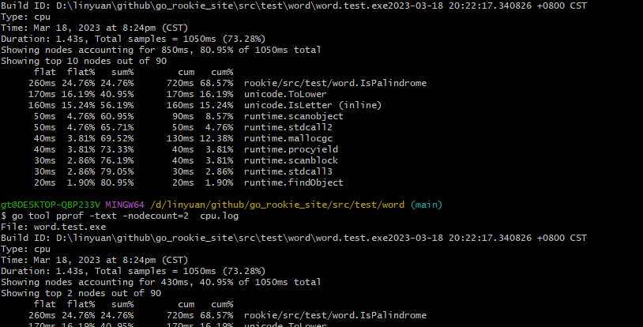

# 关于flag包

flag用于解析命令行

```gotemplate
package main

import (
    "flag"
    "fmt"
    "strings"
)

var n = flag.Bool("n", false, "omit trailing newline")
var sep = flag.String("s", " ", "separator")

func main() {
    flag.Parse()
    fmt.Print(strings.Join(flag.Args(), *sep))
    if !*n {
        fmt.Println()
    }
}

```

## go语言的一些优势
- 所有导入的包必须在每个文件的开头显示声明，这样编译器就没有必要读取和分析整个源文件来判断包的依赖关系。
- 禁止包的循环依赖，因为没有循环依赖，包的依赖关系形成一个有向无环图，每个包可以被独立编译，而且很可能是并发编译。
- 编译后包的目标文件不仅仅记录包本身的导出信息，目标文件同时还记录了包的依赖关系。因此在编译第一个包的时候，编译器只需要读取每个直接导入包的目标文件，而不需要遍历所有依赖的文件（因为很多都是重复依赖）

## 包和工具
- 通过限制包内变量的可见性，可以强制用户通过某些特定的函数来访问和更新内部变量，这样可以保证内部变量的一致性和并发时的互斥约束；
- 每个包里面可以执行init函数；对于main包，main函数才会执行；
- 循环导入会爆错
- 报的init执行 依照深度优先的原则
- 在测试时，必须指定对应的Test（首字母大写）前缀
-  go test -v -run="Canal"
  - `-v` 用于打印每个测试函数的名字和运行时间
  - `-run="Canal|Name"` 正则匹配，运行对应的匹配函数
- 基于测试者是否需要了解被测试对象的内部工作原理
  - 黑盒测试只需要测试包公开的文档和API行为；内部实现对测试代码是透明的
  - 白盒测试有访问内部函数和数据结构的权限，因此可以做到一些普通客户端无法实现的测试


## 相关命令
- go test -cpuprofile=cpu.out  cpu分析
- go test -blockprofile=block.out   代码块分析
- go test -memprofile=mem.out  内存分析
- go tool cover -html=c.out  生成覆盖率html网页
-  go test  -coverprofile=c.out 覆盖率分析

- 对于cpu执行时间的测试



## 测试的规范
- `基准测试`是测量一个程序在固定工作负载下的性能
  - 默认情况下不运行任何基准测试。我们需要通过-bench命令行标志参数手工指定要运行的基准测试函数
  - go test -bench=. 开启基准测试
  - 基准测试的运算结果可以表名，[内存分配是非常费时间](https://golang-china.github.io/gopl-zh/ch11/ch11-04.html)
  
- 避免脆弱测试代码的方法是只检测你真正关心的属性。保持测试代码的简洁和内部结构的稳定
- 报告了调用的具体函数、它的输入和结果的意义；并且打印的真实返回的值和期望返回的值；并且即使断言失败依然会继续尝试运行更多的测试
```gotemplate

func TestSplit(t *testing.T) {
    s, sep := "a:b:c", ":"
    words := strings.Split(s, sep)
    if got, want := len(words), 3; got != want {
        t.Errorf("Split(%q, %q) returned %d words, want %d",
            s, sep, got, want)
    }
    // ...
}

```


## 反射
### 为什么需要反射？
- 虽然这个Values与url.Values一模一样。但是也没办法识别出是一样的结构
- 没有办法检测未知类型的表示方式。所以我们需要反射来处理这个问题


## 关于相同内容不同写法，占用的内存不一致
- name1 占用24字节
- name2和name3占用了16字节


```gotemplate

type name1 struct {
	bool
	float64
	int16
}
type name2 struct {
	float64
	int16
	bool
}
type name3 struct {
	bool
	int16
	float64
}
```


## 关于unsafe.Pointer的一些点
```gotemplate


func main() {

	// 和 pb := &x.b 等价
	// x的起始地址 + b相对于x的偏移地址  得到b的地址
	pb := (*int16)(unsafe.Pointer(
		uintptr(unsafe.Pointer(&x)) + unsafe.Offsetof(x.b)))
	fmt.Println(&(x).b) // 地址 0x9bff42
	fmt.Println(pb)     // 地址 0x9bff42
	fmt.Println(*pb)
	*pb = 42
	fmt.Println(x.b) // "42"

	// 当一个变量被移动时
	// 所有保存改变量旧地址的指针必须 同时被更新为变量移动后的新地址
	// 一个unsafe.Pointer是一个指向变量的指针，因此当变量被移动时对应的指针也必须被更新
	// 但是uintptr类型的临时变量只是一个普通的数字，所以其值不应该被改变
	//  面错误的代码因为引入一个非指针的临时变量tmp，导致垃圾收集器无法正确识别这个是一个指向变量x的指针
	// 当第二个语句执行时，变量x可能已经被转移，这时候临时变量tmp也就不再是现在的&x.b地址。第三个向之前无效地址空间的赋值语句将彻底摧毁整个程序

	tmp := uintptr(unsafe.Pointer(&x)) + unsafe.Offsetof(x.b) // 尽量少用中间值来取地址
	fmt.Println("temp:", tmp)
	pb = (*int16)(unsafe.Pointer(tmp))
	*pb = 46
	fmt.Println(x.b)

	// 这里并没有指针引用new新创建的变量，因此该语句执行完成之后，垃圾收集器有权马上回收其内存空间，所以返回的pT将是无效的地址

	pT := uintptr(unsafe.Pointer(new(T))) // 提示: 错误!

}


```


