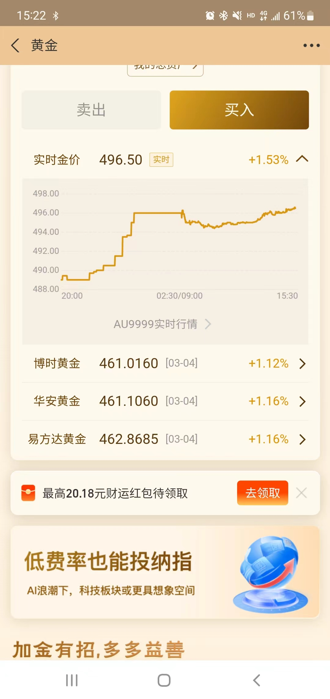
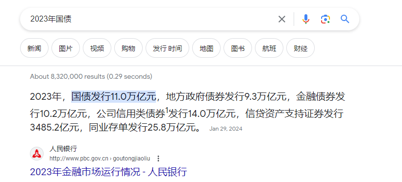
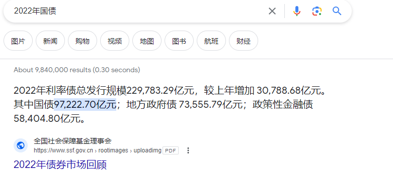
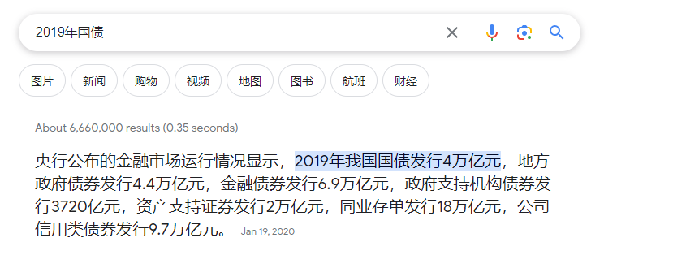
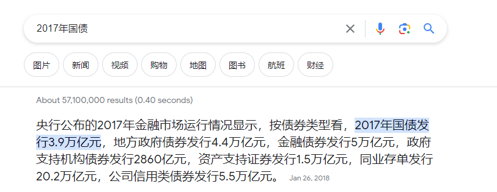

# 从一篇国债新闻引发的讨论

## 背景
都要发现了一篇国债新闻  

观察到当天黄金的涨势

从上面两张图可以看到，国债的发行对黄金的价格影响很大的。

## 关于过载发行的规律
过载在发行之前，一般都有预备发售的新闻发布。这个时候可以稍微关注这方面的信息，在关键的时间节点购买理财产品（例如黄金），赚取利润。
- 国债的发行

对比以上几个年份的国债发行。每年的数量都在增长。2023年的国债发行甚至是2017年的三倍。这个数据是不是有点吓人？

## 关于国债的投资
通过以上对比。可以适当购买国债进行投资理财。但是需要注意的是，国债的投资是有风险的。需要根据自己的实际情况进行投资。
