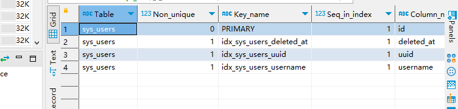

# 关于数据库的说明
## 事务
```mysql
mysql> use RUNOOB;
Database changed
mysql> CREATE TABLE runoob_transaction_test( id int(5)) engine=innodb;  # 创建数据表
Query OK, 0 rows affected (0.04 sec)
 
mysql> select * from runoob_transaction_test;
Empty set (0.01 sec)
 
mysql> begin;  # 开始事务
Query OK, 0 rows affected (0.00 sec)
 
mysql> insert into runoob_transaction_test value(5);
Query OK, 1 rows affected (0.01 sec)
 
mysql> insert into runoob_transaction_test value(6);
Query OK, 1 rows affected (0.00 sec)
 
mysql> commit; # 提交事务
Query OK, 0 rows affected (0.01 sec)
 
mysql>  select * from runoob_transaction_test;
+------+
| id   |
+------+
| 5    |
| 6    |
+------+
2 rows in set (0.01 sec)
 
mysql> begin;    # 开始事务
Query OK, 0 rows affected (0.00 sec)
 
mysql>  insert into runoob_transaction_test values(7);
Query OK, 1 rows affected (0.00 sec)
 
mysql> rollback;   # 回滚
Query OK, 0 rows affected (0.00 sec)
 
mysql>   select * from runoob_transaction_test;   # 因为回滚所以数据没有插入
+------+
| id   |
+------+
| 5    |
| 6    |
+------+
2 rows in set (0.01 sec)
 
mysql>
```


- ALTER语句对表名或表数据字段的修改
- ALTER命令中使用 MODIFY 或 CHANGE 子句 修改字段类型
- 索引
  - 索引分单列索引和组合索引。单列索引，即一个索引只包含单个列，一个表可以有多个单列索引，但这不是组合索引。组合索引，即一个索引包含多个列。
  - 虽然索引大大提高了查询速度，同时却会降低更新表的速度，如对表进行INSERT、UPDATE和DELETE。因为更新表时，MySQL不仅要保存数据，还要保存一下索引文件。
建立索引会占用磁盘空间的索引文件。
  - 防止数据库中出现重复的数据
- 一个表的索引如下(表名：sys_users; 索引有三个；自动形成索引名)



- QBE操作框架由四个部分组成（基于关系域运算的QBE语言）
  - 关系名区，用于书写欲待查询的关系名
  - 属性名区，用于显示对应关系名区关系的所有属性
  - 操作命令区，用于书写查询命令操作
  - 查询条件区，用于书写查询条件

- 关系运算的安全性（不产生无限关系和无穷验证的运算是安全的）
  - 关系代数是一种集合运算，是安全的
  - 关系演算不一定是安全的
- 安全元组演算表达式
- 关于关系运算的一些观点
  - 关系代数（由集合到集合）
  - 关系元组演算
  - 关系域演算


## 数据库系统之二---数据库语言SQL

- SQL语言是集DDL、DML、DCL 一体的数据库语言


- DDL语句引导词
  - Create（建立）、Alter（修改）、Drop（撤销）
  - 模式的定义和删除、包括Database,Table,View,Index
- DML 语句引导词
  - Insert、Delete、Update、Select
  - 各种方式的更新与检索操作
- DCL语句引导词
  - Grant,Revoke
  - 安全性控制：授权和撤销授权


- 交互式SQL->嵌入式SQL->动态SQL


- table
  - primary key  主键约束，每个表只有一个主键
  - Unique：唯一性约束（候选键），可以有多个唯一约束
  - Not Null 非空约束（该列不可为空）
  - 
