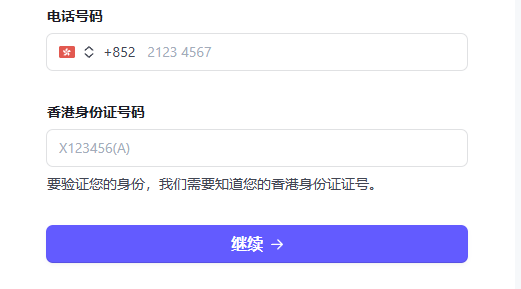

# 关于跨境支付相关的
- 测试说明，你需要办理至少一张国际信用卡，
- 比如visa、master、AE(American Express credit 卡)都可以，国内的银联卡不支持的。

## 补充

- 建议使用stripe，掉单率是最低的，并且支持很多卡，盗刷风险控制的好，相对于PayPal的180天政策，strip三到七天就能收到款项，而且不会被冻结。

- stripe香港个人类型，要香港身份证ID.`最好使用企业资质`

## 存在的问题
- 国内的银联卡支持境外支付，但是不支持境外收款，所以你需要办理一张国际信用卡。
