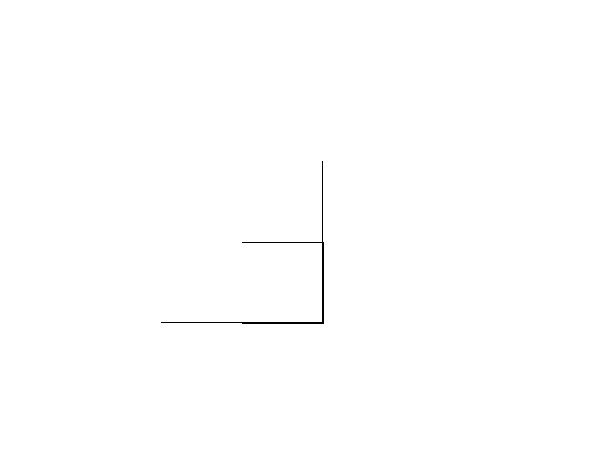
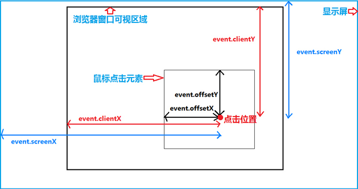

# 计算元素的位置信息

## 代码
```html
<style>
    .container {
      position: absolute;
      top: 200px;
      left: 200px;
      height: 200px;
      width: 200px;
      border: 1px solid black;
    }
    .item {
      position: absolute;
      top: 100px;
      left: 100px;

      height: 50%;
      width: 50%;
      border: 1px solid black;
    }
</style>
<body>
<div class="container">
    <div class="item">

    </div>
</div>
```

## 实际效果



|                         | source元素                                          | 结论                                 | 
|-------------------------|---------------------------------------------------|------------------------------------|
| getComputedStyle(ele)   | top:100px; left:100px; height:100px ;width:100px; | 该方法可自动计算出元素的样式信息(计算出来的宽高不包含border) |
| ele.offsetHeight 102px  | 自身的高度（包含border）                                   |                                    |
| ele.offsetWidth  102px  | 自身的宽度（包含border）                                   |                                    |
| ele.offsetLeft    100px | 距离最近的被定位元素的左边距离（自身元素左上角为原点）                       |                                    |
| ele.offsetTop    100px  | 距离最近的被定位元素的顶边距离（自身元素左上角为原点）                       |                                    |
| ele.offsetParent        | 最近的这个定位的元素                                        |                                    |
| ele.getClientRects()    | 得到元素相对于视口的位置信息                                    |                                    |


## 事件的位置信息



|               | 含义                        |  
|---------------|---------------------------|
| event.clientX | 相对可视区左上角的水平距离             | 
| event.clientY | 相对可视区左上角的垂直距离             | 
| event.pageX   | 相对文档左上角的水平距离  （随着文档的滚动变化） | 
| event.pageY   | 相对文档左上角的垂直距离  （随着文档的滚动变化） |  
| event.offsetX | 相对于绑定事件的元素的左上角的水平距离       |  
| event.offsetY | 相对于绑定事件的元素的左上角的垂直距离       |  
| event.screenX | 相对于设备屏幕的左上角的水平距离          |  
| event.screenY | 相对于设备屏幕的左上角的垂直距离          |  

## (pageX,pageY)与(clientX,clientY)之间的关系：
```javascript
function getMousePos(event) {
    var e = event || window.event;
    var scrollX = document.documentElement.scrollLeft || document.body.scrollLeft;
    var scrollY = document.documentElement.scrollTop || document.body.scrollTop;
    var x = e.pageX || e.clientX + scrollX;
    var y = e.pageY || e.clientY + scrollY;
    //alert('x: ' + x + '\ny: ' + y);
    return { 'x': x, 'y': y };
}
```