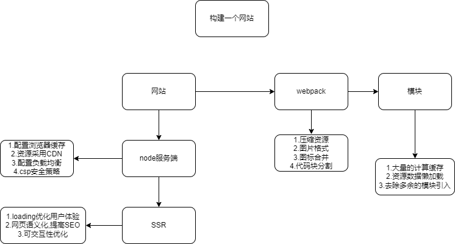

# 什么是打包？
**网页：**


本文主要介绍webpack打包编译过程；
三个文件
+ name.js
```javascript
export const name = 'world';

```
+ message.js
```javascript
import {name} from './name.js';

export default `hello ${name}!`;

```
+ entry.js
```javascript
import message from './message.js';

console.log(message);

```

## 打包后的代码
+ 模块  
相关模块都有自己对应的依赖mapping、对应的模块加载函数fn
```javascript
{
  0: [
    function(require, module, exports) {
      const _message = require('./message.js');

      const _message2 = _interopRequireDefault(_message);

      function _interopRequireDefault(obj) {
        return obj && obj.__esModule ? obj : {default: obj};
      }

      console.log(_message2.default);
    },
    {'./message.js': 1},
  ],
  1: [
    function(require, module, exports) {
      Object.defineProperty(exports, '__esModule', {
        value: true,
      });

      const _name = require('./name.js');

      exports.default = `hello ${_name.name}!`;
    },
    {'./name.js': 2},
  ],
  2: [
    function(require, module, exports) {
      Object.defineProperty(exports, '__esModule', {
        value: true,
      });
      const name = (exports.name = 'world');
    },
    {},
  ],
}
```
+ 加载模块的函数  
这里的模块加载函数，默认从`require(0)`开始执行;  
require函数的作用，传入模块ID，开始传入模块`0`,获取  
+ 模块0的fn
```javascript
function(require, module, exports) {
      const _message = require('./message.js');

      const _message2 = _interopRequireDefault(_message);

      function _interopRequireDefault(obj) {
        return obj && obj.__esModule ? obj : {default: obj};
      }

      console.log(_message2.default);
    }
```
+ 模块0的mapping(模块依赖的映射)
```javascript
{'./message.js': 1},
```
+ 加载模块的函数会获取到当前的依赖映射message模块是序号1，其模块执行函数中传入了我们
外部定义好的localRequire函数，该loadRequire函数是作为当前模块顶层的require函数的，
localRequire，因为0莫块由mapping：`{'./message.js': 1},`模块0的fn在顶层环境中传入了我们在调用fn之前的loadRequire，loadRequire
相当于缓存了0模块的模块映射，所以当前0模块调用require去加载模块`message`时，就是调用我们之前重写的loadRequire函数，之后就是调用`required(1)`
;
+ 加载1模块(`require(1)`),获取模块1的mapping和fn,调用模块1的fn并传入在模块1中定义好的loadRequire（缓存了模块1的依赖映射）；
,根据模块内部的export关键字，为外部传入的module.export引用值进行赋值变量；根据import关键字，来调用顶层传入的require函数

```javascript
(function(modules) {
  function require(id) {
    const [fn, mapping] = modules[id];

    function localRequire(name) {
      return require(mapping[name]);
    }

    const module = {exports: {}};

    fn(localRequire, module, module.exports);

    return module.exports;
  }

  require(0);
})
```

总结：
+ import 关键字主要用来调用顶层传入的require函数
+ export关键字用来为外部传入module.export的引用值进行赋值