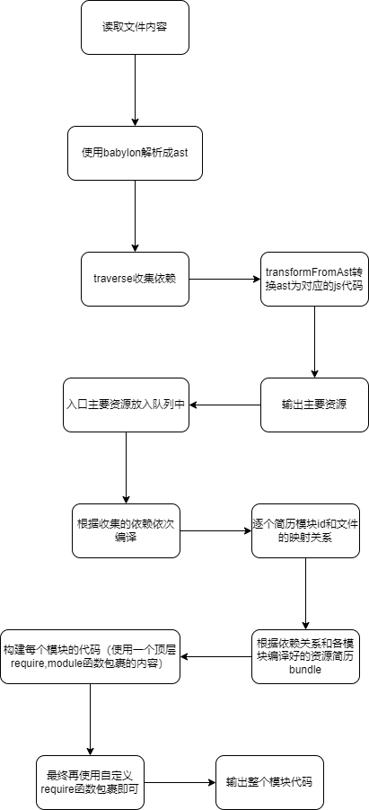

# 打包工具webpack,打包过程


+ 打包过程其实就是一个代码拼接的过程，   
+ 创建项目整体模块
创建一个模块队列。模块有一个mapping对象，根据模块依赖生成依赖资源，在模块中
；创建模块依赖和依赖资源的映射；这个时候就处理好了依赖和依赖id的映射关系；
```javascript

function createGraph(entry) {
  const mainAsset = createAsset(entry);

  const queue = [mainAsset];

  for (const asset of queue) {
    asset.mapping = {};

    const dirname = path.dirname(asset.filename);

    asset.dependencies.forEach(relativePath => {
      const absolutePath = path.join(dirname, relativePath);

      const child = createAsset(absolutePath);

      asset.mapping[relativePath] = child.id;

      queue.push(child);
    });
  }

  return queue;
}
```
+ 封装生成的资源
根据模块代码，使用require函数包裹模块代码，建立该模块的依赖映射代码；
```javascript

function bundle(graph) {
  let modules = '';

  
  graph.forEach(mod => {
    
    modules += `${mod.id}: [
      function (require, module, exports) {
        ${mod.code}
      },
      ${JSON.stringify(mod.mapping)},
    ],`;
  });

  const result = `
    (function(modules) {
      function require(id) {
        const [fn, mapping] = modules[id];

        function localRequire(name) {
          return require(mapping[name]);
        }

        const module = { exports : {} };

        fn(localRequire, module, module.exports);

        return module.exports;
      }

      require(0);
    })({${modules}})
  `;

  return result;
}
```
+ 处理文件的核心方法
打包是针对文件去进行的，首先读取文件；调用`babylon`将文件转换为ast；
更具`import声明`去收集当前模块中的依赖,为当前模块生成一个`id`;将`ast`转换为
js文件内容；

````javascript
function createAsset(filename) {
  const content = fs.readFileSync(filename, 'utf-8');
  
  const ast = babylon.parse(content, {
    sourceType: 'module',
  });

  const dependencies = [];
  traverse(ast, {
    ImportDeclaration: ({node}) => {
      dependencies.push(node.source.value);
    },
  });

  const id = ID++;
  const {code} = transformFromAst(ast, null, {
    presets: ['env'],
  });

  return {
    id,
    filename,
    dependencies,
    code,
  };
}
````

## 总结
+ 自定义了一个函数require.
+ 代码模块被封转成了`id：{fn,mapping}`这样的形式,从初始模块开始加载
+ 查找到模块中对应的mapping中的模块id；加载依赖模块；
