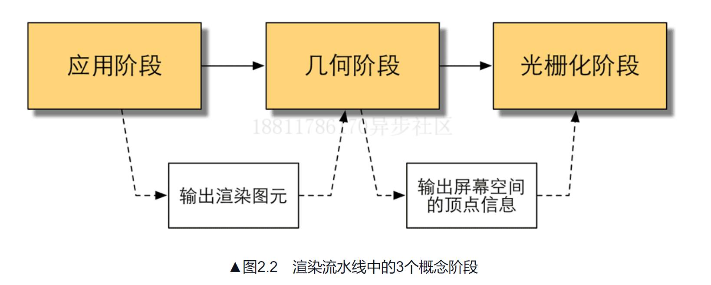
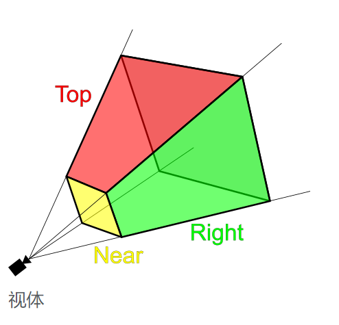
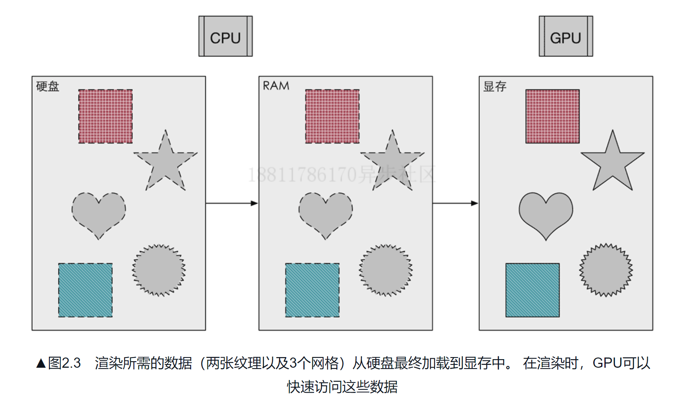
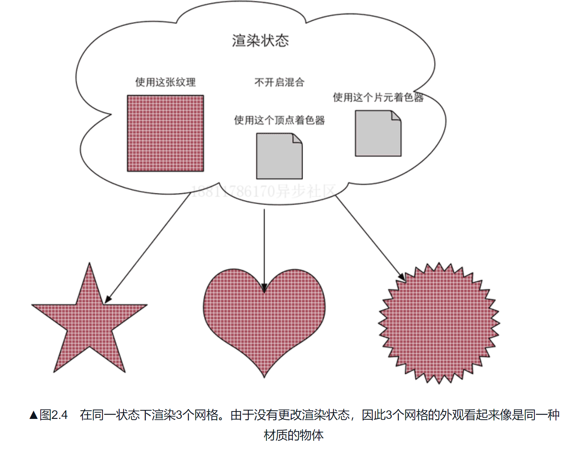

# 渲染流水线概述
渲染流水线的目的是为了生成一张二维纹理，即我们在电脑上看到的所有效果；   
他的输入：
- 一个虚拟的摄像机
- 一些光源
- 一些Shader
- 一些纹理
## 什么是PipLine
渲染流水线可分为三个阶段
- 应用阶段
- 几何阶段
- 光栅化阶段

#### 应用阶段
- 准备场景数据（摄像机位置、`视锥体`、场景模型、光源等等）;
  视锥体（英语：viewing frustum）又称视景体、视锥，是三维世界中在屏幕上可见的区域，即虚拟摄像机的视野。

- 提升性能（将不可见的物体剔除）
- 设置好每个模型的渲染状态：材质（漫反射颜色、高光反射颜色）、使用的纹理、使用的shader；

`应用阶段`最重要的输出是渲染所需要的几何信息，即`渲染图元`。渲染图元会被传递给下一阶段----`几何阶段`；

#### 几何阶段
几何阶段处理所有和我们要绘制的的集合相关的事情；这个阶段重要的任务就是`把顶点坐标变换到屏幕空间、再交给光栅器进行处理`；`通过对输入的图元进行多步处理后，这一阶段输出屏幕空间二维顶点
坐标、每个顶点对应的深度值、着色等相关信息并传递给下一阶段；`
- 决定要绘制的图元是什么
- 怎样绘制他们
- 在哪里绘制他们

#### 光栅化阶段
利用上一阶段传递过来的信息构建屏幕上的像素；光栅化的任务主要是决定每个渲染图元中的哪些像素应该被绘制在屏幕上；
需要对上一阶段得到的逐顶点数据进行插值，然后再进行逐像素处理；
- 插值 是一种通过已知的、离散的数据点，在范围内推求新数据点的过程或方法

### CPU和GPU之间的通信
渲染流水线的起点是CPU，即应用阶段，大概分为以下三个阶段：
- 把数据加载到显存中

- 设置渲染状态  
什么是渲染状态，这些状态定义了场景中的网格是怎样被渲染的。例如：使用哪一个顶点着色器/片元着色器、光源属性、材质。

- 调用Draw Call   
根据渲染状态来绘制图形；
   
