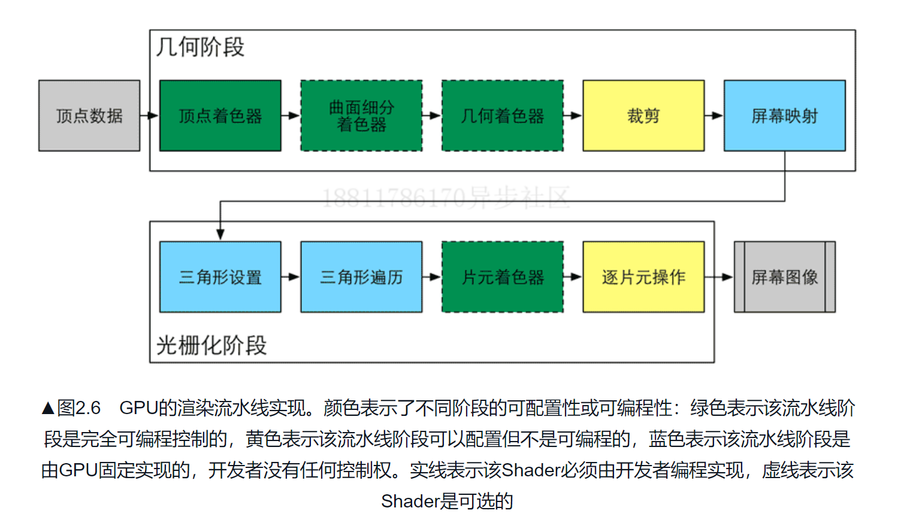
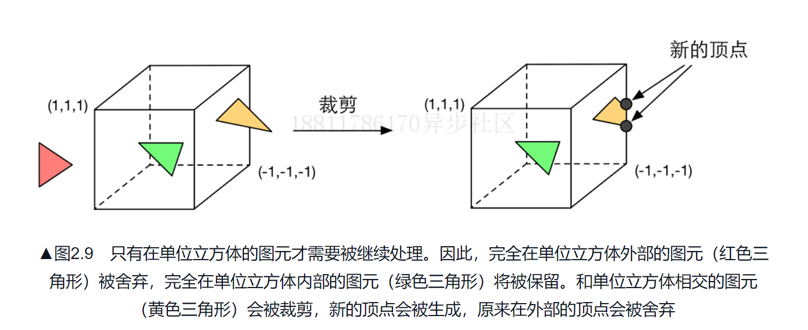
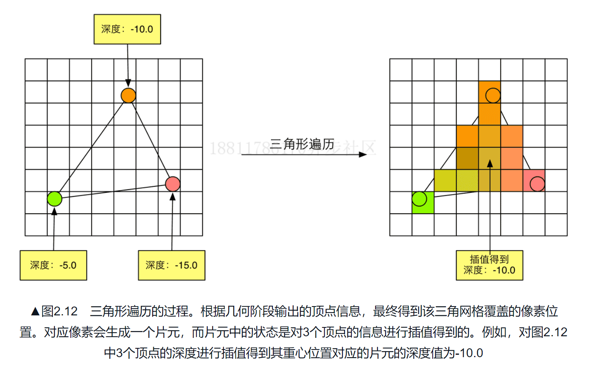
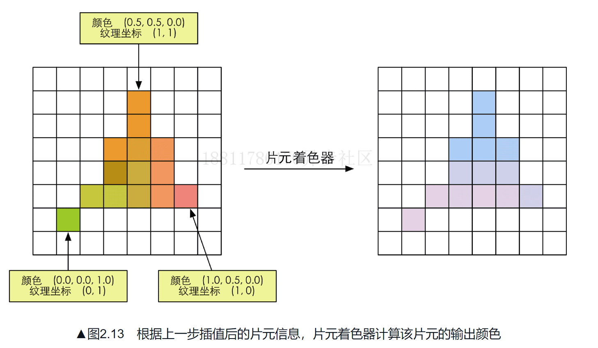
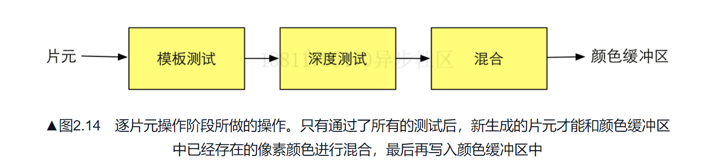

# GPU流水线概述
GPU在几何阶段和光栅化阶段向开发者开放了很多控制权；   
几何阶段和光栅化阶段可以分为若干更小的流水线阶段，每个节点GPU提供了不同的可配置性或可编程性。

- `定点着色器（vertex shader）`是完全可编程的，通常用于实现顶点的空间变换、顶点着色等功能
- `曲面细分着色器（tessellation shader）` 是可选的着色器，它用于细分图元；
- `几何着色器`，用于逐图元的着色操作，或者生成更多图元
- `裁剪`，这一阶段的目的是将那些不在摄像机视野内的顶点裁剪掉，并提出某些三角图元，例如使用自定义的裁剪平面来配置裁剪区域
- `屏幕映射`，这一阶段是不可编程和配置的，这一节点负责吧每个图元坐标转换到屏幕坐标系中。
- `三角形设置、三角形遍历`不可操作和配置
- `片元着色器`是`完全可编程`的，用于实现逐片元的着色操作
- `逐片元操作`阶段是不可编程，但是具有很高的可配置性；例如：修改颜色、深度缓冲、进行混合等等

## 顶点着色器
输入来自cpu，输入进来的每个顶点都会调用一次定点着色器。顶点本身不可创建和销毁，输入的每个顶点都会调用一次着色器；
主要工作是`坐标变换和逐顶点光照`
- 坐标变换就是把顶点坐标从模型空间转换到齐次裁剪空间；
## 裁剪
由于摄像机的视野范围有限，所以对于不在摄像机视野范围内的物体通常是不需要进行渲染的；

## 屏幕映射
将图元的x和y坐标转换到屏幕坐标系，对于输入的z坐标，屏幕映射不会对z坐标进行任何处理，实际上屏幕坐标系和z坐标一起构成一个坐标系，即`窗口坐标系`；
屏幕银蛇得到的屏幕坐标决定这个顶点对于屏幕上的哪个像素以及距离这个像素有多远。

## 光栅化
从上一个阶段输出的信息是屏幕坐标系下的顶点位置以及他们的相关的额外信息，如深度值（z坐标），法线方向，视角方向;
光栅化的主要目标：`计算图元覆盖了哪些像素，以及为这些像素计算它们的颜色；`;
#### 光栅化的几个阶段：
- 三角形设置  
计算光栅化一个三角网格的信息
- 三角形遍历
检查每个像素是否被一个三角网格覆盖，如果被覆盖，就会生成一个`片元`
- 使用三角网格的三个顶点信息对整个覆盖区域的像素进行插值

这一步的输出就是得到一个片元序列。   
一个片元并不是真正意义上的像素，而是包含了很多状态的集合，这些状态用于计算每个像素的最终颜色。   
这些状态包括了（但不限于）他的屏幕坐标、深度信息、以及从其他几何阶段输出的定点信息：例如法线、纹理坐标等等。

## 片元着色器
片元着色器非常重要的阶段就是可编程着色阶段；之前的光栅化阶段并不会影响屏幕上的每个像素的颜色值，
而是会产生一系列的数据信息，用来表述一个三角网格网格是怎样覆盖每个像素的。每个片元就负责存储这样一系列数据；真正对像素产生影响的是---`逐片元操作`；    
#### 纹理采样
为了在片元着色器中进行纹理采样，通常会在顶点着色器阶段输出每个顶点的纹理坐标，然后经过关善化阶段对三角网格的三个顶点对应的纹理坐标进行插值后，就可以得到其覆盖的片元的纹理坐标了。

当执行片元着色器时，他不可以将自己的任何结果直接发送给他的邻居们。

#### 逐片元操作
- 决定每个片元的可见性；这里主要做测试工作，例如深度测试、模板测试；

- 如果一个片元通过了所有的测试，就需要把这个片元的颜色值和以及存储在颜色缓冲中的颜色进行合并，或则说混合；
- 对于透明的片。通过混合操作进行颜色混合