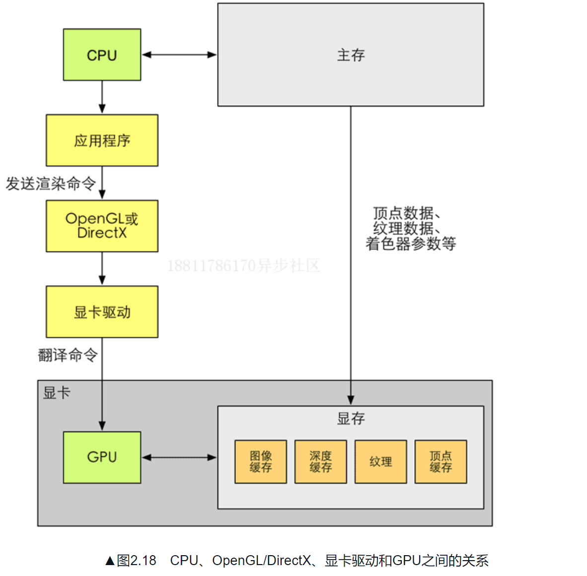

# 图像编程相关
开发者访问GPU是一件非常麻烦的事情，我们可能需要和各种`寄存器、显存`打交道；   
opengl和directX在这些硬件的基础上实现了一层抽象。这些接口可用于渲染
二维或者三维图形；   

> 概括来说，我们的应用程序运行在gpu上，应用程序通过调用Opengl或者DirectX的图形接口将渲染所需要的数据，如顶点、纹理数据、材质参数等数据存储在显存的
> 特定区域；开发者通过图像编程接口发出渲染命令，也被称为`Draw Call`

>一个显卡除了有图像处理单元GPU外，还拥有自己的内存，这个内存通常称为显存（VRAM）。GPU可以在显存中存储任何数据，但对于渲染来说，一些数据类型是必须的，例如用于屏幕显示的图像缓冲、深度缓冲；

## 关于DrawCall
draw call过多会影响帧率？ 

GPU的渲染能力很强，因此渲染速度往往快于CPU的提交命令的速度，如果draw call的数量太多，cpu就会把大量的时间花费在提交draw call（即cpu向gpu发送很多内容，包括数据，状态，命令等等）；
造成cpu过载。

如何减少draw call？

- 批处理
> 把很多很小的draw call合并为一个大的draw call
