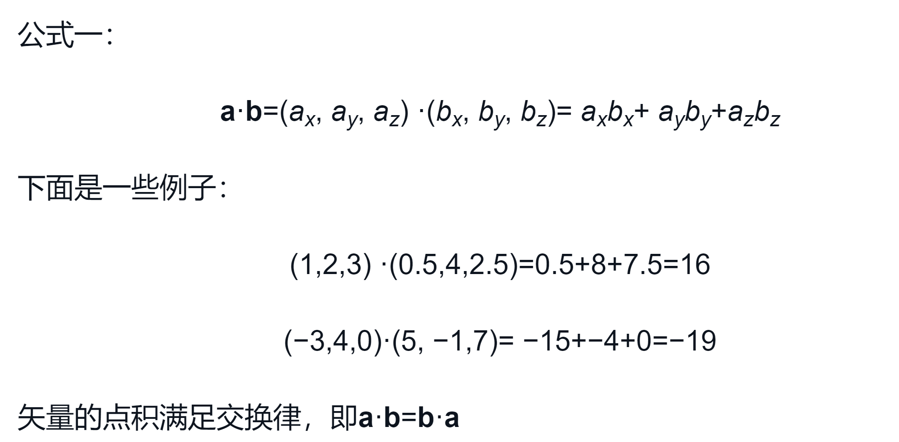
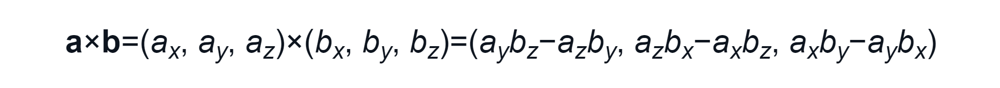
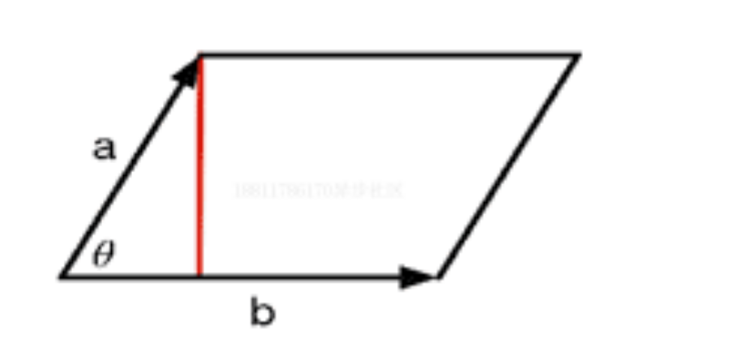
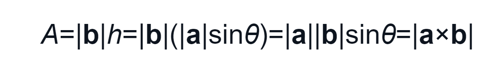

# 理论基础-笛卡尔坐标系
## 二维笛卡尔坐标系
包含两个部分的信息
- 特俗位置；即`原点`它是整个坐标的中心
- 两条过原点的互相垂直的矢量；即`x轴`、`y轴`，也被称为该坐标系的`基矢量`
## 三维笛卡尔坐标系
包含两个部分的信息
- 特俗位置；即`原点`它是整个坐标的中心
- 三条过原点的互相垂直的矢量；即`x轴`、`y轴`、`z轴`，也被称为该坐标系的`基矢量`
## 正交基与标准正交基
- 三个坐标轴互相垂直，且长度为1，这样的基矢量被称为`标准正交基`
- 在一些坐标系中，坐标轴之间互相垂直但长度不为1，这样的基矢量被称为`正交基`。
#### 图像学中的矢量、标量
`矢量的点积`

点积的几何意义可应用在投影：假设两个向量，可以通过点击求出向量夹角的`cos`值，然后可以求出，向量之间的投影关系；
向量点积的结果正是这两个向量的单位向量点积的结果；

`矢量的叉积`
  

以下叉积的模推导过程计算复杂，暂且考虑平行四边形的面积的求法； 

以下平行四边形：

四边形面积公式：

### 叉积的作用
- 计算垂直与一个平面、三角形的矢量，并判断三角面片的朝向；