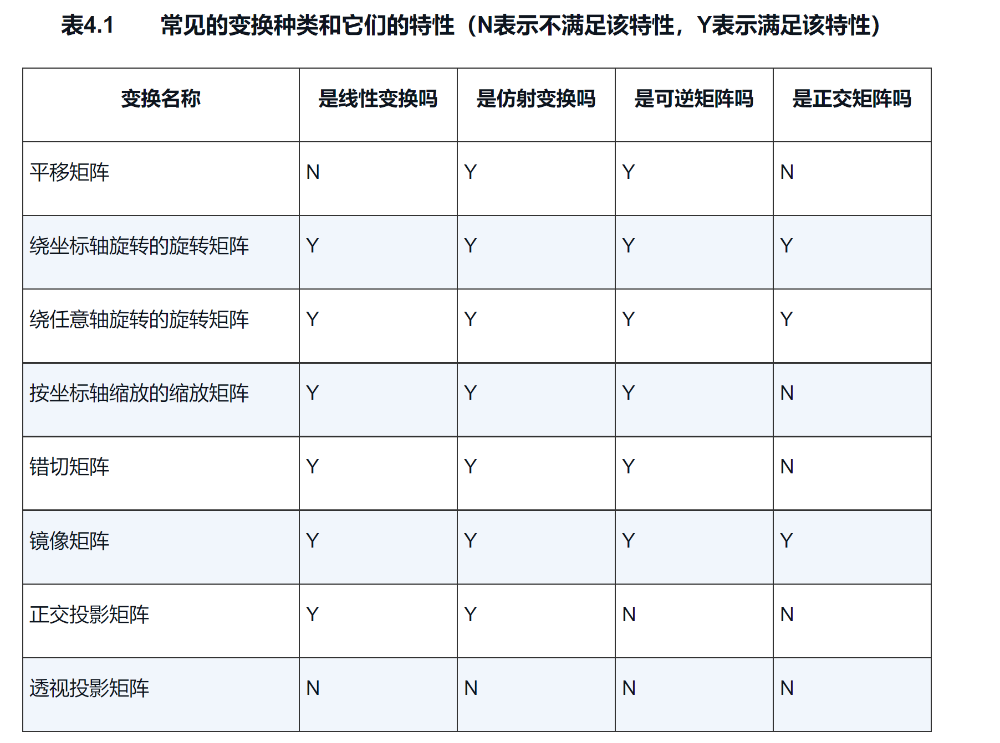

# 理论基础---矩阵   
- 矩阵运算
- 方阵的性质（n x n）
- 对角矩阵（除对角线外，所有元素都是0）
- 单位矩阵（特殊的对角矩阵）
- 转置矩阵（只需要交换位置）
- 逆矩阵（行列式不为0）
- 正交矩阵（矩阵M和它的转置矩阵的乘积是单位矩阵，那么这个矩阵M就是正交的；同样可以得到M的转置矩阵就是他的逆矩阵）
> 矩阵的每一行都是单位向量（他们与自己的点积为1）  
> 矩阵的每一行相互垂直（两行之间的点积为0）
- 矩阵的几何意义---`变换`

- 齐次坐标空间（为了统一低阶矩阵的变换）
- 对于其次空间变换时，原坐标点后面补0或1的意义：1代表时点的变换，0代表时矢量变换（`这里主要体现在平移上会有影响`）
- 在变换顺序上，依照平移、缩放、旋转的顺序；主要（先缩放，后平移）；如果（先平移，后缩放），那么之前移动的距离，会被缩小或者放大；