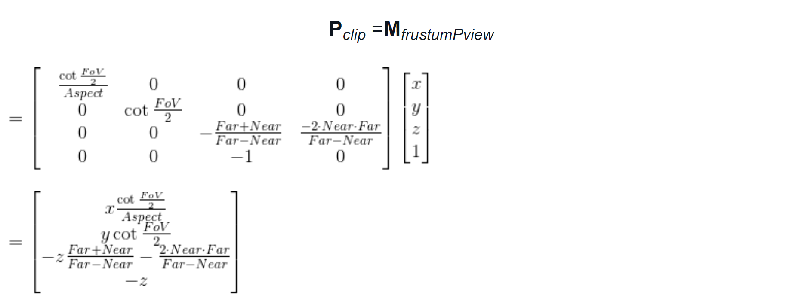

# 理论基础---坐标空间
`模型空间 => 世界空间 => 观察空间 => 屏幕空间`    

1. [x] `模型空间（以自身为坐标系，找到从而确立自身的结构信息）是最原始的坐标点（相对自身的原点）`
2. [x] `世界空间（世界空间的原点位于中心点，模型坐标的原点是依赖于世界中心原点）是对原始的坐标进行变换，变换后得到的值是相对于世界中心原点的`
3. [x] `观察空间`
> `这个空间是一个三维立体空间`，为了得到顶点在观察空间中的位置。   
> 
> 方式一： 计算观察空间坐标轴在世界空间下的表示，构建初观察空间到世界空间的变换矩阵；然后求这个矩阵的逆矩阵，也就可以得到从世界空间到观察空间的变换矩阵；    
> 
> 方法二：想象平移整个观察空间，让摄像机原点位于世界坐标原点
> 
> 以上两者方式得到的变换矩阵都是一样的；
1. [x] 裁剪空间
> 这个空间属于观察空间(放一个视锥体在观察空间中)，但是对原有的观察空间醉了一些显示限制；因此通过矩阵变换的方式剔除一些坐标，并计算出观察空间坐标的对应的裁剪
> 空间坐标值
1. [x] 屏幕空间
> 裁剪完成后，就可以将裁剪空间中的坐标投影到屏幕空间，生成2D图像

`参考：冯乐乐shader精要 4.6.4节`     
#### 模型空间和世界空间
`变换过程中，已经知道在模型空间中的坐标点，然后在世界空间坐标中，对该模型进行缩放、旋转和平移操作，从而得到在世界空间中变换后，原坐标点的新的坐标值（此时还是相对于原模型空间坐标系，而不是相对于世界坐标系）`   


在渲染过程中，往往需要把一个点或者方向矢量从一个坐标空间转换到另一个坐标空间。   `
一个顶点最开始是在模型空间中定义的，最后它会变换到屏幕空间中，得到真正的屏幕像素坐标。`
- 模型空间
> 该模型有自己的的坐标点，坐标轴
- 世界空间
> 可以容纳模型空间的一个坐标系统

- 当我们已知从模型空间到世界空间的4x4的`变换矩阵M`，可以提取它的第一列并进行归一化后来得到模型空间的x轴
在世界空间下的单位矢量表示。同样的方法可以提取y轴、z轴。   
- 从另一个角度来理解这个提取过程：因为`矩阵M`可以把一个方向矢量从模型坐标空间变换到世界坐标空间，那么，我们只需要
用它来变换模型坐标空间中的x轴，即使用矩阵乘法M[1,0,0,0]T,正好就是矩阵的第一列；   
- 从世界空间到模型空间，只需要求出`M矩阵的逆矩阵`；（如果M是一个正交矩阵的话，那么M的置就是M的逆矩阵）


#### 观察空间
观察空间也被称为`摄像机空间`，观察空间是模型空间中的一个特例
`tips:` 观察空间和屏幕空间是不一样的，`观察空间是一个三维空间`，`屏幕空间是一个二维空间；`     
`投影:`从观察空间转换到屏幕空间；   

模型空间转换到世界空间后得到新的顶点坐标；这个时候再将新的顶点坐标转换到观察空间，最终从观察空间转换到屏幕空间；


## 裁剪空间
得到了模型空间坐标在世界空间坐标的表示方法；求得观察空间到到世界空间的转换矩阵，求得该矩阵的逆矩阵，从而得到世界空间坐标到观察
空间的转换矩阵；得到模型空间到观察空间的坐标；最终将观察空间进行投影（正交投影或者透视投影也叫裁剪空间）得到二维屏幕上的坐标；

> 裁剪空间的目标是对渲染图元进行裁剪：位于空间内部的会被保留，完全位于空间外部的会被剔除；与这块空间相交的图元就会被裁剪；这块空间是由`视锥体`来决定的

### 视锥体
视锥体由六个平面包围，这些平面称为裁剪平面；视锥体的两者类型，分别涉及正交投影，另外一种是透视投影。

####  使用投影矩阵将顶点转移到裁剪空间中
`透视投影矩阵：`


透视投影的本质就是类似缩放加上平移。由于裁剪空间范围归一化之后都会在[-1,1];
因此将观察空间投影到裁剪空间后的坐标中，w分量和变换之前的z分量有关，最终标准化处理后就是除以z（此处可提现一种近大远小的效果），部分不属于[-1,1]范围的坐标会被剔除；

`正交投影矩阵 `


## 屏幕空间
`参考：4.6.8节`  
裁剪空间最终得到一个标准化的`NDC空间`（范围[-1,1]）;
根据NDC坐标即可求出在像素空间中的坐标值：


以上坐标映射关系：   
```text
NDC坐标 => 像素坐标   
[-1,-1] => [0,0]
[0,0] => [width/2,height/2]
[1,1] => [width,height]
```

# 总结
