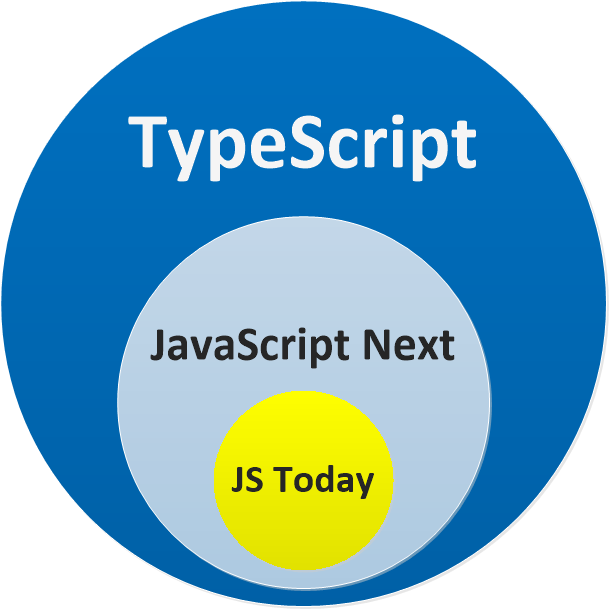

# 《精解》Typescript
typescript被编译成javascript在浏览器上执行，所以需要两个条件：  
+ [typescript编译器](https://www.npmjs.com/package/typescript)
+ [typescript编辑器](https://code.visualstudio.com/)

安装typescript
````
npm install -g typescript@next
````
##  typescript与javascript的关系
+ typescript帮助你编写更清晰，错误更少的代码
+ typescript一种新的抽象语言，但是与javascript风格相差不大，可以快速的学习并运用  
+ typescript本质上相当于一份javascript的严格的检查文档

```javascript
[]+[]; // javascript中的结果为 '',typescript中会报error

/**
 * js中还有很多无意义的书写
 * 通常js只能在运行时发现问题，但是ts在编译是就会提早的提示错误
 */

{} + [] // JS: 0, TS:error
[] + {} // JS : '[object Object]', TS Error
{} + {} // JS : 火狐浏览器中NaN,谷歌浏览器中 '[object Object][object Object]'；TS：Error
'hello' - 1 // JS : NaN, TS Error

function add(a,b) {
  return
  a + b; // JS : undefined, TS Error 'unreachable code detected'
}
```


### 相等
在javascript中有两种不同的符号： == 和 ===;当两个不同的变量类型之间使用 == 时，javascript会对两个变量进行强制类型转换；  
例如：string转换成number
```javascript
console.log(5 == '5') // true   , TS Error
console.log(5 === '5') // false , TS Error
```
javascript这样的比较方式是不理想的,例如字符串0和数字0容易让人混淆具体的含义：
```javascript
console.log('' == '0') // false
console.log(0 == '') // true

console.log('' === '0') // false
console.log(0 === '') // false
```

### 引用

处理原始的数据类型以外，在javascript中所有的对象都是引用（函数、数组、正则）；
+ 数据更改容易产生意外风险
```javascript
var foo = {}
var bar = foo // bar是foo这个对象的引用

foo.baz = 123 // 改动foo时，对于bar也产生了相应的影响
console.log(bar.baz) // 123
```

### null VS undefined
javascript和typescript中都有两种不同的底层类型：null 和 undefined,他们都表示不同的含义：  
+ 没有初始化：undefined
+ 当前不可用（已经初始化）：null  

事实上两者需要分别的进行处理，但是在javascript中使用 == 时，null和undefined之间是相等的；

```javascript

console.log(null == null); // true 
console.log(undefined == undefined); // true 
console.log(null == undefined); // true


console.log(0 == undefined); // false
console.log('' == undefined); // false
console.log(false == undefined); // false
```

### Json和序列化
json支持null而不支持undefined，当一个对象中，某个属性的值为null,序列化后的属性将会包含null值；
如果某个属性的值时undefined，那么这个属性会被清除掉；
```javascript
JSON.stringify({willStay: null, willBeGone: undefined}); // {"willStay":null}
```
基于json的数据库可能支持空值，但不支持未定义的值

## this
this由函数的调用方式进行控制，通常也被称为上下文；
例如：
```javascript
function foo() {
  console.log(this);
}

foo(); // 输出`window` 
let bar = {
  foo
}
bar.foo(); // 输出'bar'
```
如果想将this与其调用上下文断开，可以使用箭头函数；

## 闭包
js中的函数可以访问外部作用域中定义的任何变量，
```javascript
function outerFunction(arg) {
    var variableInOuterFunction = arg;

    function bar() {
        console.log(variableInOuterFunction); // 从外部作用域访问变量
    }

    bar();
}

outerFunction("hello closure"); // 输出 hello closure
```
即使外部函数返回之后，内部函数也可以从外部访问变量，因为变量任然绑定在内部函数中，而不依赖与外部函数。
```javascript
function outerFunction(arg) {
    var variableInOuterFunction = arg;
    return function() {
        console.log(variableInOuterFunction);
    }
}

var innerFunction = outerFunction("hello closure");

// 注意：外部函数已经 return
innerFunction(); // 输出 hello closure
```


