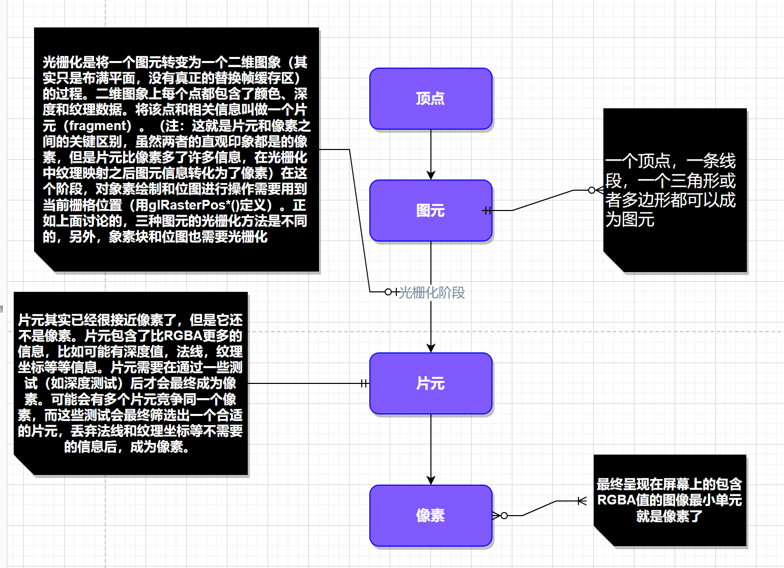
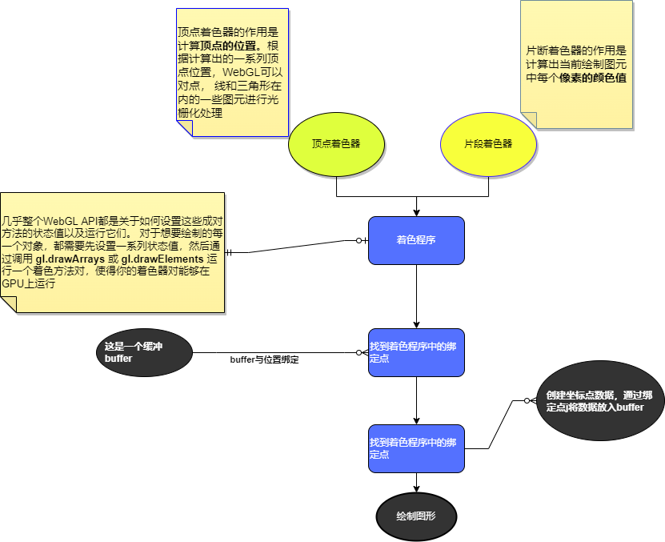

# webgl简介
仅仅是一个光栅化引擎，他根据代码绘制出点，线，三角形；想要实现更复杂的渲染，需要提供合适的代码进行组合点，线，三角形来代替实现；  
几乎整个WebGL API都是关于如何设置这些成对方法的状态值以及运行它们


webgl运行在GPU中；代码需提供成对的方法；每个方法中需要一个定点着色器和一个片段着色器，该语言称作GLSL，类似c++；每一对这样的方法称作一个着色程序（program）;   

+ 着色程序的方法中所需要的数据都发送到GPU
+ 着色器获取数据（属性和缓冲、全局变量、纹理、可变量）

> **属性和缓冲：**   
> `缓冲`是发送到GPU的一些二进制数据序列，通常情况下缓存数据包括`位置`、`法向量`、`纹理坐标`、`顶点颜色`。       
> `属性 `是指明如何从缓冲区中获取所需的数据并将他提供给顶点着色器；对于一个确切的属性，需要`告诉它从哪个缓冲却获取数据，获取的数据的类型，起始值的偏移是多少，到下一个位置的字节数是多少`。       

> **全局变量（Uniforms）**     
> 全局变量在着色程序运行前赋值，在运行过程中全局有效；       

> 纹理    
> 纹理是一个数据序列，可以在着色程序中随意读取其中的数据。大多数情况存储的是图像数据，但仅仅是数据序列，也`可以存放除了颜色数据以外的其他数据`。        

> 可变量   
> 可变量是一种顶点着色器给片段着色器传值的方式，根据渲染图元是点，线，还是多边形，`顶点着色器中设置的可变量会在片段着色器运行中获取不同的插值；`         


 `顶点、图元、像素、片元:`




# webgl运行过程


```javascript

// 创建着色器方法，输入参数：渲染上下文，着色器类型，数据源
export function createShader(
  gl, type, source
) {
  const shader = gl.createShader(type) // 创建着色器对象
  gl.shaderSource(shader, source) // 提供数据源
  gl.compileShader(shader) // 编译 -> 生成着色器
  const success = gl.getShaderParameter(shader, gl.COMPILE_STATUS)
  if (success) {
    return shader
  }

  console.log('getShaderInfoLog', gl.getShaderInfoLog(shader))
  gl.deleteShader(shader)
}


// 然后我们将这两个着色器 link（链接）到一个 program（着色程序）
export function createProgram(
  gl, vertexShader, fragmentShader
) {
  const program = gl.createProgram()
  gl.attachShader(program, vertexShader)
  gl.attachShader(program, fragmentShader)
  gl.linkProgram(program)

  const success = gl.getProgramParameter(program, gl.LINK_STATUS)
  if (success) {
    return program
  }

  console.log(gl.getProgramInfoLog(program))
  gl.deleteProgram(program)
}


export function triangles(canvas) {
  // Get A WebGL context
  const gl = canvas.getContext('webgl')
  if (!gl) {
    return
  }

  // Get the strings for our GLSL shaders
  // 顶点着色器源
  const vertexShaderSource = `
        // 一个属性值，从缓冲区获取数据
        // a_position属性的数据类型是vec4
        // vec4是一个有四个浮点数据的数据类型。
        // 在JavaScript中你可以把它想象成 a_position = {x: 0, y: 0, z: 0, w: 0}。之前我们设置的size = 2，
        // 属性默认值是0, 0, 0, 1，然后属性将会从缓冲中获取前两个值（ x 和 y ）。 z和w还是默认值 0 和 1 。
        
        attribute vec4 a_position;
    
        // 所有的着色器都有一个main函数
        void main() {
    
        // gl_Position 是一个顶点着色器主要设置的变量
        gl_Position = a_position;
      }
          `
  // 片段着色器
  const fragmentShaderSource = `
        
    
        // 片断着色器没有默认精度，所以我们需要设置一个精度
        // mediump是一个不错的默认值，代表“medium precision”（中等精度）
        precision mediump float;
    
        void main() {
        // gl_FragColor 是一个片断着色器主要设置的变量
        // 这里的颜色可参考rgba格式进行设置
        gl_FragColor = vec4(0, 0, 0, 1); // 返回“瑞迪施紫色”
      }
          `

  // 创建顶点着色器
  const vertexShader = createShader(
    gl, gl.VERTEX_SHADER, vertexShaderSource
  )
  // 创建片段着色器
  const fragmentShader = createShader(
    gl, gl.FRAGMENT_SHADER, fragmentShaderSource
  )

  // 将两个着色器链接在一起
  const program = createProgram(
    gl, vertexShader, fragmentShader
  )

  // 创建好了着色程序，我们还需要对他提供数据
  // glsl着色程序唯一输入是一个属性值a_position，从刚创建的着色程序找到这个属性值所在位置
  // 寻找属性值位置应该在初始化的时候完成，而不是在渲染时完成
  const positionAttributeLocation = gl.getAttribLocation(program, 'a_position')

  // 属性值从缓冲区获取，所以创建一个缓冲
  const positionBuffer = gl.createBuffer()

  // webgl可以通过绑定点操控全局范围内的许多数据，可以吧绑定点想象成一个全局变量
  // 首先绑定一个数据源到绑定点，然后引用绑定点指向该数据源
  // 以下我们绑定位置信息缓冲（下面的绑定点就是ARRAY_BUFFER）
  gl.bindBuffer(gl.ARRAY_BUFFER, positionBuffer)

  // 三个二维点坐标
  const positions = [
    0, 0,
    0, 1,
    -1, 0
  ]
  // webgl需要强数据类型。所以 new Float32Array(positions) 创建了32位浮点型数据序列
  // 并从positions中复制数据待序列中，
  // gl.bufferData复制这些数据到GPU的positionBuffer对象上
  // 数据最终传递到positionBuffer是因为上一步我们已经将它绑定在了ARRAY_BUFFER（也就是绑定点）上
  // 最后一个参数gl.STATIC_DRAW是提示WebGL我们将怎么使用这些数据
  // WebGL会根据提示做出一些优化。
  // gl.STATIC_DRAW提示WebGL我们不会经常改变这些数据。
  gl.bufferData(
    gl.ARRAY_BUFFER, new Float32Array(positions), gl.STATIC_DRAW
  )

  // 以上都是初始代码，在页面加载时只会运行一次.
  // 以下是渲染代码

  // 防止canvas选然后像素模糊的问题
  webglUtils.resizeCanvasToDisplaySize(gl.canvas)
  // 告诉webgl怎样吧提供的gl_Position裁剪空间坐标对应到画布像素坐标（通常画布像素坐标也叫屏幕坐标）
  // 需要调用gl.viewport 方法并传递画布的当前尺寸
  // 这样就告诉webgl裁剪空间的-1=>+1分别对应到X轴的0=>gl.canvas.width 和y轴的 0 -> gl.canvas.height
  gl.viewport(
    0, 0, gl.canvas.width, gl.canvas.height
  )

  // 用0, 0, 0, 0清空画布，分别对应 r, g, b, alpha （红，绿，蓝，阿尔法）值
  gl.clearColor(
    0, 0, 0, 0
  )
  gl.clear(gl.COLOR_BUFFER_BIT)

  // 告诉webgl运行哪个着色程序
  gl.useProgram(program)

  // 告诉webgl怎么从我们之前准备的缓冲中获取数据给着色器中的属性
  // 首先需要启用对应的属性
  gl.enableVertexAttribArray(positionAttributeLocation)

  // 将绑定点绑定到缓冲数据（positionBuffer）
  gl.bindBuffer(gl.ARRAY_BUFFER, positionBuffer)

  // 告诉属性怎么从positionBuffer中读取数据 (ARRAY_BUFFER)
  const size = 2          // 每次迭代运行提取两个单位数据
  const type = gl.FLOAT   // 每个单位的数据类型是32位浮点型
  const normalize = false // 不需要归一化数据
  const stride = 0        // 0 = 移动单位数量 * 每个单位占用内存（sizeof(type)）每次迭代运行运动多少内存到下一个数据开始点
  const offset = 0        // 从缓冲起始位置开始读取
  // 一个额外的信息是gl.vertexAttribPointer是将属性绑定到当前的ARRAY_BUFFER。
  // 换句话说就是绑定到 positionBuffer上。
  // 这也意味着现在利用绑定点随意将 ARRAY_BUFFER绑定到其它数据上后，该属性依然从positionBuffer上读取数据
  gl.vertexAttribPointer(
    positionAttributeLocation, size, type, normalize, stride, offset
  )


  // 开始绘制
  // 因为count = 3，所以顶点着色器将运行三次
  // 第一次运行将会从位置缓冲中读取前两个值赋给属性值a_position.x和a_position.y
  // 第二次运行a_position.xy将会被赋予后两个值，最后一次运行将被赋予最后两个值
  // 最后一次运行将被赋予最后两个值

  // 因为我们设置primitiveType（图元类型）为 gl.TRIANGLES（三角形）， 顶点着色器每运行三次
  // WebGL将会根据三个gl_Position值绘制一个三角形，
  // 不论我们的画布大小是多少，在裁剪空间中每个方向的坐标范围都是 -1 到 1 。
  const primitiveType = gl.TRIANGLES
  const count = 3


  // WebGL将会把它们从裁剪空间转换到屏幕空间并在屏幕空间绘制一个三角形， 如果画布大小是400×300我们会得到类似以下的转换
  //   0, 0,   -> 200, 150 位置1
  //   0, 0.5, -> 200, 225 位置2
  //   0.7, 0, -> 340, 150 位置3

  // 从以上的推断可以得出相关结论
  // canvas中心点为基础点（0，0）
  // （-1，-1） 表示（200 + (200*(-1)),150 + (150*(-1))）
  // （-0.5，0.3） 表示（200 + (200*(-5)),150 + (150*(-3))）
  gl.drawArrays(
    primitiveType, offset, count
  )
}


// todo
/**
 *
 * 上面的例子中顶点着色器只是简单传递了位置信息
 * 由于位置坐标就是裁剪空间中的坐标，所以着色器没有特殊的执行，
 * 如果想要实现三位渲染，那么就需要提供合适的着色器将三维坐标转换到裁剪空间坐标
 * 因为webgl只是一个光栅化的API
 *
 * 裁剪空间的x坐标范围是 -1 到 +1. 这就意味着0在中间并且正值在它右边。
 * 裁剪空间中 -1 是最底端 +1 是最顶端
 * 对于描述二维空间中的物体，比起裁剪空间坐标你可能更希望使用屏幕像素坐标
 */
```


