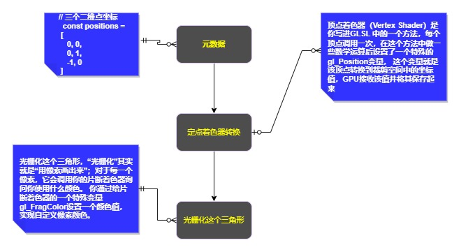

# webgl工作原理

```javascript
// 因为我们设置primitiveType（图元类型）为 gl.TRIANGLES（三角形）， 顶点着色器每运行三次
  // WebGL将会根据三个gl_Position值绘制一个三角形，
  // 不论我们的画布大小是多少，在裁剪空间中每个方向的坐标范围都是 -1 到 1 。
  const primitiveType = gl.TRIANGLES
  const count = 9
  const offset = 0
  gl.drawArrays(
    primitiveType, offset, count
  )
```
代码中的9表示`处理九个顶点`，所有会有九个顶点被转换   
左侧是你提供的数据。顶点着色器（Vertex Shader）是你写进GLSL 中的一个方法，每个顶点调用一次，在这个方法中做一些数学运算后设置了一个特殊的gl_Position变量， 这个变量就是该顶点转换到裁剪空间中的坐标值，GPU接收该值并将其保存起来


假设正在`渲染一个三角形`，顶点着色器每完成三次顶点处理，webgl就会用这个顶点话一个三角形,整体渲染过程如下



