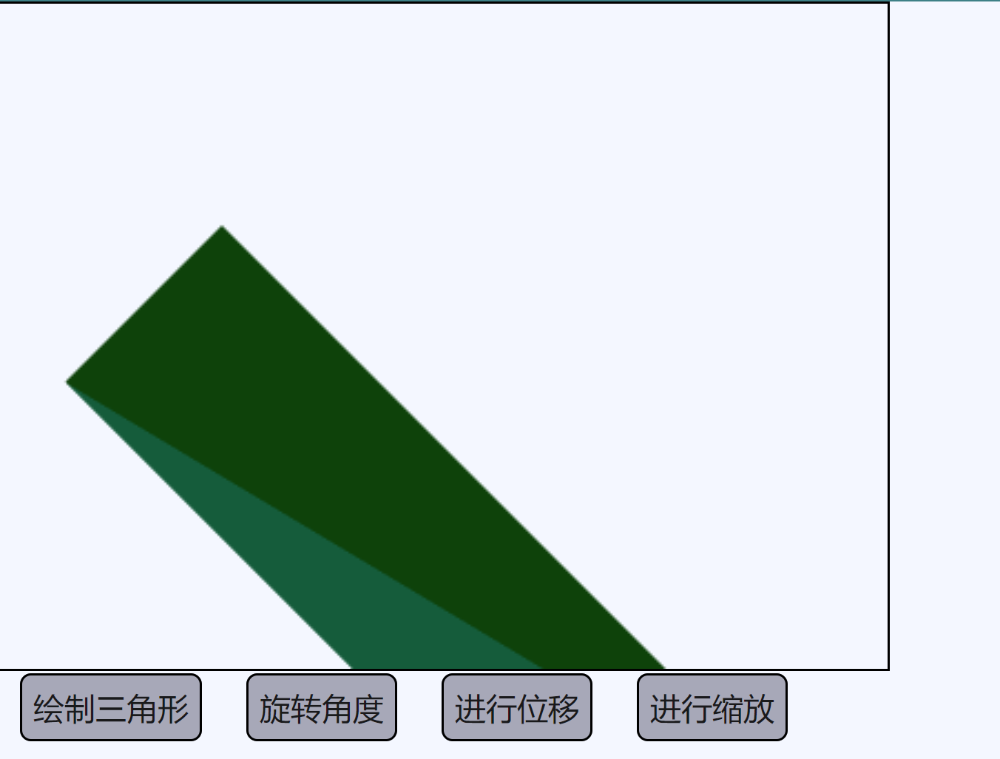
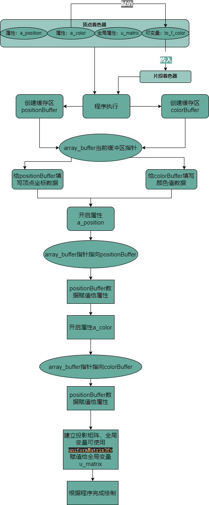

# webgl工作原理
最终实现：缩放、旋转、位置


##### tips：
+ 使用插值实现颜色渐变
```javascript
// 给矩形的两个三角形
// 设置颜色值并发到缓冲
function setColors(gl) {
  // 给每个顶点定义不同的颜色
  gl.bufferData(
      gl.ARRAY_BUFFER,
      new Float32Array(
        [ Math.random(), Math.random(), Math.random(), 1,
          Math.random(), Math.random(), Math.random(), 1,
          Math.random(), Math.random(), Math.random(), 1,
          Math.random(), Math.random(), Math.random(), 1,
          Math.random(), Math.random(), Math.random(), 1,
          Math.random(), Math.random(), Math.random(), 1]),
      gl.STATIC_DRAW);
}
```


- 关于绘制时的参数说明
```javascript
// 因为我们设置primitiveType（图元类型）为 gl.TRIANGLES（三角形）， 顶点着色器每运行三次
  // WebGL将会根据三个gl_Position值绘制一个三角形，
  // 不论我们的画布大小是多少，在裁剪空间中每个方向的坐标范围都是 -1 到 1 。
  const primitiveType = gl.TRIANGLES
  const count = 9
  const offset = 0
  gl.drawArrays(
    primitiveType, offset, count
  )
```
代码中的9表示`处理九个顶点`，所有会有九个顶点被转换   
左侧是你提供的数据。顶点着色器（Vertex Shader）是你写进GLSL 中的一个方法，每个顶点调用一次，在这个方法中做一些数学运算后设置了一个特殊的gl_Position变量， 这个变量就是该顶点转换到裁剪空间中的坐标值，GPU接收该值并将其保存起来


假设正在`渲染一个三角形`，顶点着色器每完成三次顶点处理，webgl就会用这个顶点话一个三角形,整体渲染过程如下


程序绘制过程:
````javascript
import { createProgramFromStrings } from '../webglCommon'
const m3 = require('../webglScript/m3')


export function rectangle(canvas) {
  const gl = canvas.getContext('webgl')
  if (!gl) {
    return
  }


  const vertexShaderSource = `
    // 定义顶点二维向量
    attribute vec2 a_position;
    // 颜色属性 四维向量 rgba
    attribute vec4 a_color;
    // 全局变量矩阵 3*3的方阵
    uniform mat3 u_matrix;
    // 可变量颜色 思维向量
    varying vec4 to_f_color;
    
    void main() {
      //
      // 位置乘以矩阵
      gl_Position = vec4((u_matrix * vec3(a_position, 1)).xy, 0, 1);
    
      // Copy the color from the attribute to the varying.
      to_f_color = a_color;
    }
  `
  const fragmentShaderSource = `
    precision mediump float;
    
    
    void main() {
      gl_FragColor = to_f_color;
    }
  `
  /**
   *  设置着色器程序
   * （顶点着色器定义了position的转换方法）
   * (片段着色器中定义了颜色变量)
   */
  const program = createProgramFromStrings(
    gl, vertexShaderSource, fragmentShaderSource
  )

  /**
   * 在程序着色程序中找到位置和颜色变量
   */
  const positionLocation = gl.getAttribLocation(program, 'a_position')
  const colorLocation = gl.getAttribLocation(program, 'a_color')

  /**
   * 找到全局变量矩阵信息
   * @type {WebGLUniformLocation}
   */
  const matrixLocation = gl.getUniformLocation(program, 'u_matrix')
  //=====================================几何位置绑定=============================
  /**
   * 创建一个顶点信息缓冲区
   * 将缓冲区绑定到绑定点
   * tips:
   * gl.createBuffer 创建一个缓冲
   * gl.bindBuffer 设置缓冲为当前使用的缓冲
   * gl.bufferData将数据拷贝到缓冲，这个操作一般在初始化完成
   * 以下操作完成了将数据拷贝到 positionBuffer
   * @type {WebGLBuffer | AudioBuffer}
   */
  const positionBuffer = gl.createBuffer()
  gl.bindBuffer(gl.ARRAY_BUFFER, positionBuffer)
  /**
   * 设置顶点几何信息（即坐标信息）
   */
  setGeometry(gl)
  //============================================================================

  //=====================================颜色信息绑定=============================
  /**
   * 创建一个颜色信息缓冲却
   * 将缓冲区绑定在绑定点
   * @type {WebGLBuffer | AudioBuffer}
   */
  const colorBuffer = gl.createBuffer()
  gl.bindBuffer(gl.ARRAY_BUFFER, colorBuffer)
  /**
   * 设置颜色信息
   */
  setColors(gl)
  //===========================================================================


  // 设置平移的初始值
  let translation = [0, 0]
  // 设置旋转的初始值（旋转中心点为左上角的点）
  let angleInRadians = 0
  // 设置缩放的初始值（长宽的缩放问题）
  let scale = [1, 1]
  // 开始画当前的图像信息
  drawScene()
  function updatePosition(event, ui) {
    translation = ui.value
    drawScene()
  }

  function updateAngle(event, ui) {
    const angleInDegrees = 360 - ui.value
    angleInRadians = angleInDegrees * Math.PI / 180
    drawScene()
  }

  function updateScale(event, ui) {
    scale = ui.value
    drawScene()
  }


  // 开始画图
  function drawScene() {

    // 从裁剪空间抓换到屏幕空间上
    // 裁剪空间通常设置为0，0（因为裁剪会造成图像的一部分丢失掉）
    gl.viewport(
      0, 0, gl.canvas.width, gl.canvas.height
    )

    // 清除画布信息
    gl.clear(gl.COLOR_BUFFER_BIT)

    // 使用着色程序
    gl.useProgram(program)

    // 开启位置属性
    gl.enableVertexAttribArray(positionLocation)
    // 之前数据已经拷贝到了 positionBuffer
    // 绑定顶点缓冲区 (当前缓冲使用 positionBuffer)
    //
    gl.bindBuffer(gl.ARRAY_BUFFER, positionBuffer)

    // 告诉属性怎么从positionBuffer中读取数据 (ARRAY_BUFFER)
    let size = 2          // 每次迭代运行提取两个单位数据 todo (位置是 [x,y] 格式的 所以是两点)
    let type = gl.FLOAT   // 每个单位的数据类型是32位浮点型
    let normalize = false // 不需要归一化数据
    let stride = 0        // 0 = 移动单位数量 * 每个单位占用内存（sizeof(type)）每次迭代运行运动多少内存到下一个数据开始点
    let offset = 0        // 从缓冲起始位置开始读取
    /**
     * tips
     * 因为当前的ARRAY_BUFFER是positionBuffer
     * 也就是将当前的positionBuffer数据写入在了顶点属性上
     */
    // 一个额外的信息是gl.vertexAttribPointer是将属性绑定到当前的ARRAY_BUFFER。
    // 换句话说就是绑定到 positionBuffer上。
    // 这也意味着现在利用绑定点随意将 ARRAY_BUFFER绑定到其它数据上后，该属性依然从positionBuffer上读取数据
    gl.vertexAttribPointer(
      positionLocation, size, type, normalize, stride, offset
    )

    // 开启颜色属性
    gl.enableVertexAttribArray(colorLocation)

    // 绑定颜色缓冲区
    // 在此设置当前绑定点是colorBuffer
    gl.bindBuffer(gl.ARRAY_BUFFER, colorBuffer)

    // 告诉属性怎么从colorBuffer中读取数据
    size = 4          // 每次迭代运行提取4个单位数据  todo (颜色是 rgba 格式的 所以是由四个数据)
    type = gl.FLOAT   // 每个单位的数据类型是32位浮点型
    normalize = false // 不需要归一化数据
    stride = 0        // 0 = 移动单位数量 * 每个单位占用内存（sizeof(type)）每次迭代运行运动多少内存到下一个数据开始点
    offset = 0        // 从缓冲起始位置开始读取
    /**
     * tips
     * 因为当前的ARRAY_BUFFER是colorBuffer
     * 也就是将当前的colorBuffer数据写入在了颜色属性上
     */
    gl.vertexAttribPointer(
      colorLocation, size, type, normalize, stride, offset
    )

    // 创建 3*3的裁剪空间，也叫做齐次裁剪空间；（该矩阵叫做裁剪矩阵，也叫做投影矩阵）
    let matrix = m3.projection(gl.canvas.clientWidth, gl.canvas.clientHeight)
    console.log(matrix)
    /**
     * todo
     * 对矩阵进行平移变换
     */
    matrix = m3.translate(
      matrix, translation[0], translation[1]
    )
    /**
     * todo
     * 对矩阵进行旋转变换
     */
    matrix = m3.rotate(matrix, angleInRadians)
    /**
     * todo
     * 对矩阵进行缩放变换
     */
    matrix = m3.scale(
      matrix, scale[0], scale[1]
    )

    // 在矩阵位置设置该矩阵
    // 这里设置了矩阵信息
    gl.uniformMatrix3fv(
      matrixLocation, false, matrix
    )

    /**
     * todo
     * 顶点信息
     * 颜色信息设置好之后
     * 开始进行图像绘制
     * @type {string|number|GLenum|*}
     */
    const primitiveType = gl.TRIANGLES
    offset = 0
    const count = 6
    /**
     *  todo
     *  执行渲染，
     *  此时矩阵数据，颜色属性，顶点属性已经被设置好
     *  可直接绘制三角形
     */
    gl.drawArrays(
      primitiveType, offset, count
    )

  }
  return {
    updateAngle,
    updatePosition,
    updateScale,
  }
}


// 用定义矩形的值填充缓冲区。
// 将把值放在当前的任何缓冲区中
// 绑定到 ARRAY_BUFFER 绑定点

// 最后一个参数gl.STATIC_DRAW是提示WebGL我们将怎么使用这些数据
// WebGL会根据提示做出一些优化。
// gl.STATIC_DRAW提示WebGL我们不会经常改变这些数据。
function setGeometry(gl) {
  //gl.bufferData将数据拷贝到缓冲，这个操作一般在初始化完成
  gl.bufferData(
    gl.ARRAY_BUFFER,
    new Float32Array([
      0, 0,
      0, 200, // 公共点1
      200,  0, // 公共点2
      0, 200,
      200,  0,
      200,  200]),
    gl.STATIC_DRAW
  )
}

// 用定义颜色的值填充缓冲区。
// 将把值放在当前的任何缓冲区中
// 绑定到 ARRAY_BUFFER 绑定点
function setColors(gl) {
  // 两种随机颜色
  const r1 = Math.random()
  const b1 = Math.random()
  const g1 = Math.random()
  const r2 = Math.random()
  const b2 = Math.random()
  const g2 = Math.random()

  gl.bufferData(
    gl.ARRAY_BUFFER,
    new Float32Array([r1, b1, g1, 1,
      r1, b1, g1, 1,
      r1, b1, g1, 1,
      r2, b2, g2, 1,
      r2, b2, g2, 1,
      r2, b2, g2, 1]),
    gl.STATIC_DRAW
  )
}

````



