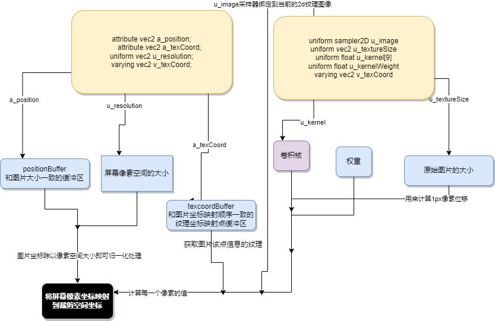

# webgl图像处理、


## 程序大纲

```javascript


import { createProgramFromStrings } from '../webglCommon'

export function triangles(canvas, image) {
  const gl = canvas.getContext('webgl')
  if (!gl) {
    return
  }
  const vertexShaderSource = `
        attribute vec2 a_position;
        attribute vec2 a_texCoord;
        
        uniform vec2 u_resolution;
        
        varying vec2 v_texCoord;
        
        void main() {
           // 像素空间转换到裁剪空间（-1，1）
           vec2 zeroToOne = a_position / u_resolution;
        
           // 转换 0->1 to 0->2
           vec2 zeroToTwo = zeroToOne * 2.0;
        
           // 转换 0->2 to -1->+1 (裁剪空间坐标)
           vec2 clipSpace = zeroToTwo - 1.0;
           // 将y轴反转
           gl_Position = vec4(clipSpace * vec2(1, -1), 0, 1);
        
           // 传入纹理坐标
           v_texCoord = a_texCoord;
        }
  `
  /**
   * todo
   * sampler2D和vec2、float表示一种数据类型，
   * 只不过sampler2D关键字声明的变量表示一种取样器类型变量，
   * 简单点说就是该变量对应纹理图片的像素数据
   * @type {string}
   */
  const fragmentShaderSource = `
      precision mediump float;
      
      // 纹理信息
      // 2d采样器
      uniform sampler2D u_image;
      // 纹理大小
      uniform vec2 u_textureSize;
      // 卷积核
      uniform float u_kernel[9];
      // 核权重
      uniform float u_kernelWeight;
      
      // 顶点着色器传入的纹理坐标.
      varying vec2 v_texCoord;
      
      void main() {
         // 1px 像素
         // 图像处理需要其他像素的颜色值怎么办？
         // 由于WebGL的纹理坐标范围是 0.0 到 1.0 ， 那我们可以简单计算出移动一个像素对应的距离
         
         vec2 onePixel = vec2(1.0, 1.0) / u_textureSize;
         
         
         // 以下
         // 第一个参数代表图片纹理，第二个参数代表纹理坐标点，通过GLSL的内建函数texture2D来获取对应位置纹理的颜色RGBA值
         // texture2D函数创建texture2D贴图，并对像素进行操作
         // 取得当前纹理坐标周围坐标的像素值，然后做卷积运算
         // 最终得到一个像素值，这个像素值就是当前片段着色器器的颜色值
         
         
         
         // vec4 texture2D(sampler2D sampler, vec2 coord)
         // vec4 texture2D(sampler2D sampler, vec2 coord, float bias)
         // 因为texImage2D指定了被绑定的纹理图像
         // 参数1是一个采样器，这个采样器（u_image）会被绑定到当前的纹理图像
         // 参数1： sampler指定将从中检索纹素的纹理绑定到的采样器 。
         // 参数2： coord指定纹理将被采样的纹理坐标。
         // 参数3： bias指定在详细级别计算期间要应用的可选偏差
         // texture2D 函数返回一个纹素，即给定坐标的纹理（颜色）值
         vec4 colorSum =
             texture2D(u_image, v_texCoord + onePixel * vec2(-1, -1)) * u_kernel[0] +
             texture2D(u_image, v_texCoord + onePixel * vec2( 0, -1)) * u_kernel[1] +
             texture2D(u_image, v_texCoord + onePixel * vec2( 1, -1)) * u_kernel[2] +
             texture2D(u_image, v_texCoord + onePixel * vec2(-1,  0)) * u_kernel[3] +
             texture2D(u_image, v_texCoord + onePixel * vec2( 0,  0)) * u_kernel[4] +
             texture2D(u_image, v_texCoord + onePixel * vec2( 1,  0)) * u_kernel[5] +
             texture2D(u_image, v_texCoord + onePixel * vec2(-1,  1)) * u_kernel[6] +
             texture2D(u_image, v_texCoord + onePixel * vec2( 0,  1)) * u_kernel[7] +
             texture2D(u_image, v_texCoord + onePixel * vec2( 1,  1)) * u_kernel[8] ;
      
         gl_FragColor = vec4((colorSum / u_kernelWeight).rgb, 1);
      }
  `
  // 启动一个程序
  const program = createProgramFromStrings(
    gl, vertexShaderSource, fragmentShaderSource
  )
  
  // 找到顶点数据的位置
  const positionLocation = gl.getAttribLocation(program, 'a_position')
  const texcoordLocation = gl.getAttribLocation(program, 'a_texCoord')
  
  // 创建一个缓冲区，防止裁剪空间中的点
  const positionBuffer = gl.createBuffer()
  // 当当缓冲区指向 positionBuffer
  gl.bindBuffer(gl.ARRAY_BUFFER, positionBuffer)
  // 建立一个和图片一样大的矩形（给positionBuffer中注入数据）
  setRectangle(
    gl, 0, 0, image.width, image.height
  )
  
  /**
   * todo
   * 为提供一个纹理坐标缓存区
   * 纹理坐标就是纹理与图形的映射关系（顶点和纹理坐标必须按照一致的顺序进行映射）
   * 图形中每个顶点都会关联一个纹理坐标，表示顶点需要从该位置读取纹理图像的数据。
   *
   * 纹理坐标的范围是 0 到 1 之间，
   * 顶点坐标一般是用（ x，y，z）描述，而纹理坐标是用（ s，t，r）描述
   * 常规情况下，纹理坐标默认左下角为（0，0），右上角为（1，1）
   * 纹理坐标的映射关系并不是固定的，可以根据图片的翻转，进行不同的映射，但是不能让图片交叉
   * @type {WebGLBuffer | AudioBuffer}
   */
  const texcoordBuffer = gl.createBuffer()
  gl.bindBuffer(gl.ARRAY_BUFFER, texcoordBuffer)
  gl.bufferData(
    gl.ARRAY_BUFFER, new Float32Array([
      0.0,  0.0,
      1.0,  0.0,
      0.0,  1.0,
      0.0,  1.0,
      1.0,  0.0,
      1.0,  1.0
    ]), gl.STATIC_DRAW
  )
  
  // =========================================创建图像纹理=============START========================================
  const texture = gl.createTexture()
  gl.bindTexture(gl.TEXTURE_2D, texture)
  
  // 设置纹理参数
  // target: gl.TEXTURE_2D
  // TEXTURE_WRAP_S 纹理坐标水平填充       默认值 gl.CLAMP_TO_EDGE
  gl.texParameteri(
    gl.TEXTURE_2D, gl.TEXTURE_WRAP_S, gl.CLAMP_TO_EDGE
  )
  
  // TEXTURE_WRAP_T纹理坐标垂直填充        默认值 gl.CLAMP_TO_EDGE
  gl.texParameteri(
    gl.TEXTURE_2D, gl.TEXTURE_WRAP_T, gl.CLAMP_TO_EDGE
  )
  
  // TEXTURE_MIN_FILTER     纹理缩小滤波器     默认值 gl.CLAMP_TO_EDGE
  gl.texParameteri(
    gl.TEXTURE_2D, gl.TEXTURE_MIN_FILTER, gl.NEAREST
  )
  
  // TEXTURE_MAG_FILTER  纹理放大滤波器       默认值 gl.NEAREST
  gl.texParameteri(
    gl.TEXTURE_2D, gl.TEXTURE_MAG_FILTER, gl.NEAREST
  )
  /**
   * todo
   *
   *
   * 指定根据图像二维纹理图像
   * 参数 ：target, level, internalformat, format, type, ImageData? pixels
   *
   */
  gl.texImage2D(
    gl.TEXTURE_2D, 0, gl.RGBA, gl.RGBA, gl.UNSIGNED_BYTE, image
  )
  // =========================================创建图像纹理=============END========================================
  
  
  // 找到全局变量的位置
  const resolutionLocation = gl.getUniformLocation(program, 'u_resolution')
  const textureSizeLocation = gl.getUniformLocation(program, 'u_textureSize')
  const kernelLocation = gl.getUniformLocation(program, 'u_kernel[0]')
  const kernelWeightLocation = gl.getUniformLocation(program, 'u_kernelWeight')
  
  // 定义卷积核
  const kernels = {
    normal: [
      0, 0, 0,
      0, 1, 0,
      0, 0, 0
    ],
    gaussianBlur: [
      0.045, 0.122, 0.045,
      0.122, 0.332, 0.122,
      0.045, 0.122, 0.045
    ],
    gaussianBlur2: [
      1, 2, 1,
      2, 4, 2,
      1, 2, 1
    ],
    gaussianBlur3: [
      0, 1, 0,
      1, 1, 1,
      0, 1, 0
    ],
    unsharpen: [
      -1, -1, -1,
      -1,  9, -1,
      -1, -1, -1
    ],
    sharpness: [
      0, -1, 0,
      -1, 5, -1,
      0, -1, 0
    ],
    sharpen: [
      -1, -1, -1,
      -1, 16, -1,
      -1, -1, -1
    ],
    edgeDetect: [
      -0.125, -0.125, -0.125,
      -0.125,  1,     -0.125,
      -0.125, -0.125, -0.125
    ],
    edgeDetect2: [
      -1, -1, -1,
      -1,  8, -1,
      -1, -1, -1
    ],
    edgeDetect3: [
      -5, 0, 0,
      0, 0, 0,
      0, 0, 5
    ],
    edgeDetect4: [
      -1, -1, -1,
      0,  0,  0,
      1,  1,  1
    ],
    edgeDetect5: [
      -1, -1, -1,
      2,  2,  2,
      -1, -1, -1
    ],
    edgeDetect6: [
      -5, -5, -5,
      -5, 39, -5,
      -5, -5, -5
    ],
    sobelHorizontal: [
      1,  2,  1,
      0,  0,  0,
      -1, -2, -1
    ],
    sobelVertical: [
      1,  0, -1,
      2,  0, -2,
      1,  0, -1
    ],
    previtHorizontal: [
      1,  1,  1,
      0,  0,  0,
      -1, -1, -1
    ],
    previtVertical: [
      1,  0, -1,
      1,  0, -1,
      1,  0, -1
    ],
    boxBlur: [
      0.111, 0.111, 0.111,
      0.111, 0.111, 0.111,
      0.111, 0.111, 0.111
    ],
    triangleBlur: [
      0.0625, 0.125, 0.0625,
      0.125,  0.25,  0.125,
      0.0625, 0.125, 0.0625
    ],
    emboss: [
      -2, -1,  0,
      -1,  1,  1,
      0,  1,  2
    ],
  }
  const initialSelection = 'edgeDetect2'
  
  // ===============定义一套UI交互=====================================================START===============
  const ui = document.querySelector('#ui')
  const select = document.createElement('select')
  for (const name in kernels) {
    const option = document.createElement('option')
    option.value = name
    if (name === initialSelection) {
      option.selected = true
    }
    option.appendChild(document.createTextNode(name))
    select.appendChild(option)
  }
  select.onchange = function() {
    drawWithKernel(this.options[this.selectedIndex].value)
  }
  ui.appendChild(select)
  drawWithKernel(initialSelection)
  
  function computeKernelWeight(kernel) {
    const weight = kernel.reduce(function(prev, curr) {
      return prev + curr
    })
    return weight <= 0 ? 1 : weight
  }
  
  // ===============定义一套UI交互=====================================================END===================
  
  function drawWithKernel(name) {
    
    // 裁剪空间到像素空间
    gl.viewport(
      0, 0, gl.canvas.width, gl.canvas.height
    )
    
    // 清除
    gl.clearColor(
      0, 0, 0, 0
    )
    gl.clear(gl.COLOR_BUFFER_BIT)
    
    // 使用着色器程序
    gl.useProgram(program)
    
    // 开启位置属性
    gl.enableVertexAttribArray(positionLocation)
    
    /**
     * todo
     * positionBuffer 缓冲区绑定点
     * positionBuffer存储的是矩形的区域最表点
     */
    gl.bindBuffer(gl.ARRAY_BUFFER, positionBuffer)
    
    // 设置从positionBuffer中读取数据时的一些参数
    let size = 2          // 每次迭代运行提取两个单位数据
    let type = gl.FLOAT   // 每个单位的数据类型是32位浮点型
    let normalize = false // 不需要归一化数据
    let stride = 0        // 0 = 移动单位数量 * 每个单位占用内存（sizeof(type)）每次迭代运行运动多少内存到下一个数据开始点
    let offset = 0        // 从缓冲起始位置开始读取
    // positionLocation 得到了 positionBuffer的数据
    gl.vertexAttribPointer(
      positionLocation, size, type, normalize, stride, offset
    )
    
    // 开启纹理属性
    gl.enableVertexAttribArray(texcoordLocation)
    
    /**
     * todo
     * texcoordBuffer 缓冲区绑定点
     * texcoordBuffer 存储的是矩形的纹理映射区域
     */
    gl.bindBuffer(gl.ARRAY_BUFFER, texcoordBuffer)
    // 设置从texcoordBuffer中读取数据时的一些参数
    size = 2          // 每次迭代运行提取两个单位数据
    type = gl.FLOAT   // 每个单位的数据类型是32位浮点型
    normalize = false // 不需要归一化数据
    stride = 0       // 0 = 移动单位数量 * 每个单位占用内存（sizeof(type)）每次迭代运行运动多少内存到下一个数据开始点
    offset = 0        // 从缓冲起始位置开始读取
    
    // texcoordLocation 得到了 texcoordBuffer的数据
    gl.vertexAttribPointer(
      texcoordLocation, size, type, normalize, stride, offset
    )
    
    /**
     * todo
     * 设置全局变量 该变量用来处理
     *
     * 像素空间转换到裁剪空间（-1，1）
     * vec2 zeroToOne = a_position / u_resolution;
     */
    gl.uniform2f(
      resolutionLocation, gl.canvas.width, gl.canvas.height
    )
    
    // set the size of the image
    /**
     * todo
     * 设置全局变量 该变量用来处理
     *
     * 纹理大小
     * uniform vec2 u_textureSize;
     */
    gl.uniform2f(
      textureSizeLocation, image.width, image.height
    )
    
    // 设置全局变量卷积核
    // 设置全局变量卷积核权重
    gl.uniform1fv(kernelLocation, kernels[name])
    gl.uniform1f(kernelWeightLocation, computeKernelWeight(kernels[name]))
    
    // 绘制三角形
    const primitiveType = gl.TRIANGLES
    offset = 0
    const  count = 6
    gl.drawArrays(
      primitiveType, offset, count
    )
  }
}

function setRectangle(
  gl, x, y, width, height
) {
  const x1 = x
  const x2 = x + width
  const y1 = y
  const y2 = y + height
  gl.bufferData(
    gl.ARRAY_BUFFER, new Float32Array([
      x1, y2,
      x1, y1,
      x2, y1,
      x1, y2,
      x2, y1,
      x2, y2
    ]), gl.STATIC_DRAW
  )
}


```
