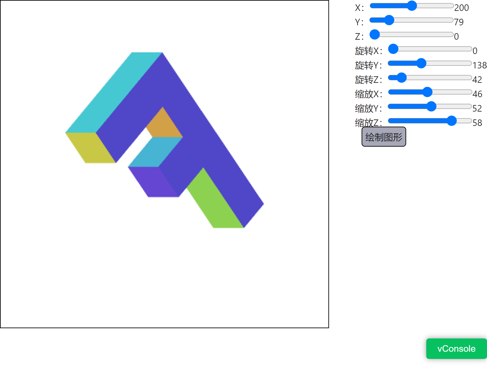

# webgl 三维空间中的正交投影
正交投影与透视投影不同，`正交投影没有近大远小的效果`


#### tips:
- DEPTH BUFFER（深度缓冲）
>在绘制图像时组合使用。 当WebGL绘制每个着色像素时也会写入深度像素， 它的值基于顶点着色器返回的Z值，就像我们将 X 和 Y 转换到裁剪空间一样， Z 也在裁剪空间或者 (-1 到 +1) 。这个值会被转换到深度空间( 0 到 +1)， WebGL绘制一个着色像素之前会检查对应的深度像素， 如果对应的深度像素中的深度值小于当前像素的深度值，WebGL就不会绘制新的颜色。 反之它会绘制片断着色器提供的新颜色并更新深度像素中的深度值。 这也意味着在其他像素后面的像素不会被绘制。
- 清除深度缓冲为 1.0
> gl.clear(gl.COLOR_BUFFER_BIT | gl.DEPTH_BUFFER_BIT);
- 开启深度缓冲
> gl.enable(gl.DEPTH_TEST);


```javascript
import { createProgramFromStrings } from '../webglCommon'

export function render(canvas, initialValue) {
  const  gl = canvas.getContext('webgl')
  if (!gl) {
    return
  }
  const vertexShaderSource = `
  attribute vec4 a_position;
  
  // 定义一个顶点颜色属性
  attribute vec4 a_color;
  // 定义一个可变量 传入片元着色器
  varying vec4 v_color;
  
  uniform mat4 u_matrix;
  void main() {
    // 矩阵*位置得到新的位置
    gl_Position = u_matrix * a_position;
    // 将颜色传递给片断着色器
    v_color = a_color;
  }
  `
  const fragmentShaderSource = `
  precision mediump float;
  // 从顶点着色器中传入
  varying vec4 v_color;
  
  
  
  void main() {
     gl_FragColor = v_color;
  }
  `
  // 创建着色器程序
  const program = createProgramFromStrings(
    gl, vertexShaderSource, fragmentShaderSource
  )
  const colorLocation = gl.getAttribLocation(program, 'a_color')
  const positionLocation = gl.getAttribLocation(program, 'a_position')
  const matrixLocation = gl.getUniformLocation(program, 'u_matrix')

  const positionBuffer = gl.createBuffer()
  gl.bindBuffer(gl.ARRAY_BUFFER, positionBuffer)
  // 为绑定点的顶点缓冲区填入顶点数据
  setGeometry(gl)


  const colorBuffer = gl.createBuffer()
  gl.bindBuffer(gl.ARRAY_BUFFER, colorBuffer)
  // 将颜色值传入缓冲
  setColors(gl)

  function degToRad(d) {
    return d * Math.PI / 180
  }
  const { rx, ry, rz, tx, ty, tz, sx, sy, sz, } = initialValue
  const translation = [tx, ty, tz]
  const rotation = [degToRad(rx), degToRad(ry), degToRad(rz)]
  const scale = [sx, sy, sz]

  gl.enable(gl.DEPTH_TEST)
  drawScene()

  function updatePosition(index, value) {
    translation[index] = value
    drawScene()
  }

  function updateRotation(index, value) {
    const angleInRadians = value * Math.PI / 180
    rotation[index] = angleInRadians
    drawScene()
  }

  function updateScale(index, value) {
    scale[index] = value
    drawScene()
  }
  return {
    updateScale,
    updatePosition,
    updateRotation,
  }
  function drawScene() {

    // 将裁剪空间转换到像素空间
    gl.viewport(
      0, 0, gl.canvas.width, gl.canvas.height
    )

    gl.clear(gl.COLOR_BUFFER_BIT | gl.DEPTH_BUFFER_BIT)
    gl.useProgram(program)

    // 启用位置属性（只有启用了之后才能够为这个属性进行赋值）
    gl.enableVertexAttribArray(positionLocation)

    // 将绑定点与positionBuffer绑定
    gl.bindBuffer(gl.ARRAY_BUFFER, positionBuffer)
    /**
     * todo
     * 以下将当前绑定点的缓冲数据，读取到指定的位置
     * @type {number}
     */
    // 告诉属性怎么从 positionBuffer (ARRAY_BUFFER) 中读取位置
    let size = 3          // 每次迭代使用 3 个单位的数据
    let type = gl.FLOAT   // 单位数据类型是32位的浮点型
    let normalize = false // 不需要归一化数据
    let stride = 0        // 0 = 移动距离 * 单位距离长度sizeof(type)  每次迭代跳多少距离到下一个数据
    let offset = 0        // 从绑定缓冲的起始处开始
    gl.vertexAttribPointer(
      positionLocation, size, type, normalize, stride, offset
    )


    // 启用颜色属性
    gl.enableVertexAttribArray(colorLocation)

    // 绑定颜色缓冲
    gl.bindBuffer(gl.ARRAY_BUFFER, colorBuffer)

    // 告诉颜色属性怎么从 colorBuffer (ARRAY_BUFFER) 中读取颜色值
    size = 3                 // 每次迭代使用3个单位的数据
    type = gl.UNSIGNED_BYTE  // 单位数据类型是无符号 8 位整数
    normalize = true         // 标准化数据 (从 0-255 转换到 0.0-1.0)
    stride = 0               // 0 = 移动距离 * 单位距离长度sizeof(type)  每次迭代跳多少距离到下一个数据
    offset = 0               // 从绑定缓冲的起始处开始
    gl.vertexAttribPointer(
      colorLocation, size, type, normalize, stride, offset
    )

    // 计算出这个空间矩阵
    let matrix = m4.projection(
      gl.canvas.clientWidth, gl.canvas.clientHeight, 300
    )
    /**
     * todo
     * =====================================================start===============================
     * 先乘以平移矩阵
     * 再乘以算转矩阵
     * 最后乘以缩放矩阵
     */
    matrix = m4.translate(
      matrix, translation[0], translation[1], translation[2]
    )
    matrix = m4.xRotate(matrix, rotation[0])
    matrix = m4.yRotate(matrix, rotation[1])
    matrix = m4.zRotate(matrix, rotation[2])
    matrix = m4.scale(
      matrix, scale[0], scale[1], scale[2]
    )
    /**
     * =====================================================end===============================
     */

    /**
     * todo
     * 设置这个新的矩阵，，后续只要这个新的矩阵和原有的坐标点矩阵进行相乘即可得到新的坐标
     */
    gl.uniformMatrix4fv(
      matrixLocation, false, matrix
    )

    // 开始绘制
    const primitiveType = gl.TRIANGLES
    offset = 0
    const  count = 16 * 6  // 6个三角形18个顶点  所以需要绘制18次数
    gl.drawArrays(
      primitiveType, offset, count
    )
  }
}

const m4 = {

  projection: function(
    width, height, depth
  ) {
    // 注意：这个矩阵翻转了 Y 轴，所以 0 在上方
    return [
      2 / width, 0, 0, 0,
      0, -2 / height, 0, 0,
      0, 0, 2 / depth, 0,
      -1, 1, 0, 1
    ]
  },

  multiply: function(a, b) {

    // eslint-disable-next-line no-mixed-operators
    const a00 = a[(0 * 4) + 0]

    // eslint-disable-next-line no-mixed-operators
    const a01 = a[(0 * 4) + 1]

    // eslint-disable-next-line no-mixed-operators
    const a02 = a[(0 * 4) + 2]

    // eslint-disable-next-line no-mixed-operators
    const a03 = a[(0 * 4) + 3]

    // eslint-disable-next-line no-mixed-operators
    const a10 = a[(1 * 4) + 0]

    // eslint-disable-next-line no-mixed-operators
    const a11 = a[1 * 4 + 1]

    // eslint-disable-next-line no-mixed-operators
    const a12 = a[1 * 4 + 2]

    // eslint-disable-next-line no-mixed-operators
    const a13 = a[1 * 4 + 3]

    // eslint-disable-next-line no-mixed-operators
    const a20 = a[2 * 4 + 0]
    // eslint-disable-next-line no-mixed-operators
    const a21 = a[2 * 4 + 1]
    // eslint-disable-next-line no-mixed-operators
    const a22 = a[2 * 4 + 2]
    // eslint-disable-next-line no-mixed-operators
    const a23 = a[2 * 4 + 3]
    // eslint-disable-next-line no-mixed-operators
    const a30 = a[3 * 4 + 0]
    // eslint-disable-next-line no-mixed-operators
    const a31 = a[3 * 4 + 1]
    // eslint-disable-next-line no-mixed-operators
    const a32 = a[3 * 4 + 2]
    // eslint-disable-next-line no-mixed-operators
    const a33 = a[3 * 4 + 3]
    // eslint-disable-next-line no-mixed-operators
    const b00 = b[0 * 4 + 0]
    // eslint-disable-next-line no-mixed-operators
    const b01 = b[0 * 4 + 1]
    // eslint-disable-next-line no-mixed-operators
    const b02 = b[0 * 4 + 2]
    // eslint-disable-next-line no-mixed-operators
    const b03 = b[0 * 4 + 3]
    // eslint-disable-next-line no-mixed-operators
    const b10 = b[1 * 4 + 0]
    // eslint-disable-next-line no-mixed-operators
    const b11 = b[1 * 4 + 1]
    // eslint-disable-next-line no-mixed-operators
    // eslint-disable-next-line no-mixed-operators
    const b12 = b[1 * 4 + 2]
    // eslint-disable-next-line no-mixed-operators
    const b13 = b[1 * 4 + 3]
    // eslint-disable-next-line no-mixed-operators
    const b20 = b[2 * 4 + 0]
    // eslint-disable-next-line no-mixed-operators
    const b21 = b[2 * 4 + 1]
    // eslint-disable-next-line no-mixed-operators
    const b22 = b[2 * 4 + 2]
    // eslint-disable-next-line no-mixed-operators
    const b23 = b[2 * 4 + 3]
    // eslint-disable-next-line no-mixed-operators
    const b30 = b[3 * 4 + 0]
    // eslint-disable-next-line no-mixed-operators
    const b31 = b[3 * 4 + 1]
    // eslint-disable-next-line no-mixed-operators
    const b32 = b[3 * 4 + 2]
    // eslint-disable-next-line no-mixed-operators
    const b33 = b[3 * 4 + 3]
    // eslint-disable-next-line no-mixed-operators
    return [

      // eslint-disable-next-line no-mixed-operators
      b00 * a00 + b01 * a10 + b02 * a20 + b03 * a30,

      // eslint-disable-next-line no-mixed-operators
      b00 * a01 + b01 * a11 + b02 * a21 + b03 * a31,

      // eslint-disable-next-line no-mixed-operators
      b00 * a02 + b01 * a12 + b02 * a22 + b03 * a32,

      // eslint-disable-next-line no-mixed-operators
      b00 * a03 + b01 * a13 + b02 * a23 + b03 * a33,

      // eslint-disable-next-line no-mixed-operators
      b10 * a00 + b11 * a10 + b12 * a20 + b13 * a30,

      // eslint-disable-next-line no-mixed-operators
      b10 * a01 + b11 * a11 + b12 * a21 + b13 * a31,

      // eslint-disable-next-line no-mixed-operators
      b10 * a02 + b11 * a12 + b12 * a22 + b13 * a32,

      // eslint-disable-next-line no-mixed-operators
      b10 * a03 + b11 * a13 + b12 * a23 + b13 * a33,

      // eslint-disable-next-line no-mixed-operators
      b20 * a00 + b21 * a10 + b22 * a20 + b23 * a30,
      // eslint-disable-next-line no-mixed-operators
      b20 * a01 + b21 * a11 + b22 * a21 + b23 * a31,

      // eslint-disable-next-line no-mixed-operators
      b20 * a02 + b21 * a12 + b22 * a22 + b23 * a32,

      // eslint-disable-next-line no-mixed-operators
      b20 * a03 + b21 * a13 + b22 * a23 + b23 * a33,

      // eslint-disable-next-line no-mixed-operators
      b30 * a00 + b31 * a10 + b32 * a20 + b33 * a30,

      // eslint-disable-next-line no-mixed-operators
      b30 * a01 + b31 * a11 + b32 * a21 + b33 * a31,

      // eslint-disable-next-line no-mixed-operators
      b30 * a02 + b31 * a12 + b32 * a22 + b33 * a32,


      // eslint-disable-next-line no-mixed-operators
      b30 * a03 + b31 * a13 + b32 * a23 + b33 * a33
    ]
  },
  // 生成平移矩阵
  translation: function(
    tx, ty, tz
  ) {
    return [
      1,  0,  0,  0,
      0,  1,  0,  0,
      0,  0,  1,  0,
      tx, ty, tz, 1
    ]
  },

  xRotation: function(angleInRadians) {
    const c = Math.cos(angleInRadians)
    const s = Math.sin(angleInRadians)
    // x 方向的旋转矩阵
    return [
      1, 0, 0, 0,
      0, c, s, 0,
      0, -s, c, 0,
      0, 0, 0, 1
    ]
  },

  yRotation: function(angleInRadians) {
    const c = Math.cos(angleInRadians)
    const s = Math.sin(angleInRadians)
    // y 方向的旋转矩阵

    return [
      c, 0, -s, 0,
      0, 1, 0, 0,
      s, 0, c, 0,
      0, 0, 0, 1
    ]
  },

  zRotation: function(angleInRadians) {
    const c = Math.cos(angleInRadians)
    const s = Math.sin(angleInRadians)
    // z 方向的旋转矩阵

    return [
      c, s, 0, 0,
      -s, c, 0, 0,
      0, 0, 1, 0,
      0, 0, 0, 1
    ]
  },

  scaling: function(
    sx, sy, sz
  ) {

    // 缩放矩阵
    return [
      sx, 0,  0,  0,
      0, sy,  0,  0,
      0,  0, sz,  0,
      0,  0,  0,  1
    ]
  },

  translate: function(
    m, tx, ty, tz
  ) {
    return m4.multiply(m, m4.translation(
      tx, ty, tz
    ))
  },

  xRotate: function(m, angleInRadians) {
    return m4.multiply(m, m4.xRotation(angleInRadians))
  },

  yRotate: function(m, angleInRadians) {
    return m4.multiply(m, m4.yRotation(angleInRadians))
  },

  zRotate: function(m, angleInRadians) {
    return m4.multiply(m, m4.zRotation(angleInRadians))
  },

  scale: function(
    m, sx, sy, sz
  ) {
    return m4.multiply(m, m4.scaling(
      sx, sy, sz
    ))
  },

}
//  'F' 文字.
function setGeometry(gl) {
  gl.bufferData(
    gl.ARRAY_BUFFER,
    new Float32Array([
      // left column front
      0,   0,  0,
      30,   0,  0,
      0, 150,  0,
      0, 150,  0,
      30,   0,  0,
      30, 150,  0,

      // top rung front
      30,   0,  0,
      100,   0,  0,
      30,  30,  0,
      30,  30,  0,
      100,   0,  0,
      100,  30,  0,

      // middle rung front
      30,  60,  0,
      67,  60,  0,
      30,  90,  0,
      30,  90,  0,
      67,  60,  0,
      67,  90,  0,

      // left column back
      0,   0,  30,
      30,   0,  30,
      0, 150,  30,
      0, 150,  30,
      30,   0,  30,
      30, 150,  30,

      // top rung back
      30,   0,  30,
      100,   0,  30,
      30,  30,  30,
      30,  30,  30,
      100,   0,  30,
      100,  30,  30,

      // middle rung back
      30,  60,  30,
      67,  60,  30,
      30,  90,  30,
      30,  90,  30,
      67,  60,  30,
      67,  90,  30,

      // top
      0,   0,   0,
      100,   0,   0,
      100,   0,  30,
      0,   0,   0,
      100,   0,  30,
      0,   0,  30,

      // top rung right
      100,   0,   0,
      100,  30,   0,
      100,  30,  30,
      100,   0,   0,
      100,  30,  30,
      100,   0,  30,

      // under top rung
      30,   30,   0,
      30,   30,  30,
      100,  30,  30,
      30,   30,   0,
      100,  30,  30,
      100,  30,   0,

      // between top rung and middle
      30,   30,   0,
      30,   30,  30,
      30,   60,  30,
      30,   30,   0,
      30,   60,  30,
      30,   60,   0,

      // top of middle rung
      30,   60,   0,
      30,   60,  30,
      67,   60,  30,
      30,   60,   0,
      67,   60,  30,
      67,   60,   0,

      // right of middle rung
      67,   60,   0,
      67,   60,  30,
      67,   90,  30,
      67,   60,   0,
      67,   90,  30,
      67,   90,   0,

      // bottom of middle rung.
      30,   90,   0,
      30,   90,  30,
      67,   90,  30,
      30,   90,   0,
      67,   90,  30,
      67,   90,   0,

      // right of bottom
      30,   90,   0,
      30,   90,  30,
      30,  150,  30,
      30,   90,   0,
      30,  150,  30,
      30,  150,   0,

      // bottom
      0,   150,   0,
      0,   150,  30,
      30,  150,  30,
      0,   150,   0,
      30,  150,  30,
      30,  150,   0,

      // left side
      0,   0,   0,
      0,   0,  30,
      0, 150,  30,
      0,   0,   0,
      0, 150,  30,
      0, 150,   0]),
    gl.STATIC_DRAW
  )
}


// Fill the buffer with colors for the 'F'.
function setColors(gl) {
  gl.bufferData(
    gl.ARRAY_BUFFER,
    new Uint8Array([
      // left column front
      200,  70, 120,
      200,  70, 120,
      200,  70, 120,
      200,  70, 120,
      200,  70, 120,
      200,  70, 120,

      // top rung front
      200,  70, 120,
      200,  70, 120,
      200,  70, 120,
      200,  70, 120,
      200,  70, 120,
      200,  70, 120,

      // middle rung front
      200,  70, 120,
      200,  70, 120,
      200,  70, 120,
      200,  70, 120,
      200,  70, 120,
      200,  70, 120,

      // left column back
      80, 70, 200,
      80, 70, 200,
      80, 70, 200,
      80, 70, 200,
      80, 70, 200,
      80, 70, 200,

      // top rung back
      80, 70, 200,
      80, 70, 200,
      80, 70, 200,
      80, 70, 200,
      80, 70, 200,
      80, 70, 200,

      // middle rung back
      80, 70, 200,
      80, 70, 200,
      80, 70, 200,
      80, 70, 200,
      80, 70, 200,
      80, 70, 200,

      // top
      70, 200, 210,
      70, 200, 210,
      70, 200, 210,
      70, 200, 210,
      70, 200, 210,
      70, 200, 210,

      // top rung right
      200, 200, 70,
      200, 200, 70,
      200, 200, 70,
      200, 200, 70,
      200, 200, 70,
      200, 200, 70,

      // under top rung
      210, 100, 70,
      210, 100, 70,
      210, 100, 70,
      210, 100, 70,
      210, 100, 70,
      210, 100, 70,

      // between top rung and middle
      210, 160, 70,
      210, 160, 70,
      210, 160, 70,
      210, 160, 70,
      210, 160, 70,
      210, 160, 70,

      // top of middle rung
      70, 180, 210,
      70, 180, 210,
      70, 180, 210,
      70, 180, 210,
      70, 180, 210,
      70, 180, 210,

      // right of middle rung
      100, 70, 210,
      100, 70, 210,
      100, 70, 210,
      100, 70, 210,
      100, 70, 210,
      100, 70, 210,

      // bottom of middle rung.
      76, 210, 100,
      76, 210, 100,
      76, 210, 100,
      76, 210, 100,
      76, 210, 100,
      76, 210, 100,

      // right of bottom
      140, 210, 80,
      140, 210, 80,
      140, 210, 80,
      140, 210, 80,
      140, 210, 80,
      140, 210, 80,

      // bottom
      90, 130, 110,
      90, 130, 110,
      90, 130, 110,
      90, 130, 110,
      90, 130, 110,
      90, 130, 110,

      // left side
      160, 160, 220,
      160, 160, 220,
      160, 160, 220,
      160, 160, 220,
      160, 160, 220,
      160, 160, 220]),
    gl.STATIC_DRAW
  )
}

```