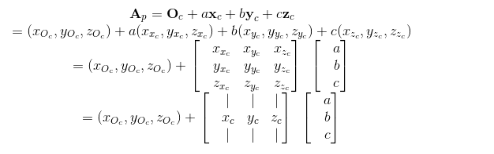
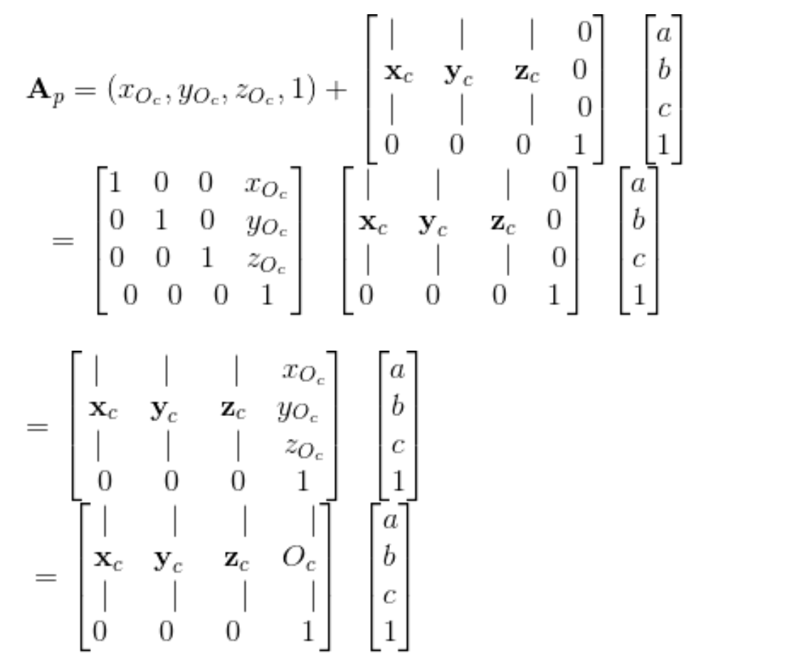
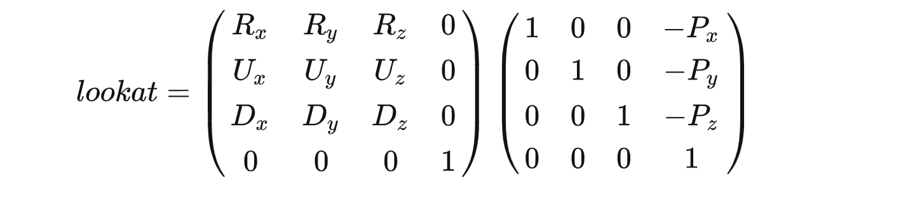

# webgl 三维空间中的方向光源
## 坐标空间变换
> 有一个父坐标空间`P`，子坐标空间`C`。已知道
> 在父坐标空间中子坐标空间的原点以及3个单位坐标轴。
> - 需求1：把子坐标空间下表示的点或者矢量，转换到父坐标空间下；
> - 需求2：把父坐标空间下表示的点或者矢量，转换到子坐标空间下；
### 求子坐标空间到父坐标空间下的变换矩阵Mc-p;
子坐标空间的点坐标是相对于子坐标空间原点的，而子坐标空间的原点是相对于父空间坐标的，因此移动子坐标空间原点到子坐标空间的点Ac，即可得到Ac相对于父坐标空间的点；
子坐标空间中的一点Ac（a,b,c）,以及子坐标空间的原点Oc;因此可以求出其在父坐标空间下的点Ap;
- 向x轴移动a个单位
- 向y轴移动b个单位
- 向z轴移动c个单位




`以上就是求得了子坐标空间到父坐标空间的变换矩阵的过程。`

对比lookAt矩阵，该矩阵就是为了将父坐标空间（世界空间）变换到子坐标空间（观察空间），因此lookAt矩阵就是上面矩阵的逆矩阵；  
tips：在本段程序中



````javascript
import { createProgramFromStrings } from '../webglCommon'
import m4 from '../webglCommon/m4'

export function render(canvas) {
  const  gl = canvas.getContext('webgl')
  if (!gl) {
    return
  }
  const vertexShaderSource = `
    attribute vec4 a_position;
    attribute vec3 a_normal;
    
    uniform mat4 u_matrix;
    
    varying vec3 v_normal;
    // 定义一个世界矩阵
    uniform mat4 u_world;
    
    void main() {
      // Multiply the position by the matrix.
      gl_Position = u_matrix * a_position;
    
      // 世界方向发生变化的时候 重新改变当前这个法向量
      v_normal = mat3(u_world) * a_normal;
    }
  `
  const fragmentShaderSource = `
  
    precision mediump float;
    
    // Passed in from the vertex shader.
    varying vec3 v_normal;
    
    uniform vec3 u_reverseLightDirection;
    uniform vec4 u_color;
    
    void main() {
      // because v_normal is a varying it's interpolated
      // so it will not be a unit vector. Normalizing it
      // will make it a unit vector again
      vec3 normal = normalize(v_normal);
    
      float light = dot(normal, u_reverseLightDirection);
    
      gl_FragColor = u_color;
    
      // Lets multiply just the color portion (not the alpha)
      // by the light
      gl_FragColor.rgb *= light;
    }
  `
  const program = createProgramFromStrings(
    gl, vertexShaderSource, fragmentShaderSource
  )

  const positionLocation = gl.getAttribLocation(program, 'a_position')
  const normalLocation = gl.getAttribLocation(program, 'a_normal')
  const worldLocation = gl.getUniformLocation(program, 'u_world')
  const matrixLocation = gl.getUniformLocation(program, 'u_matrix')
  const colorLocation = gl.getUniformLocation(program, 'u_color')

  const reverseLightDirectionLocation =
    gl.getUniformLocation(program, 'u_reverseLightDirection')

  const positionBuffer = gl.createBuffer()
  gl.bindBuffer(gl.ARRAY_BUFFER, positionBuffer)
  // 在positionBuffer存储顶点信息
  setGeometry(gl)


  const normalBuffer = gl.createBuffer()
  gl.bindBuffer(gl.ARRAY_BUFFER, normalBuffer)
  // 存储对应顶点的法向量信息
  setNormals(gl)


  function degToRad(d) {
    return d * Math.PI / 180
  }

  let fieldOfViewRadians = degToRad(60)
  let fRotationRadians = 0

  drawScene()

  function updateRotation(ui) {
    fRotationRadians = degToRad(ui.value)
    drawScene()
  }
  function updateFieldOfViewRadians(value) {

    fieldOfViewRadians = degToRad(value)
    drawScene()
  }
  return { updateRotation, updateFieldOfViewRadians, }
  function drawScene() {

    // 设置像素空间的相关参数
    gl.viewport(
      0, 0, gl.canvas.width, gl.canvas.height
    )

    gl.clear(gl.COLOR_BUFFER_BIT | gl.DEPTH_BUFFER_BIT)

    // 启用裁剪，默认剔除背面的三角形
    gl.enable(gl.CULL_FACE)

    // 启用深度缓冲
    gl.enable(gl.DEPTH_TEST)

    gl.useProgram(program)

    gl.enableVertexAttribArray(positionLocation)
    gl.bindBuffer(gl.ARRAY_BUFFER, positionBuffer)
    let size = 3          // 三维空间 位置坐标有三个 x,y,z
    let  type = gl.FLOAT   // 数据类型是float
    let  normalize = false // 不做归一化处理
    let  stride = 0
    let  offset = 0        // 从缓冲区的开始位置读取
    gl.vertexAttribPointer(
      positionLocation, size, type, normalize, stride, offset
    )

    /**
     * todo
     * 设置每个顶点的法向量数据
     * 法向量也是三维空间的向量，所以也是三个值 x,y,z
     */
    gl.enableVertexAttribArray(normalLocation)
    gl.bindBuffer(gl.ARRAY_BUFFER, normalBuffer)
    size = 3
    type = gl.FLOAT
    normalize = false
    stride = 0
    offset = 0
    gl.vertexAttribPointer(
      normalLocation, size, type, normalize, stride, offset
    )


    //=================== 根据以上构造观察空间到世界空间的矩阵==================START============
    /**
     * todo
     * 本身是没有摄像机的概念
     * 摄像机矩阵优又可以被称为观察空间
     * 为了得到顶点在观察空间中的位置通常有两种方法可以进行处理：
     * 1.
     * 1.1计算观察空间三个坐标轴在世界空间下的表示方法（构建从观察空间到世界空间的变换矩阵）
     * 1.2 对该变换矩阵求逆矩阵（即可得到世界空间到观察空间的矩阵变换）
     *
     * 2. 想象平移旋转整个观察空间，让摄像机原点位于世界的原点
     * 例如摄像机在世界空间中的变换是先按照（30,0,0）进行旋转
     * 然后按照（0，10，-10）进行平移
     * 2.1 为了把摄像机重新回到初始位置 就需要进行逆变换
     * 即先平移（0，-10，10），再按照（-30，0，0）进行旋转
     * 以上方式二也可以求得世界空间到观察空间的变换矩阵
     *
     *
     * 通过把场景中的所有物体进行移动，产生一种我们在移动的感觉，而不是移动场景
     * lookAt矩阵的定义：
     * camera： 摄像机的 位置
     * target： 摄像机看向的目标的 位置
     * up： 向上的up的单位坐标点的 位置
     * 以上
     * 定义z 方向是 camera-target
     * 定义up 一个向上的方向(0,1,0)
     * 此时 up和 z是不一定垂直的，但是定义得到了一个面
     * up 叉乘 z 得到 x 方向的向量 此时x垂直up,x垂直z
     * 再用-z叉乘x得到y向量 此时就得到 一个基础坐标系 (x,y,z)
     *
     * 得到相机的三个分量之后，又知道相机的中心坐标
     * 这样就可以得到 由相机空间 到  世界空间 的变换矩阵  |R||T|
     * R就是（x,y,z分量组成的矩阵） T 就是相机中心点的位置矩阵
     *
     * 那么只需要对上面的矩阵求逆变换，就可以得到  世界空空间 到 相机空间 的变换矩阵
     *
     *
     * @type {number[]}
     */

    const camera = [50, 100, 160] // 定义相机的 坐标
    const target = [0, 100, 0] // 定义中心点坐标
    const up = [0, 1, 0] // 定义一个向上的 方向向量
    const cameraMatrix = m4.lookAt(
      camera, target, up
    )
    //=================== 根据以上构造观察空间到世界空间的矩阵==================START============


    //=================== 构造一个裁剪空间矩阵（透视投影）==================START============
    /**
     * todo
     * fieldOfViewRadians 这个值如果是可以设置的化，那么这个矩阵就是一个透视投影矩阵
     * projectionMatrix 相当于一个裁剪矩阵
     * @type {number}
     */
    // 开始计算这个 透视投影的矩阵
    const aspect = gl.canvas.clientWidth / gl.canvas.clientHeight
    const zNear = 1
    const zFar = 2000
    // 根据透视投影的计算规则进行处理
    const projectionMatrix = m4.perspective(
      fieldOfViewRadians, aspect, zNear, zFar
    )
    //=================== 构造一个裁剪空间矩阵（透视投影）==================END============

    /**
     * todo 由于cameraMatrix是一个由观察空间到世界空间的矩阵;所以这里求逆变换即可得到 由   世界空间到观察空间的一个矩阵
     *
     * @type {Matrix4}
     */
    const viewMatrix = m4.inverse(cameraMatrix)

    /**
     * todo
     * 裁剪空间坐标 = 裁剪矩阵也叫投影矩阵 * 世界空间到观察空间的矩阵 * 点P
     * P1 = projectionMatrix* viewMatrix * P
     * todo viewProjectionMatrix是结合了投影矩阵和观察矩阵
     */
    const viewProjectionMatrix = m4.multiply(projectionMatrix, viewMatrix)

    // 定义一个旋转矩阵
    const worldMatrix = m4.yRotation(fRotationRadians)
    // 世界变化，也会影响到某个顶点的法向量的变化
    gl.uniformMatrix4fv(
      worldLocation, false, worldMatrix
    )
    // 转换矩阵乘以旋转矩阵得到最终的交互矩阵
    const worldViewProjectionMatrix = m4.multiply(viewProjectionMatrix, worldMatrix)

    // 这个MVP矩阵
    gl.uniformMatrix4fv(
      matrixLocation, false, worldViewProjectionMatrix
    )

    gl.uniform4fv(colorLocation, [0.2, 1, 0.2, 1]) // green

    // 设立光照的方向（归一化向量，面光源）
    gl.uniform3fv(reverseLightDirectionLocation, m4.normalize([0.5, 0.7, 1]))

    const primitiveType = gl.TRIANGLES
    offset = 0
    const count = 16 * 6
    gl.drawArrays(
      primitiveType, offset, count
    )
  }
}

function setGeometry(gl) {
  const positions = new Float32Array([
    // left column front
    0,   0,  0,
    0, 150,  0,
    30,   0,  0,
    0, 150,  0,
    30, 150,  0,
    30,   0,  0,

    // top rung front
    30,   0,  0,
    30,  30,  0,
    100,   0,  0,
    30,  30,  0,
    100,  30,  0,
    100,   0,  0,

    // middle rung front
    30,  60,  0,
    30,  90,  0,
    67,  60,  0,
    30,  90,  0,
    67,  90,  0,
    67,  60,  0,

    // left column back
    0,   0,  30,
    30,   0,  30,
    0, 150,  30,
    0, 150,  30,
    30,   0,  30,
    30, 150,  30,

    // top rung back
    30,   0,  30,
    100,   0,  30,
    30,  30,  30,
    30,  30,  30,
    100,   0,  30,
    100,  30,  30,

    // middle rung back
    30,  60,  30,
    67,  60,  30,
    30,  90,  30,
    30,  90,  30,
    67,  60,  30,
    67,  90,  30,

    // top
    0,   0,   0,
    100,   0,   0,
    100,   0,  30,
    0,   0,   0,
    100,   0,  30,
    0,   0,  30,

    // top rung right
    100,   0,   0,
    100,  30,   0,
    100,  30,  30,
    100,   0,   0,
    100,  30,  30,
    100,   0,  30,

    // under top rung
    30,   30,   0,
    30,   30,  30,
    100,  30,  30,
    30,   30,   0,
    100,  30,  30,
    100,  30,   0,

    // between top rung and middle
    30,   30,   0,
    30,   60,  30,
    30,   30,  30,
    30,   30,   0,
    30,   60,   0,
    30,   60,  30,

    // top of middle rung
    30,   60,   0,
    67,   60,  30,
    30,   60,  30,
    30,   60,   0,
    67,   60,   0,
    67,   60,  30,

    // right of middle rung
    67,   60,   0,
    67,   90,  30,
    67,   60,  30,
    67,   60,   0,
    67,   90,   0,
    67,   90,  30,

    // bottom of middle rung.
    30,   90,   0,
    30,   90,  30,
    67,   90,  30,
    30,   90,   0,
    67,   90,  30,
    67,   90,   0,

    // right of bottom
    30,   90,   0,
    30,  150,  30,
    30,   90,  30,
    30,   90,   0,
    30,  150,   0,
    30,  150,  30,

    // bottom
    0,   150,   0,
    0,   150,  30,
    30,  150,  30,
    0,   150,   0,
    30,  150,  30,
    30,  150,   0,

    // left side
    0,   0,   0,
    0,   0,  30,
    0, 150,  30,
    0,   0,   0,
    0, 150,  30,
    0, 150,   0])
  // 变变动旋转的中心点
  let matrix = m4.xRotation(Math.PI)
  matrix = m4.translate(
    matrix, -50, -50, 0
  )

  for (let ii = 0; ii < positions.length; ii += 3) {
    const vector = m4.transformPoint(matrix, [positions[ii + 0], positions[ii + 1], positions[ii + 2], 1])
    positions[ii + 0] = vector[0]
    positions[ii + 1] = vector[1]
    positions[ii + 2] = vector[2]
  }
  gl.bufferData(
    gl.ARRAY_BUFFER, positions, gl.STATIC_DRAW
  )
}

function setNormals(gl) {
  const normals = new Float32Array([
    // left column front
    0, 0, 1,
    0, 0, 1,
    0, 0, 1,
    0, 0, 1,
    0, 0, 1,
    0, 0, 1,

    // top rung front
    0, 0, 1,
    0, 0, 1,
    0, 0, 1,
    0, 0, 1,
    0, 0, 1,
    0, 0, 1,

    // middle rung front
    0, 0, 1,
    0, 0, 1,
    0, 0, 1,
    0, 0, 1,
    0, 0, 1,
    0, 0, 1,

    // left column back
    0, 0, -1,
    0, 0, -1,
    0, 0, -1,
    0, 0, -1,
    0, 0, -1,
    0, 0, -1,

    // top rung back
    0, 0, -1,
    0, 0, -1,
    0, 0, -1,
    0, 0, -1,
    0, 0, -1,
    0, 0, -1,

    // middle rung back
    0, 0, -1,
    0, 0, -1,
    0, 0, -1,
    0, 0, -1,
    0, 0, -1,
    0, 0, -1,

    // top
    0, 1, 0,
    0, 1, 0,
    0, 1, 0,
    0, 1, 0,
    0, 1, 0,
    0, 1, 0,

    // top rung right
    1, 0, 0,
    1, 0, 0,
    1, 0, 0,
    1, 0, 0,
    1, 0, 0,
    1, 0, 0,

    // under top rung
    0, -1, 0,
    0, -1, 0,
    0, -1, 0,
    0, -1, 0,
    0, -1, 0,
    0, -1, 0,

    // between top rung and middle
    1, 0, 0,
    1, 0, 0,
    1, 0, 0,
    1, 0, 0,
    1, 0, 0,
    1, 0, 0,

    // top of middle rung
    0, 1, 0,
    0, 1, 0,
    0, 1, 0,
    0, 1, 0,
    0, 1, 0,
    0, 1, 0,

    // right of middle rung
    1, 0, 0,
    1, 0, 0,
    1, 0, 0,
    1, 0, 0,
    1, 0, 0,
    1, 0, 0,

    // bottom of middle rung.
    0, -1, 0,
    0, -1, 0,
    0, -1, 0,
    0, -1, 0,
    0, -1, 0,
    0, -1, 0,

    // right of bottom
    1, 0, 0,
    1, 0, 0,
    1, 0, 0,
    1, 0, 0,
    1, 0, 0,
    1, 0, 0,

    // bottom
    0, -1, 0,
    0, -1, 0,
    0, -1, 0,
    0, -1, 0,
    0, -1, 0,
    0, -1, 0,

    // left side
    -1, 0, 0,
    -1, 0, 0,
    -1, 0, 0,
    -1, 0, 0,
    -1, 0, 0,
    -1, 0, 0])
  gl.bufferData(
    gl.ARRAY_BUFFER, normals, gl.STATIC_DRAW
  )
}


````