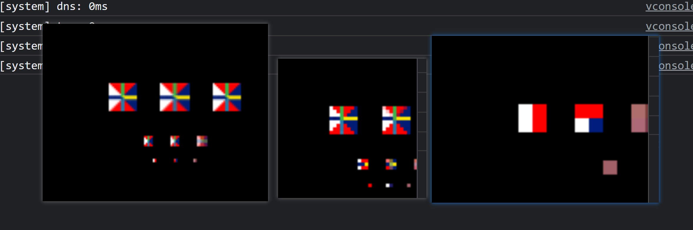

# webgl 三维空间中的2D纹理
- 正常的几何顶点坐标（x,y,z）；在顶点着色器中，归一化处理后的x,y,z范围都在[-1,1]内；
- 纹理坐标点映射 是在[0,1]范围内；比如纹理坐标[0,0],其对应的顶点坐标为[-1,1];
- 纹理坐标起始点在左上角，结束点在右下角；
### 纹理环绕
`为了处理纹理超出0~1范围的纹理坐标，例如采取重复的环绕方式；采样（4.5,-4.5）的纹理坐标，实际采样的纹理坐标应是（0.5，0.5）。对于负数纹理坐标，采样的实际位置应是1-uv，例如（-0.2,-0.6）应该采样（0.8,0.4）；
`


| 方式                 | 描述                                          |
|--------------------|---------------------------------------------|
| GL_REPEAT          | 对纹理的默认行为。重复纹理图像                             |
| GL_MIRRORED_REPEAT | 和GL_REPEAT一样，但每次重复图片是镜像放置的。                 |
| GL_CLAMP_TO_EDGE   | 纹理坐标会被约束在0到1之间，超出的部分会重复纹理坐标的边缘，产生一种边缘被拉伸的效果 |
| GL_CLAMP_TO_BORDER | 超出的坐标为用户指定的边缘颜色。                            |

### 纹理过滤


| 环绕方式       | 描述                               |
|------------|----------------------------------|
| GL_LINEAR  | 从纹理坐标到纹素中心的距离越小，纹素的颜色对采样颜色的贡献就越大 |
| GL_NEAREST | 选择中心最接近纹理坐标的纹素                   |

### 贴图 `（mipmap ）`

`tips:`可以认为贴图就是在对应的片元位置使用自己想要的纹理像素进行赋值修改；


| 方式                        | 描述                                             |
|---------------------------|------------------------------------------------|
| GL_NEAREST_MIPMAP_NEAREST | 采用最近的 mipmap 以匹配像素大小，并使用最近邻插值进行纹理采样            |
| GL_LINEAR_MIPMAP_NEAREST  | 采用最近的 mipmap 级别并使用线性插值对该级别进行采样。                |
| GL_NEAREST_MIPMAP_LINEAR  | 在最接近像素大小的两个 mipmap 之间进行线性插值，并通过最近邻插值对插值级别进行采样。 |
| GL_LINEAR_MIPMAP_LINEAR   | 在两个最接近的 mipmap 之间进行线性插值，并通过线性插值对插值级别进行采样       |

> 关于纹理贴图的一些说明，`LINEAR_MIPMAP_LINEAR`在处理贴图上是最慢的，其是选取最合适的两个贴图各取四个点进行混合，读取八个像素比读取一个像素
> 慢很多；现代游戏可能一次需要2到4个贴图，4贴图*8像素=绘制每个像素需要读取32个像素，就会慢很多；   
> 
> 另一个原因，比如处理一些复古的东西可能需要使用`NEAREST`；
> 
> 如果不会绘制比最大贴图要小的东西，就不需要考虑多个贴图的影响，这样可以直接使用NEAREST或者LINEAR;


### 关于gl.texImage2D参数的含义
例如： `gl.texImage2D(
gl.TEXTURE_2D, 0, gl.RGBA, 1, 1, 0, gl.RGBA, gl.UNSIGNED_BYTE,
new Uint8Array([150, 166, 245, 255])
)`

- 第一个参数设置了纹理目标
- 第二个参数指定了多级渐源纹理的级别
- 第三个参数告诉openGL把纹理存储为何种格式
- 第四和第五个设置最终纹理的高度。在之前加载图像的时候存储了宽高
- 第六个参数是历史遗留问题，始终设置为0
- 第七和第八个参数定义了源图的格式和数据类型
- 最后一个参数是真正的图像数据

```javascript

import { createProgramFromStrings } from '../webglCommon'

/**
 * tips
 * 纹理图片必须是 2 的 n 次方的方阵
 * 以下是 256*256 的图片纹理
 *
 * 纹理范围
 */
import imgTexture from '../webglCommon/noodles.jpg'


export function render(canvas) {
  const gl = canvas.getContext('webgl')
  if (!gl) {
    return
  }
  const v =  `
    attribute vec4 a_position;
    attribute vec2 a_texcoord;
    
    uniform mat4 u_matrix;
    
    varying vec2 v_texcoord;
    
    void main() {
      gl_Position = a_position;
    
      // 传入给片元的纹理坐标点
      v_texcoord = a_texcoord;
    }
  `
  const f = `
    precision mediump float;
  
    varying vec2 v_texcoord;
    
    uniform sampler2D u_texture;
    
    void main() {
       // 从对应的层级采集 对应的纹理坐标的颜色 默认就是从第0层采集  即 u_texture = 0
       gl_FragColor = texture2D(u_texture, v_texcoord);
    }
  `
  const program = createProgramFromStrings(
    gl, v, f
  )

  const positionLocation = gl.getAttribLocation(program, 'a_position')
  const texcoordLocation = gl.getAttribLocation(program, 'a_texcoord')

  const positionBuffer = gl.createBuffer()
  gl.bindBuffer(gl.ARRAY_BUFFER, positionBuffer)
  setGeometry(gl)

  const texcoordBuffer = gl.createBuffer()
  gl.bindBuffer(gl.ARRAY_BUFFER, texcoordBuffer)
  setTexcoords(gl)

  const texture = gl.createTexture()
  gl.bindTexture(gl.TEXTURE_2D, texture)
  gl.texImage2D(
    gl.TEXTURE_2D, 0, gl.RGBA, 1, 1, 0, gl.RGBA, gl.UNSIGNED_BYTE,
    new Uint8Array([0, 0, 255, 255])
  )
  const image = new Image()
  image.src = imgTexture
  image.addEventListener('load', function() {
    gl.bindTexture(gl.TEXTURE_2D, texture)
    gl.texImage2D(
      gl.TEXTURE_2D, 0, gl.RGBA, gl.RGBA, gl.UNSIGNED_BYTE, image
    )

    if (isPowerOf2(image.width) && isPowerOf2(image.height)) {
      gl.generateMipmap(gl.TEXTURE_2D)
    } else {
      gl.texParameteri(
        gl.TEXTURE_2D, gl.TEXTURE_WRAP_S, gl.CLAMP_TO_EDGE
      )
      gl.texParameteri(
        gl.TEXTURE_2D, gl.TEXTURE_WRAP_T, gl.CLAMP_TO_EDGE
      )
      gl.texParameteri(
        gl.TEXTURE_2D, gl.TEXTURE_MIN_FILTER, gl.LINEAR
      )
    }
  })

  function isPowerOf2(value) {
    return (value & (value - 1)) === 0
  }


  requestAnimationFrame(drawScene)

  function drawScene() {

    gl.viewport(
      0, 0, gl.canvas.width, gl.canvas.height
    )

    gl.enable(gl.CULL_FACE)
    gl.enable(gl.DEPTH_TEST)


    gl.clear(gl.COLOR_BUFFER_BIT | gl.DEPTH_BUFFER_BIT)

    gl.useProgram(program)

    gl.enableVertexAttribArray(positionLocation)

    gl.bindBuffer(gl.ARRAY_BUFFER, positionBuffer)

    let size = 3
    let type = gl.FLOAT
    let  normalize = false
    let stride = 0
    let offset = 0
    gl.vertexAttribPointer(
      positionLocation, size, type, normalize, stride, offset
    )

    gl.enableVertexAttribArray(texcoordLocation)

    gl.bindBuffer(gl.ARRAY_BUFFER, texcoordBuffer)

    size = 2
    type = gl.FLOAT
    normalize = false
    stride = 0
    offset = 0
    gl.vertexAttribPointer(
      texcoordLocation, size, type, normalize, stride, offset
    )


    gl.drawArrays(
      gl.TRIANGLES, 0, 6 * 6
    )

    requestAnimationFrame(drawScene)
  }
}

// Fill the buffer with the values that define a cube.
function setGeometry(gl) {
  const positions = new Float32Array([
    -0.5, -0.5,  -0.5,
    -0.5,  0.5,  -0.5,
    0.5, -0.5,  -0.5,
    -0.5,  0.5,  -0.5,
    0.5,  0.5,  -0.5,
    0.5, -0.5,  -0.5,

    -0.5, -0.5,   0.5,
    0.5, -0.5,   0.5,
    -0.5,  0.5,   0.5,
    -0.5,  0.5,   0.5,
    0.5, -0.5,   0.5,
    0.5,  0.5,   0.5,

    -0.5,   0.5, -0.5,
    -0.5,   0.5,  0.5,
    0.5,   0.5, -0.5,
    -0.5,   0.5,  0.5,
    0.5,   0.5,  0.5,
    0.5,   0.5, -0.5,

    -0.5,  -0.5, -0.5,
    0.5,  -0.5, -0.5,
    -0.5,  -0.5,  0.5,
    -0.5,  -0.5,  0.5,
    0.5,  -0.5, -0.5,
    0.5,  -0.5,  0.5,

    -0.5,  -0.5, -0.5,
    -0.5,  -0.5,  0.5,
    -0.5,   0.5, -0.5,
    -0.5,  -0.5,  0.5,
    -0.5,   0.5,  0.5,
    -0.5,   0.5, -0.5,

    0.5,  -0.5, -0.5,
    0.5,   0.5, -0.5,
    0.5,  -0.5,  0.5,
    0.5,  -0.5,  0.5,
    0.5,   0.5, -0.5,
    0.5,   0.5,  0.5

  ])
  gl.bufferData(
    gl.ARRAY_BUFFER, positions, gl.STATIC_DRAW
  )
}

function setTexcoords(gl) {
  gl.bufferData(
    gl.ARRAY_BUFFER,
    new Float32Array([
      // select the top left image
      0, 0,
      0, 0.5,
      0.25, 0,
      0, 0.5,
      0.25, 0.5,
      0.25, 0,
      // select the top middle image
      0.25, 0,
      0.5, 0,
      0.25, 0.5,
      0.25, 0.5,
      0.5, 0,
      0.5, 0.5,
      // select to top right image
      0.5, 0,
      0.5, 0.5,
      0.75, 0,
      0.5, 0.5,
      0.75, 0.5,
      0.75, 0,
      // select the bottom left image
      0, 0.5,
      0.25, 0.5,
      0, 1,
      0, 1,
      0.25, 0.5,
      0.25, 1,
      // select the bottom middle image
      0.25, 0.5,
      0.25, 1,
      0.5, 0.5,
      0.25, 1,
      0.5, 1,
      0.5, 0.5,
      // select the bottom right image
      0.5, 0.5,
      0.75, 0.5,
      0.5, 1,
      0.5, 1,
      0.75, 0.5,
      0.75, 1

    ]),
    gl.STATIC_DRAW
  )
}


```