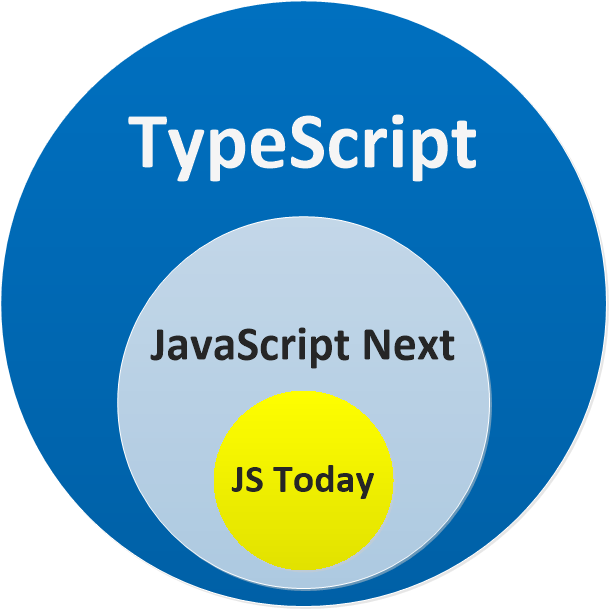

# 初识
typescript被编译成javascript在浏览器上执行，所以需要两个条件：  
+ [typescript编译器](https://www.npmjs.com/package/typescript)
+ [typescript编辑器](https://code.visualstudio.com/)

安装typescript
````
npm install -g typescript@next
````
##  typescript与javascript的关系
1. [x] typescript帮助你编写更清晰，错误更少的代码
2. [x] typescript一种新的抽象语言，但是与javascript风格相差不大，可以快速的学习并运用
3. [x] typescript本质上相当于一份javascript的严格的检查文档

```javascript
[]+[]; // javascript中的结果为 '',typescript中会报error

/**
 * js中还有很多无意义的书写
 * 通常js只能在运行时发现问题，但是ts在编译是就会提早的提示错误
 */

{} + [] // JS: 0, TS:error
[] + {} // JS : '[object Object]', TS Error
{} + {} // JS : 火狐浏览器中NaN,谷歌浏览器中 '[object Object][object Object]'；TS：Error
'hello' - 1 // JS : NaN, TS Error

function add(a,b) {
  return
  a + b; // JS : undefined, TS Error 'unreachable code detected'
}
```


### 相等
在javascript中有两种不同的符号： == 和 ===;当两个不同的变量类型之间使用 == 时，javascript会对两个变量进行强制类型转换；  
例如：string转换成number
```javascript
console.log(5 == '5') // true   , TS Error
console.log(5 === '5') // false , TS Error
```
javascript这样的比较方式是不理想的,例如字符串0和数字0容易让人混淆具体的含义：
```javascript
console.log('' == '0') // false
console.log(0 == '') // true

console.log('' === '0') // false
console.log(0 === '') // false
```

### 引用

处理原始的数据类型以外，在javascript中所有的对象都是引用（函数、数组、正则）；
+ 数据更改容易产生意外风险
```javascript
var foo = {}
var bar = foo // bar是foo这个对象的引用

foo.baz = 123 // 改动foo时，对于bar也产生了相应的影响
console.log(bar.baz) // 123
```

### null VS undefined
javascript和typescript中都有两种不同的底层类型：null 和 undefined,他们都表示不同的含义：  
+ 没有初始化：undefined
+ 当前不可用（已经初始化）：null  

事实上两者需要分别的进行处理，但是在javascript中使用 == 时，null和undefined之间是相等的；

```javascript

console.log(null == null); // true 
console.log(undefined == undefined); // true 
console.log(null == undefined); // true


console.log(0 == undefined); // false
console.log('' == undefined); // false
console.log(false == undefined); // false
```

### Json和序列化
json支持null而不支持undefined，当一个对象中，某个属性的值为null,序列化后的属性将会包含null值；
如果某个属性的值时undefined，那么这个属性会被清除掉；
```javascript
JSON.stringify({willStay: null, willBeGone: undefined}); // {"willStay":null}
```
基于json的数据库可能支持空值，但不支持未定义的值

## this
this由函数的调用方式进行控制，通常也被称为上下文；
例如：
```javascript
function foo() {
  console.log(this);
}

foo(); // 输出`window` 
let bar = {
  foo
}
bar.foo(); // 输出'bar'
```
如果想将this与其调用上下文断开，可以使用箭头函数；

## 闭包
js中的函数可以访问外部作用域中定义的任何变量，
```javascript
function outerFunction(arg) {
    var variableInOuterFunction = arg;

    function bar() {
        console.log(variableInOuterFunction); // 从外部作用域访问变量
    }

    bar();
}

outerFunction("hello closure"); // 输出 hello closure
```
即使外部函数返回之后，内部函数也可以从外部访问变量，因为变量任然绑定在内部函数中，而不依赖与外部函数。
```javascript
function outerFunction(arg) {
    var variableInOuterFunction = arg;
    return function() {
        console.log(variableInOuterFunction);
    }
}

var innerFunction = outerFunction("hello closure");

// 注意：外部函数已经 return
innerFunction(); // 输出 hello closure
```

## Number
javascript只有一种数字类型，他是一个双精度64位数字；
+ 二进制浮点数不能正确映射到十进制数目,对于真正的十进制数，可以使用big.js
```javascript
console.log(.1 + .2); // 0.30000000000000004 
```  

+ 内置数字类型表示的整数限制是 Number.MAX_SAFE_INTEGER 和 Number.MIN_SAFE_INTEGER.

```javascript
console.log({max: Number.MAX_SAFE_INTEGER, min: Number.MIN_SAFE_INTEGER});
// {max: 9007199254740991, min: -9007199254740991}

```
+ 不安全的值与这些安全值相差+1或者-1，任何数的加法/减法都会对结果进行四舍五入；
```javascript

console.log(Number.MAX_SAFE_INTEGER + 1 === Number.MAX_SAFE_INTEGER + 2); // true!
console.log(Number.MIN_SAFE_INTEGER - 1 === Number.MIN_SAFE_INTEGER - 2); // true!

console.log(Number.MAX_SAFE_INTEGER);      // 9007199254740991
console.log(Number.MAX_SAFE_INTEGER + 1);  // 9007199254740992 - Correct
console.log(Number.MAX_SAFE_INTEGER + 2);  // 9007199254740992 - Rounded!
console.log(Number.MAX_SAFE_INTEGER + 3);  // 9007199254740994 - Rounded - correct by luck
console.log(Number.MAX_SAFE_INTEGER + 4);  // 9007199254740996 - Rounded!
```
+ 可以使用es6的Number.isSafeInteger来检查数字的安全性
```javascript
// Safe value
console.log(Number.isSafeInteger(Number.MAX_SAFE_INTEGER)); // true

// Unsafe value
console.log(Number.isSafeInteger(Number.MAX_SAFE_INTEGER + 1)); // false

// Because it might have been rounded to it due to overflow
console.log(Number.isSafeInteger(Number.MAX_SAFE_INTEGER + 10)); // false
```

+  [Big.js](https://github.com/MikeMcl/big.js/)支持任意精度的数字
2. [x] 完美的十进制数、案犯范围超出的整数值；
3. [x] + 避免将这个库用于UI/性能密集型的运算，chart、canvas等；
4. [x] 当某些数字计算不能用有效数字表示时，javascript会返回一个**NaN**值

5. [x] 超出精度范围的值解析为 Infinity/-Infinity，
6. [x] 特殊情况下的无穷大也会被记录为 Infinity/-Infinity
7. [x] 最小的非零值为 Number.MIN_VALUE
8. [x] 比非零值小的转化为0 
  ` console.log(Number.MIN_VALUE / 10);  // 0`

## Classes
1. [x] classes提供了一个很有用的抽象结构
2. [x] 为开发者提供了一种固定的方式去定义类
3. [x] 便于面向对象的开发者进行理解

+ 基本的使用方式

````javascript
class Point {
    x: number;
    y: number;
    constructor(x: number, y: number) {
        this.x = x;
        this.y = y;
    }
    add(point: Point) {
        return new Point(this.x + point.x, this.y + point.y);
    }
}

var p1 = new Point(0, 10);
var p2 = new Point(10, 20);
var p3 = p1.add(p2); // {x:10,y:30}
````
```javascript
// 映射为es5的代码如下：
var Point = (function () {
    function Point(x, y) {
        this.x = x;
        this.y = y;
    }
    Point.prototype.add = function (point) {
        return new Point(this.x + point.x, this.y + point.y);
    };
    return Point;
})();
```
+ 继承
+ statics
+ 访问修饰符 public,private and protected  （未指定修饰符的，默认是public）

| accessible on   | public | private | protected |
|-----------------|--------|---------|-----------|
| class           | yes    | yes     | yes       |
| class children  | yes    | yes     | no        |
| class instances | yes    | no      | no        |

```javascript
class FooBase {
    public x: number;
    private y: number;
    protected z: number;
}

// EFFECT ON INSTANCES
var foo = new FooBase();
foo.x; // okay
foo.y; // ERROR : private
foo.z; // ERROR : protected

// EFFECT ON CHILD CLASSES
class FooChild extends FooBase {
    constructor() {
      super();
        this.x; // okay
        this.y; // ERROR: private
        this.z; // okay
    }
}
```
+ abstract(抽象类)  
  abstract可以被认为是访问修饰符，与前面提到的修饰符相反，它可以在一个
类及该类的任何成员上，具有抽象修饰符主要意味着不能直接调用此类功能，并且子类必须提供该功能；
```javascript
abstract class FooCommand {
  abstract execute(): string;
}

class BarErrorCommand  extends FooCommand {} // 'BarErrorCommand' needs implement abstract member 'execute'.

class BarCommand extends FooCommand {
  execute() {
    return `Command Bar executed`;
  }
}

const barCommand = new BarCommand();

barCommand.execute(); // Command Bar executed
```

+ extends
```typescript
// d是子类 b是基类
var __extends = this.__extends || function (d, b) {
    // 将基类成员复制到子类上
    for (var p in b) if (b.hasOwnProperty(p)) d[p] = b[p];
    // 设置一个构造器是子类的构造函数
    function __() { this.constructor = d; }
    // 将该构造函数的原型指向基类
    __.prototype = b.prototype;
    // 子类函数原型指向 已经以基类为原型的构造函数所构造的一个实例
    // d.prototype = {__proto__ : __.prototype, constructor : d}
    // new的实际意义
    // 实际效果 d.prototype = {__proto__ : __.prototype}
    // d.prototype = {__proto__ : b.prototype}.
    // d.prototype.__proto__ = b.prototype.（此处的意义在于：
    // 子实例查找完成之后，可以继续深度从基类原型中进行查找 ）
    d.prototype = new __();
};
```
1. [x] extends的作用就是将改变子类原型未某个对象实例，该对象原型指向的是基类，该对象的构造器
   实际是子类；所以保证了构造子类时调用的构造函数是子类方法；保证了查找属性时，
   首先会在自身__proto__上查找，此时没有找到就会从__proto__.__proto____（即基类原型链）查找；


### 箭头函数
1. [x] 不用声明式的去定义函数，是的定义函数的方式更加简洁
2. [x] 不用担心所定义的函数中的this丢失真正的含义
3. [x] 如果您希望this成为调用上下文，则不应该使用箭头函数。同样，如果打算使用一些参数，也不建议使用箭头函数
```javascript
function Person(age) {
    this.age = age;
    this.growOld = () => {
        this.age++;
    }
}
var person = new Person(1);
setTimeout(person.growOld,1000);
// this的意义丢失
setTimeout(function() { console.log(person.age); },2000); // 2
```
```javascript
function Person(age) {
    // 传统箭头函数的作用。捕获对this的引用
    this.age = age;
    var _this = this;  // capture this
    this.growOld = function() {
        _this.age++;   // use the captured this
    }
}
var person = new Person(1);
setTimeout(person.growOld,1000);

setTimeout(function() { console.log(person.age); },2000); // 2
```

## es6
1. [x] let  
`var`变量时函数作用域，`let`是块作用域；
```javascript
var foo = 123;
if (true) {
    var foo = 456;
}
console.log(foo); // 456
```
使用`let`定义时：
```javascript
let foo = 123;
if (true) {
    let foo = 456;
}
console.log(foo); // 123
```
证明函数创建了一个新的作用域范围
```javascript
var foo = 123;
function test() {
    var foo = 456;
}
test();
console.log(foo); // 123
```
1. [x] `const`  
定义静态变量，值始终保持不变，const在可读性和可维护性方面的做法都很好；
   避免使用魔法数字；
```javascript
// Low readability
if (x > 10) {
}

// Better!
const maxRows = 10;
if (x > maxRows) {
}
```
`const`声明必须初始化，仅在块作用域中有效声明,建议始终使用const进行声明，除非该值有改变的必要性；

+ [x] 解构，很容易将解构视为结构化的逆向；解构让代码的数量更少，具有更好的可读性和可维护性；
1. 数组解构
2. 对象解构   

+ [x] 扩展运算符`(...)`
1. 传参
2. 解构
3. 数组赋值
4. 对象赋值

+ [x] `for···of` 意图更清晰，减少代码量
1. 迭代数组

+ [x] 迭代器
1. `iterators` 不是ts或者es6的功能，他是面向对象编程语言常见的一种行为设计模式
该接口允许从属于该对象的某个集合中检索一个值；
```typescript
interface Iterator<T> {
    next(value?: any): IteratorResult<T>;
    return?(value?: any): IteratorResult<T>;
    throw?(e?: any): IteratorResult<T>;
}
```
2. `IteratorResult` 
```typescript
interface IteratorResult<T> {
    done: boolean;
    value: T;
}
```
3. 实现一个迭代器函数
```typescript
class Component {
    constructor (public name: string) {}
}

// 定义迭代器的返回类型
interface IteratorResult<T> {
    done: boolean;
    value: T;
}

// 定义迭代器的方法
interface Iterator<T> {
    next(value?: any): IteratorResult<T>;
    return?(value?: any): IteratorResult<T>;
    throw?(e?: any): IteratorResult<T>;
}

// Frame实现迭代器
class Frame implements Iterator<Component>{
    private pointer = 0

    constructor(public name: string, public components : Component[]) {

    }

    public next(value?: any): IteratorResult<Component> {
        if(this.pointer< this.components.length) {
            return {
                done: false,
                value: this.components[this.pointer++]
            }
        } else {
            return {
                done: true,
                value: null
            }
        }

    }
}

```

4. 改造
```typescript
//...
class Frame implements Iterable<Component> {

  constructor(public name: string, public components: Component[]) {}

  [Symbol.iterator]() {
    let pointer = 0;
    let components = this.components;

    return {
      next(): IteratorResult<Component> {
        if (pointer < components.length) {
          return {
            done: false,
            value: components[pointer++]
          }
        } else {
          return {
            done: true,
            value: null
          }
        }
      }
    }
  }
}

let frame = new Frame("Door", [new Component("top"), new Component("bottom"), new Component("left"), new Component("right")]);
for (let cmp of frame) {
  console.log(cmp);
}
```
```typescript
//...
class Frame implements IterableIterator<Component> {

  private pointer = 0;

  constructor(public name: string, public components: Component[]) {}

  public next(): IteratorResult<Component> {
    if (this.pointer < this.components.length) {
      return {
        done: false,
        value: this.components[this.pointer++]
      }
    } else {
      return {
        done: true,
        value: null
      }
    }
  }

  [Symbol.iterator](): IterableIterator<Component> {
    return this;
  }

}
//...
```
+ [x] 模板字符串
1. 字符串插值
```javascript
var lyrics = 'Never gonna give you up';
var html = '<div>' + lyrics + '</div>';
```
now:
```javascript
var lyrics = 'Never gonna give you up';
var html = `<div>${lyrics}</div>`;
```
2. 多行字符
```javascript
var lyrics = "Never gonna give you up \
\nNever gonna let you down";
```
now
```javascript
var lyrics = `Never gonna give you up
Never gonna let you down`;
```
3. 标记模板
```javascript
var say = "a bird in hand > two in the bush";
var html = htmlEscape `<div> I would just like to say : ${say}</div>`;

// a sample tag function
function htmlEscape(literals: TemplateStringsArray, ...placeholders: string[]) {
    let result = "";

    // interleave the literals with the placeholders
    for (let i = 0; i < placeholders.length; i++) {
        result += literals[i];
        result += placeholders[i]
            .replace(/&/g, '&amp;')
            .replace(/"/g, '&quot;')
            .replace(/'/g, '&#39;')
            .replace(/</g, '&lt;')
            .replace(/>/g, '&gt;');
    }

    // add the last literal
    result += literals[literals.length - 1];
    return result;
}
```

+ [x] Promise
1.
